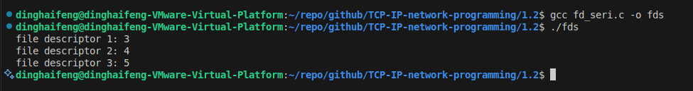
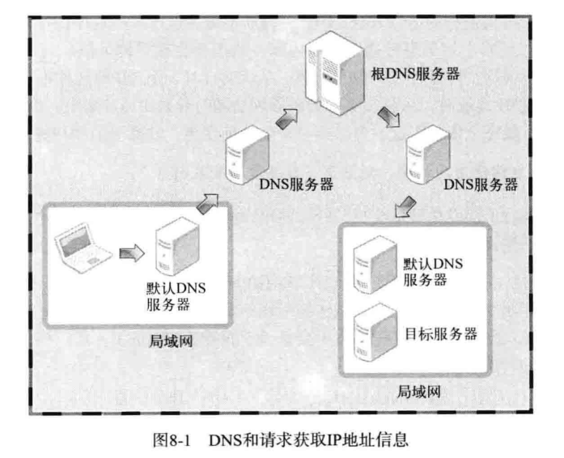
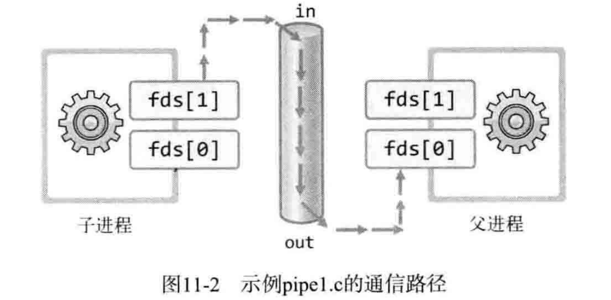
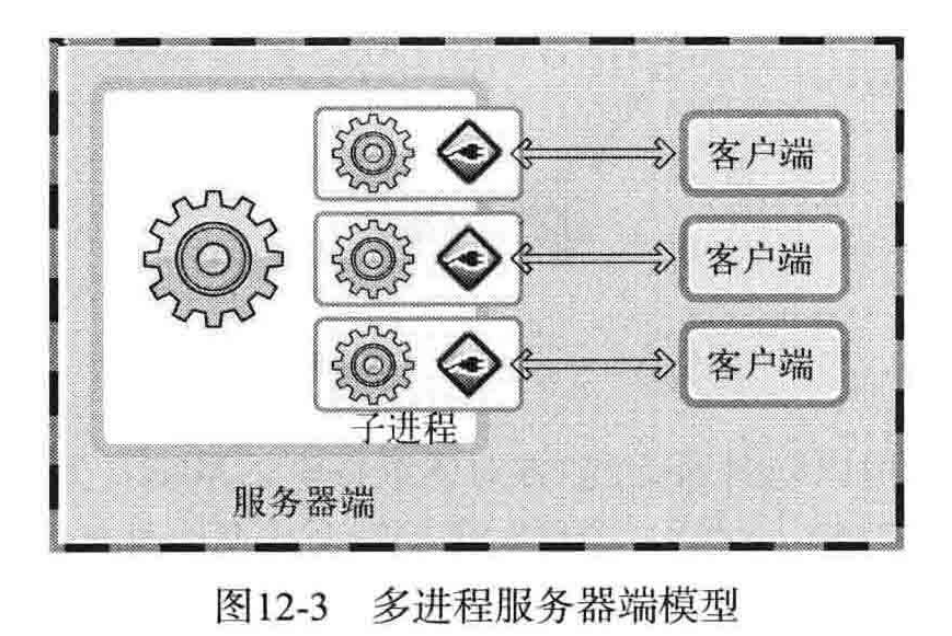
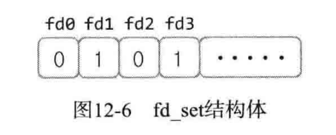

# TCP/IP 网络编程

## 1 理解网络编程和套接字

### 1.1 理解网络编程和套接字

**网络编程就是编写程序使两台连网的计算机相互交换数据。**


#### 构建接电话套接字

下面利用电话机讲解套接字的创建及使用方法。构建套接字需要下面四个函数：

**调用`socket`函数**（安装电话机）

有了电话机才能安装电话，接下来我们准备一部漂亮的电话机。下列函数创建的就是相当于电话机的套接字。

```cpp
#include <sys/socket.h>
int socket(int domain, int type, int protocol)
```

准备好电话机后要考虑电话号码的问题，这样别人才能联系到自己。


**调用`bind`函数**（分配电话号码）

就像给电话机分配电话号码一样（虽然不是真的把电话号给了电话机），利用以下函数给创建好的套接字分配地址信息（**IP地址**和**端口号**）。

```cpp
#include <sys/socket.h>
int bind(int sockfd, struct sockaddr *myaddr, socklen_t addrlen);
//成功时返回0，失败时返回-1
```

调用`bind`函数给套接字分配地址后，就基本完成了接电话的所有准备工作。接下来需要连接电话线并等待来电。


**调用`listen`函数**（连接电话线）

连接电话线后，电话机就转为可接听状态，这时其他人可以拨打电话请求连接到该机。同样，需要把套接字转化成**可接受连接**的状态。

```cpp
#include <sys/socket.h>
int listen(int sockfd, int backlog);
//成功时返回0，失败时返回-1
```

连接好电话线后，如果有人拨打电话就会响铃，拿起话筒才能接听电话。


**调用`accept`函数**（拿起话筒）

拿起话筒意味着**接收了对方的连接请求**。套接字同样如此，如果有人为了完成数据传输而请求连接，就需要调用以下函数进行受理。

```cpp
#include <sys.socket.h>
int accept(int sockfd, struct sockaddr *addr, socklen_t *addrlen);
//成功时返回文件描述符，失败时返回-1
```


**网络编程中接收连接请求的套接字创建过程可整理如下：**

1. 调用`socket`函数**创建套接字**
2. 调用`bind`函数**分配IP地址和端口号**
3. 调用`listen`函数**转为可接受请求状态**
4. 调用`accept`函数**受理连接请求**


#### 编写“Hello World!”服务器端

**服务器端（server）**是能够**受理连接请求**的程序。下面构建服务器以验证之前提到的函数调用过程，该服务器端收到连接请求后向请求者返回“Hello World！”答复。

**`hello_server.c`**

```cpp
#include <stdio.h>
#include <stdlib.h>
#include <string.h>
#include <unistd.h>
#include <arpa/inet.h>
#include <sys/socket.h>
void error_handling(char *message);

int main(int argc, char *argv[])
{
    int serv_sock;
    int clnt_sock;

    struct sockaddr_in serv_addr;
    struct sockaddr_in clnt_addr;
    socklen_t clnt_addr_size;

    char message[] = "Hello World!";

    if(argc != 2)
    {
        printf("Usage : %s <port>\n", argv[0]);
        exit(1);
    }
    
    //调用socket函数创建套接字
    serv_sock = socket(PF_INET, SOCK_STREAM, 0);
    if(serv_sock == -1)
        error_handling("socket() error");

    memset(&serv_addr, 0, sizeof(serv_addr));
    serv_addr.sin_family = AF_INET;
    serv_addr.sin_addr.s_addr = htonl(INADDR_ANY);
    serv_addr.sin_port = htons(atoi(argv[1]));

    //调用bind函数分配IP地址和端口号
    if(bind(serv_sock, (struct sockaddr*)&serv_addr, sizeof(serv_addr)) == -1)
        error_handling("bind() error");

    //调用listen函数将套接字转为可接受连接状态
    if(listen(serv_sock, 5) == -1)
        error_handling("listen() error");

    //调用accept函数受理连接请求.如果在没有连接请求的情况下调用该函数,则不会返回,直到有连接请求为止
    clnt_addr_size = sizeof(clnt_addr);
    clnt_sock = accept(serv_sock, (struct sockaddr*)&clnt_addr, &clnt_addr_size);
    if(clnt_sock == -1)
        error_handling("accept() error");

    //调用write函数传输数据,若程序经过accept函数说明此时已有连接请求
    write(clnt_sock, message, sizeof(message));
    close(clnt_sock);
    close(serv_sock);
    return 0;
}

void error_handling(char *message)
{
    fputs(message, stderr);
    fputc('\n', stderr);
    exit(1);
}
```

编译运行该示例后，会**创建等待连接请求的服务器端**。


#### 构建打电话套接字

服务器端创建的套接字又称为**服务器端套接字**或**监听套接字**。接下来介绍的套接字是用于**请求连接**的客户端套接字。

还未介绍打电话（请求连接）的函数，因为其调用的是**客户端套接字**，如下所示。

```cpp
#include <sys/socket.h>
int connect(int sockfd, struct sockaddr *serv_addr, socklen_t addrlen);
//成功时返回0，失败时返回-1
```

**客户端**只有**调用`socket`函数创建套接字**和**调用`connect`函数向服务器端发送连接请求**这两个步骤。

**`hello_client.c`**

```cpp
#include <stdio.h>
#include <stdlib.h>
#include <string.h>
#include <unistd.h>
#include <arpa/inet.h>
#include <sys/socket.h>
void error_handling(char *message);

int main(int argc, char* argv[])
{
    int sock;
    struct sockaddr_in serv_addr;
    char message[30];
    int str_len;

    if(argc!=3)
    {
        printf("Usage : %s <IP> <port>\n", argv[0]);
        exit(1);
    }

    //调用socket函数创建套接字,但此时套接字并不马上分为服务器端和客户端
    //如果紧接着调用bind、listen函数,将成为服务器端套接字;如果调用connect函数,将成为客户端套接字
    sock = socket(PF_INET, SOCK_STREAM, 0);
    if(sock == -1)
        error_handling("socket() error");

    memset(&serv_addr, 0, sizeof(serv_addr));
    serv_addr.sin_family = AF_INET;
    serv_addr.sin_addr.s_addr = inet_addr(argv[1]);
    serv_addr.sin_port = htons(atoi(argv[2]));

    //调用connect函数向服务器端发送连接请求
    if(connect(sock, (struct sockaddr*)&serv_addr, sizeof(serv_addr)) == -1)
        error_handling("connect() error!");
    
    str_len = read(sock, message, sizeof(message)-1);
    if(str_len == -1)
        error_handling("read() error!");

    printf("Message from server : %s \n", message);
    close(sock);
    return 0;
}

void error_handling(char* message) 
{
    fputs(message, stderr);
    fputc('\n', stderr);
    exit(1);
}
```

这样就编好了**服务器端**和**客户端**。


#### 在Linux平台下运行

**运行结果：`hello_server.c`**

 

正常情况下程序将停留在此状态（仅有第一行），因为服务器端调用的`accept`函数还未返回。接下来运行客户端。


**运行结果：`hello_server.c`**

 

由此查看客户端消息传输过程，同时发现，**完成消息传输后，服务器端和客户端都停止运行**。执行过程中输入的`127.0.0.1`是运行示例用的计算机（本地计算机）的**IP地址**，`9190`为**端口号**（0～1023以外的数）。如果在**同一台计算机**中同时运行服务器端和客户端，将采用这种连接方式。但如果服务器端和客户端在**不同计算机**中运行，则需要采用**服务器端所在计算机的IP地址**。


### 1.2 基于Linux的文件操作

在Linux中，socket也被认为是文件的一种，因此**在网络传输过程中可以使用文件I/O的相关函数**。


#### 底层文件访问和文件描述符

**底层**可以表达为**与标注无关的操作系统提供的**。稍后讲解的函数是由**Linux**提供的，而非ANSI标准定义的函数。如果想使用Linux提供的文件I/O函数，首先应该理解好**文件描述符**的概念。

此处的文件描述符是**系统分配给文件或套接字的整数**。实际上，学习C语言过程中用过的标准输入输出及标准错误在Linux中也被分配表1-1中的文件描述符。


文件和套接字一般经过创建过程才会被分配文件描述符。而表1-1中的3种输入输出对象即使未经过特殊的创建过程，程序开始运行后也会被自动分配文件描述符。


每当生成文件或套接字，操纵系统将返回分配给它们的整数。这个整数将成为程序员与操作系统之间良好沟通的渠道。实际上，文件描述符只不过是为了方便称呼操作系统创建的文件或套接字赋予的数而已。

文件描述符有时也称为文件句柄，但“句柄”主要是Windows中的术语。因此若设计Windows平台将使用“句柄”，如果是Linux平台则用“描述符”。


#### 打开文件

首先介绍**打开文件以读写数据**的函数。调用此函数时需传递两个参数：第一个参数是**打开的目标文件及路径信息**，第二个参数是**文件打开模式**（文件特性信息）。

```cpp
#include <sys/types.h>
#include <sys.stat.h>
#include <fcntl.h>

//path 文件的字符串地址   flag 文件打开模式信息
int open(const char *path, int flag);
//成功时返回文件描述符，失败时返回-1
```

表1-2是此函数第二个参数 `flag` 可能的常量值及含义。如需传递多个参数，则应提供**位或运算**（OR）符组合并传递。


#### 关闭文件

使用文件后必须关闭，下面介绍关闭文件时调用的函数。

```cpp
#include <unistd.h>

//fd 需要关闭的文件或套接字的文件描述符
int close(int fd);
//成功时返回0，失败时返回-1
```

若调用此函数的同时传递**文件描述符**参数，则关闭（终止）相应文件。另外需注意的是，此函数不仅可以关闭**文件**，还可以关闭**套接字**。再次证明了**Linux系统不区分文件与套接字**。


#### 将数据写入文件

接下来介绍的`write`函数用于**向文件输出数据**。由于Linux不区分文件与套接字，因此**通过套接字向其他计算机传递数据**时也会用到该函数。之前用于传递"Hello World!"。

```cpp
#include <unistd.h>

//fd 显示数据传输对象的文件描述符   buf 保存要传输数据的缓冲地址值   nbytes 要传输数据的字节数
ssize_t write(int fd,con void * buf, size_t nbytes);
//成功时返回写入的字节数，失败时返回-1
```

此函数定义中，`size_t`是通过typedef声明的`unsigned int`类型。对`ssize_t`来说，`size_t`前面多加的`s`代表`signed`，即**`ssize_t`是通过typedef声明的`signed int`类型**。

下面通过示例更好理解该函数。此程序将**创建新文件并保存数据**

```cpp
//篇幅原因仅写重要部分
int fd;
char buf[]="Let's go!\n";

fd=open("data.txt", O_CREAT|O_WRONLY|O_TRUNC); //创建文件、只写、删除全部现有数据(即创建只写的空文件)
if(fd == -1)
    error_handling("open() error!");
printf("file descriptor: %d \n", fd);   //文件描述符

//向 对应于fd中保存的文件描述符的文件 传输 buf中保存的数据
if(write(fd, buf, sizeof(buf)) == -1)
    error_handling("wirte() error!");
close(fd);
```

运行示例后，利用Linux的 `cat` 命令输出**data.txt**文件内容，可以确认已向文件传输数据（需要加上 `sudo`）。运行结果如下所示：

 


#### 读取文件中的数据

与之前的`write`函数相对应，`read`函数用来输入（接收）数据。

```cpp
#include <unistd.h>

//fd 显示数据传输对象的文件描述符   buf 保存要传输数据的缓冲地址值   nbytes 要传输数据的最大字节数
ssize_t read(int fd, void * buf, size_t nbytes);
```

下面示例将通过`read`函数读取**data.txt**中保存的数据（仅写关解部分）。

```cpp
int fd;
char buf[BUF_SIZE];  //#define BUF_SIZE 100

fd=open("data.txt", O_CREAT|O_WRONLY|O_TRUNC); //打开读取专用文件data.txt
if(fd == -1)
    error_handling("open() error!");
printf("file descriptor: %d \n", fd);   //文件描述符

//调用read函数 向数组buf 保存读入的数据
if(read(fd, buf, sizeof(buf)) == -1)
    error_handling("read() error!");
printf("file data: %s", buf);
close(fd);
```

运行结果如下：
 


#### 文件描述符与套接字

下面将同时创建文件和套接字，并用**整数型态**比较**返回的文件描述符值**。

```cpp
int fd1, fd2, fd3;
fd1 = socket(PF_INET, SOCK_STREAM, 0);
fd2 = open("test.dat", O_CREAT|O_WRONLY|O_TRUNC);
fd3 = socket(PF_INET, SOCK_DGRAM, 0);

printf("file descriptor1: %d\n", fd1);
printf("file descriptor2: %d\n", fd2);
printf("file descriptor3: %d\n", fd3);
```

运行结果如下所示：
 

`PF_INET`表示**IPv4协议族**。用于指定套接字使用IPv4网络协议

`SOCK_STREAM`表示使用**TCP协议**。用于提供有序、双向、面向连接的字节流，保证数据按顺序到达且不重复

`SOCK_DGRAM`表示使用**UDP**协议。不保证数据到达顺序或是否到达，且每个数据包都是独立的

在代码示例中：

- fd1是**TCP套接字**(`PF_INET`+`SOCK_STREAM`)
- fd2是**普通文件**
- fd3是**UDP套接字**(`PF_INET`+`SOCK_DGRAM`)
- 三个文件描述符通常是连续的数字(如3,4,5)，除非中间有其他文件操作


**socket()如何得出文件描述符**：

- 当调用`socket()`函数时，内核会：
  a. 创建一个套接字数据结构
  b. 在进程的文件描述符表中分配一个空闲的最小数字作为文件描述符
  c. 将套接字与该文件描述符关联
- 文件描述符是一个非负整数，是进程访问I/O资源的句柄
- 通常从**3**开始分配(0-2被标准输入、输出、错误占用)
- 每次成功调用都会返回一个新的文件描述符


### 1.3 基于Windows平台的实现

Window套接字（简称Winsock）大部分参考BSD系列和UNIX套接字设计，所有很多地方与Linux套接字类似。因此只需要更改Linux环境下编号的一部分网络程序内容，就能在Windows平台运行。


#### Winsock的初始化

进行Winsock编程时，首先必须调用`WSAStartup`函数，**设置程序中用到的Winsock版本，并初始化相应版本的库**。

```cpp
#include <winsock2.h>

//wVersionRequested 程序员要用的Winsock版本信息   lpWSAData WSDATA结构体变量的地址值
int WSAStartup(WORD wVersionRequested, LPWSADATA lpWSAData);
//成功时返回0,失败时返回非0的错误代码值
```

对上述两个参数进行解释。首先是第一个Winsock中存在多个版本，应准备`WORD`类型的（`WORD`是通过typedef声明定义的`unsigned short`）**套接字版本信息**，并传递给第一个参数 `wVersionRequested`。若版本位1.2，则其中1是主版本号，2是副版本号，应传递**0x0201**。

如上所述，**高8位为副版本号，低8位为高版本号**，以此进行传递。可借助`MAKEWORD`宏函数构建**WORD**型版本信息

- `MAKEWORD(1, 2);`   主版本为1,副版本为2,返回0x0201
- `MAKEWORD(2, 2);`   主版本为2,副版本为2,返回0x0202

接下来讲解第二个参数`lpWSAData`，此参数中需传入`WSADATA`型结构体变量地址（`LPWSADATA`是`WSADATA`的**指针**类型）。调用完函数后，相应参数中将填充已初始化的库信息。虽无特殊含义，但为了调用函数，必须传递`WSADATA`结构体变量位置。

下面给出`WSAStartup`函数调用过程，这段代码几乎已成为Winsock编程的公式。

```cpp
int main(int argc, char* argv[])
{
    WSADATA wsaData;
    /******************/
    if(WSAStartup(MAKEWORD(2, 2), &wsaData) != 0)
        ErrorHandling("WSAStartup() error!");
    /******************/
    return 0;
}
```


上面已介绍Winsock相关库的**初始化方法**，接下来讲解如何**注销**该库——利用下面给出的函数。

```cpp
#include <winsock2.h>

int WSACleanup(void);
//成功时返回0,失败时返回SOCKET_ERROR
```

调用该函数时，Winsock相关库将**归还Windows操作系统，无法再调用Winsock相关函数**。


### 1.4 基于Windows的套接字相关函数及示例

本节介绍的Winsock函数与之前的Linux套接字相关函数相对应，在此不做出太多介绍


#### 基于Windows的套接字相关函数

首先介绍的函数与Linux下的`socket`函数提供相同功能。稍后讲解返回值类型`SOCKET`。

```cpp
#include <winsock2.h>

SOCKET socket(int af, int type, int protocol);
//成功时返回0,失败时返回SOCKET_ERROR
```

下列函数与Linux的`bind`函数相同，调用其**分配IP地址和端口号**。

```cpp
#include <winsock2.h>

int bind(SOCKET s, const struct sockaddr * name, int namelen);
//成功时返回0,失败时返回SOCKET_ERROR
```

下列函数与Linux的`listen`函数相同，调用其**使套接字可接收客户端连接**。

```cpp
#include <winsock2.h>

int listen(SOCKET s, int backlog);
//成功时返回0,失败时返回SOCKET_ERROR
```

下列函数与Linux的`accept`函数相同，调用其**受理客户端连接请求**。

```cpp
#include <winsock2.h>

int accept(SOCKET s, const struct sockaddr * addr, int addrlen);
//成功时返回套接字句柄,失败时返回INVALID_SOCKET
```

下列函数与Linux的`connect`函数相同，调用其**从客户端发送连接请求**。

```cpp
#include <winsock2.h>

int connect(SOCKET s, const struct sockaddr * name, int namelen);
//成功时返回0,失败时返回SOCKET_ERROR
```

最后这个函数在**关闭套接字**时调用。Linux中，关闭文件和套接字时都会调用`close`函数；而Windows中有专门用来关闭套接字的函数。

```cpp
#include <winsock2.h>

int closesocket(SOCKET s);
//成功时返回0,失败时返回SOCKET_ERROR
```

以上就是基于Windows的套接字相关函数，虽然返回值和参数与Linux函数有所区别，但具有相同功能的函数名是一样的。


#### 创建基于Windows的服务器端和客户端

接下来将之前基于Linux的服务器端和客户端示例转化到Windows平台。目前只需验证**套接字相关函数的调用过程**、**套接字库的初始化**与**注销过程**即可。

**`hello_server_win.c`**

```cpp
#include <stdio.h>
#include <stdlib.h>
#include <winsock2.h>
void ErrorHandling(char* message);

int main(int argc,char* argv[])
{
    WSADATA wsaData;
    SOCKET hServSock, hClntSock;
    SOCKADDR_IN servAddr, clntAddr;
    int szClntAddr;
    char message[] = "Hello World!";
    if(argc != 2)
    {
        printf("Usage : %s <port>\n", argv[0]);
        exit(1);
    }

    //初始化套接字库
    if(WSAStartup(MAKEWORD(2, 2), &wsaData) != 0)
        ErrorHandling("WSAStartup() error!");

    //创建套接字
    hServSock = socket(PF_INET, SOCK_STREAM, 0);
    if(hServSock == INVALID_SOCKET)
        ErrorHandling("socket() error!");

    memset(&servAddr, 0, sizeof(servAddr));
    servAddr.sin_family = AF_INET;
    servAddr.sin_addr.s_addr = htonl(INADDR_ANY);
    servAddr.sin_port = htons(atoi(argv[1]));

    //给该套接字分配IP地址和端口号
    if(bind(hServSock, (SOCKADDR*) &servAddr, sizeof(servAddr)) == SOCKET_ERROR)
        ErrorHandling("bind() error!");

    //使套接字成为服务器端套接字
    if(listen(hServSock, 5) == SOCKET_ERROR)
        ErrorHandling("listen() error!");

    //受理客户端连接请求
    szClntAddr = sizeof(clntAddr);
    hClntSock = accept(hServSock, (SOCKADDR*)&clntAddr, &szClntAddr);
    if(hClntSock == INVALID_SOCKET)
        ErrorHandling("accept() error!");
    
    //向客户端传输数据
    send(hClntSock, message, sizeof(message), 0);
    closesocket(hClntSock);
    closesocket(hServSock);
    WSACleanup();
    return 0;
}

void ErrorHandling(char *message)
{
    fputs(message, stderr);
    fputc('\n', stderr);
    exit(1);
}
```

 

（第一次代码出错）


**`hello_client_win.c`**

```cpp
#include <stdio.h>
#include <stdlib.h>
#include <winsock2.h>
void ErrorHandling(char* message);

int main(int argc,char* argv[])
{
    WSADATA wsaData;
    SOCKET hSocket;
    SOCKADDR_IN servAddr;

    char message[30];
    int strlen;
    if(argc!=3)
    {
        printf("Usage : %s <IP> <port>\n", argv[0]);
        exit(1);
    }

    //初始化Winsock库
    if(WSAStartup(MAKEWORD(2, 2), &wsaData) != 0)
        ErrorHandling("WSAStartup() error!");

    //创建套接字
    hSocket = socket(PF_INET, SOCK_STREAM, 0);
    if(hSocket == INVALID_SOCKET)
        ErrorHandling("socket() error!");

    memset(&servAddr, 0, sizeof(servAddr));
    servAddr.sin_family = AF_INET;
    servAddr.sin_addr.s_addr = inet_addr(argv[1]);
    servAddr.sin_port = htons(atoi(argv[2]));

    //通过套接字向该服务器端发送连接请求
    if(connect(hSocket, (SOCKADDR*)&servAddr, sizeof(servAddr)) == SOCKET_ERROR)
        ErrorHandling("connect error!");

    //接收服务器发来的数据
    strlen = recv(hSocket, message, sizeof(message)-1, 0);
    if(strlen == -1)
        ErrorHandling("read() error!");
    printf("Message from server: %s \n", message);

    closesocket(hSocket);
    //注销初始化的Winsock库
    WSACleanup();
    return 0;
}

void ErrorHandling(char *message)
{
    fputs(message, stderr);
    fputc('\n', stderr);
    exit(1);
}
```

 

如果运行正常，则与Linux相同，程序进入**等待状态**。这是因为服务器调用了`accept`函数。接着运行客户端显示结果。


#### 基于Windows的I/O函数

Linux中套接字也是文件，因而可以通过文件I/O函数`read`和`write`进行数据传输。而Windows严格区分文件I/O函数和套接字I/O函数。下面介绍Winsock数据传输函数。

```cpp
#include <winsock2.h>

////s 表示数据传输对象连接的套接字句柄值   buf 保存待传输数据的缓冲地址值   len 要传输的字节数   flags 传输数据时用到的多种选项信息
int send(SOCKET s, const char * buf, int len, int flags);
//成功时返回传输字节数，失败时返回SOCKET_ERROR
```

此函数与Linux的`write`函数相比，只是多了最后的`flags`参数。现在只需传递0，表示不设置任何选项。下面介绍与`send`函数对应的`recv`函数。

```cpp
#include <winsock2.h>

//s 表示数据接收对象连接的套接字句柄值   buf 保存接收数据的缓冲地址值   len 能够接受的最大字节数   flags 接收数据时用到的多种选项信息
int recv(SOCKET s, const char * buf, int len, int flags);
//成功时返回接收的字节数（收到EOF时为0），失败时返回SOCKET_ERROR
```


## 2 套接字类型与协议设置

### 2.1 套接字协议及其数据传输特性

#### 关于协议

如果相隔很远的两人想展开对话，必须先决定对话方式。如果一方使用电话，那么另一方也只能使用电话，而不是书信。可以说，电话是二人对话的协议。

**协议是对话中使用的通信规则**，把上述概念拓展到计算机领域可整理为“计算机间对话必备通信规则”。


#### 创建套接字

创建套接字所用的`socket`函数已在第一章简单介绍过。但为了完全理解该函数此处将再次进行讨论。

```cpp
#include <sys/socket.h>

//domain 套接字中使用的协议族（Protocol Family）信息   type 套接字数据传输类型信息   protocol 计算机间通信中使用的协议信息
int socket(int domain, int type, int protocol);
//成功时返回文件描述符，失败时返回-1
```

该函数的参数对创建套接字来说是不可或缺的，下面将给出详细说明。


#### 协议族（Protocol Family）

套接字通信中的协议有一些分类，通过`socket`函数的第一个参数传递**套接字中使用的协议分类信息**，此协议分类信息成为**协议族**，可分为如下几类：


重点讲解表2-1中`PF_INET`对应的**IPv4互联网协议族**。

此外，套接字中实际采用的最终协议信息是通过`socket`函数的**第三个参数**传递的。在指定的协议族范围内通过第一个参数决定第三个参数。


#### 套接字类型（Type）

套接字类型指的是**套接字的数据传输方式**，通过`socket`函数的第二个参数传递，只有这样才能决定创建的套接字的数据传输方式。

注：决定了协议族（第一个参数）不能同时决定数据传输方式，即`PF_INET`协议族中也存在多种数据传输方式。

下面介绍2种具有代表性的数据传输方式。

##### 套接字类型1：面向连接的套接字（SOCK_STREAM）

如果向`socket`函数的第二个参数传递`SOCK_STREAM`，将创建面向**连接**的套接字。面向连接的套接字可以比喻成2个工人通过1条传送带传递物品。

数据传输方式特征如下：

- **传输过程种数据不会消失**
- **按序传输数据**
- **传输的数据不存在数据边界（Boundary）**

“传输数据的计算机通过3次调用`write`函数传递了100字节的数据，但接收数据的计算机仅通过1次`read`函数调用就接受了全部100个字节”

收发数据的套接字内部有**缓冲**（buffer），简言之就是字节数组。通过套接字传输的数据将保存到该数组。因此收到数据后并不意味着马上调用`read`函数。只要不超过数组容量，很有可能在数据填充满缓冲后通过一次`read`函数调用读取全部，也有可能分成多次`read`函数调用进行读取。也就是说，在面向连接的套接字中，`read`函数和`write`函数的调用次数并无太大意义。所以说**面向连接的套接字不存在数据边界**。

注：缓冲被填满后，传输端套接字将停止传输，所以不会发生数据丢失。

此外，“传输和接收端各有1名工人”，即**面向连接的套接字只能与另外一个同样特性的套接字连接**。

**总结：可靠的、按序传递的、基于字节的面向连接的数据传输方式的套接字**


##### 套接字类型2：面向消息的套接字（SOKCK_DGRAM）

如果向`socket`函数的第二个参数传递`SOCK_DGRAM`，将创建面向**消息**的套接字。面向连接的套接字可以比喻成高速移动的摩托车快递。

数据传输方式特征如下：

- **强调快速传输而非传输顺序**
- **传输的数据可能丢失也可能损毁**
- **传输的数据有数据边界**
- **限制每次传输的数据大小**

用比喻的摩托快递来讲，如果2辆摩托车分别发送2件包裹，则接收者也需要分2次接收。这种特性就是“**传输的数据具有数据边界**”。

**总结：不可靠的、不按序传递的、以数据的高速传递为目的的套接字**


##### 协议的最终选择

通过`socket`函数前面两个参数传递了**协议族信息**和**套接字数据传输方式**。接下来讲解第三个参数，该参数**决定最终采用的协议**。

**传递前两个参数即可创建所需套接字**，所以大部分情况下可以**向第三个参数传递0**。除非遇到以下这种情况：

“同一协议族中存在多个数据传输方式相同的协议”

**传输方式相同，但协议不同**。此时需要通过第三个参数**具体指定协议信息**。

下面构建向`socket`函数传递的参数

IPv4与网络地址系统相关，参数`PF_INET`指**IPv4网络协议族**，`SOCK_STREAM`是**面向连接的数据传输**。满足这两个条件的协议只有`IPROTO_TCP`，这种套接字称为**TCP套接字**。

```cpp
//IPv4协议族中面向连接的套接字
int tcp_socket = socket(PF_INET, SOCK_STREAM, IPPROTO_TCP);
```

`SOCK_DGRAM`指的是**面向消息的数据传输**方式，满足上述条件的协议只有`IPPROTO_UDP`,这种套接字称为**UDP套接字**。

```cpp
//IPv4协议族中面向消息的套接字
int udp_socket = socket(PF_INET, SOCK_DGRAM, IPPROTO_UDP);
```


#### 面向连接的套接字：TCP套接字示例

其他章节将讲解UDP套接字，此处只给出**面向连接的TCP套接字**示例，本示例是在第一章的如下两个源文件基础上修改而成的。

- `hello_server.c` --> `tcp_server.c`：无变化！
- `hello_client.c` --> `tcp_client.c`：更改`read`函数调用方式！

调整其中一部分代码，以验证TCP套接字**传输的数据不存在数据边界**的特性。

**`tcp_client.c`**

```cpp
#include <stdio.h>
#include <stdlib.h>
#include <string.h>
#include <unistd.h>
#include <arpa/inet.h>
#include <sys/socket.h>
void error_handling(char *message);

int main(int argc, char* argv[])
{
    int sock;
    struct sockaddr_in serv_addr;
    char message[30];
    int str_len = 0;
    int idx = 0, read_len=0;

    if(argc!=3)
    {
        printf("Usage : %s <IP> <port>\n", argv[0]);
        exit(1);
    }

    //创建TCP套接字。若前两个参数传递PF_INET、SOCK_STREAM，则可以省略第三个参数IPPROTO_TCP（传参为0）
    sock = socket(PF_INET, SOCK_STREAM, 0);
    if(sock == -1)
        error_handling("socket() error");

    memset(&serv_addr, 0, sizeof(serv_addr));
    serv_addr.sin_family = AF_INET;
    serv_addr.sin_addr.s_addr = inet_addr(argv[1]);
    serv_addr.sin_port = htons(atoi(argv[2]));

    if(connect(sock, (struct sockaddr*)&serv_addr, sizeof(serv_addr)) == -1)
        error_handling("connect() error!");
    
    //while循环中反复调用read函数，每次读取1个字节。如果read返回0，则循环条件为假，跳出while循环
    while (read_len = read(sock, &message[idx++], 1))
    {
        if(read_len == -1)
            error_handling("read() error!");

        //执行该语句时，变量read_len的值始终为1，因为while循环每次读取1个字节。跳出while循环后，str_len中存有读取的总字节数
        str_len += read_len;
    }
    
    printf("Message from server : %s \n", message);
    printf("Function read call count: %d \n", str_len);
    close(sock);
    return 0;
}

void error_handling(char* message) 
{
    fputs(message, stderr);
    fputc('\n', stderr);
    exit(1);
}
```

运行结果如下：

 

从运行结果可以看出，服务器端发送了**13字节**的数据，客户端调用**13次**`read`函数进行读取。

`tcp_server.c`与`hello_server.c`完全一致，故在此不过多赘述。


### 2.2 Windows平台下的实现及验证

前面讲过的套接字类型及传输特性**与操作系统无关**。Windows平台下的实现方式也类似，不需要过多说明，只需稍加了解`socket`函数**返回类型**即可。

#### Windows操作系统的socket函数

Windows的函数名和参数名斗鱼Linux平台相同，只是返回值类型稍有不同。再次给出`socekt`函数的声明。

```cpp
#include <winsock2.h>

SOCKET socket(int af, int type, int protocol);
//成功时返回socket句柄，失败时返回INVALID_SOCKET
```

该函数的返回类型为`SOCKET`，此结构体用来**保存整数型套接字句柄值**。实际上，`socket`函数返回**整数型数据**，因此可以用`int`型变量接收，就像在Linux中一样。但考虑以后的扩展性，定义为`SOCKET`数据类型。以后可将`SOCKET`视作**保存套接字句柄**的一个数据类型。

同样，发生错误时返回`INVALID_SOCKET`，只需将其理解为**提示错误的常数**即可。其实际值为**-1**。


#### 基于Windows的TCP套接字示例

把之前的`tcp_server.c、tcp_client.c`如下改为基于Windows的程序

- `hello_server_win.c` --> `tcp_server_win.c`：无变化！
- `hello_client_win.c` --> `tcp_client_win.c`：更改`read`函数调用方式！

与之前一样，仅展示`tcp_client_win.c`

```cpp
#include <stdio.h>
#include <stdlib.h>
#include <winsock2.h>
void ErrorHandling(char* message);

int main(int argc,char* argv[])
{
    WSADATA wsaData;
    SOCKET hSocket;   //声明SOCKET变量以保持socket函数返回值
    SOCKADDR_IN servAddr;

    char message[30];
    int strLen=0;
    int idx=0,readLen=0;

    if(argc!=3)
    {
        printf("Usage : %s <IP> <port>\n", argv[0]);
        exit(1);
    }

    if(WSAStartup(MAKEWORD(2, 2), &wsaData) != 0)
        ErrorHandling("WSAStartup() error!");

    //创建TCP套接字，具体同Linux
    hSocket = socket(PF_INET, SOCK_STREAM, 0);
    if(hSocket == INVALID_SOCKET)
        ErrorHandling("socket() error!");

    memset(&servAddr, 0, sizeof(servAddr));
    servAddr.sin_family = AF_INET;
    servAddr.sin_addr.s_addr = inet_addr(argv[1]);
    servAddr.sin_port = htons(atoi(argv[2]));

    if(connect(hSocket, (SOCKADDR*)&servAddr, sizeof(servAddr)) == SOCKET_ERROR)
        ErrorHandling("connect error!");

    //while循环中调用recv函数读取数据，每次1个字节
    while(readLen = recv(hSocket, &message[idx++], 1, 0))
    {
        if(readLen == -1)
            ErrorHandling("read() error!");
		
        //while循环中每次读取1个字节，因此变量strLen每次加1，这与recv函数调用次数相同
        strLen += readLen;
    }
        
    printf("Message from server: %s \n", message);
    printf("Function read call count: %d \n", strLen);

    closesocket(hSocket);
    WSACleanup();
    return 0;
}

void ErrorHandling(char *message)
{
    fputs(message, stderr);
    fputc('\n', stderr);
    exit(1);
}
```

运行结果如下：

 


## 3 地址族与数据序列

### 3.1 分配给套接字的IP协议和端口号

**IP**是Internet Protocol（网络协议）的简写，是**为收发网络数据**而分配给计算机的值。

**端口号**并非赋予计算机的值，而是**区分程序中创建的套接字**而分配给套接字的序号。

下面逐一讲解。


#### 网络地址（Internet Address）

为使计算机连接到网络并收发数据，必须向其分配**IP地址**。IP地址分为两类：

- **IPv4**（Internet Protocol version 4） 4字节地址族
- **IPv6**（Internet Protocol version 6） 16字节地址族

IPv4和IPv6的差别主要是**表示IP地址所用的字节数**，目前通用的地址族为**IPv4**.IPv6是为了应对2010年前后IP地址耗尽的问题而提出的标准，即便如此，现在还是主要使用IPv4。

IPv4的4字节IP地址分为**网络地址**和**主机（指计算机）地址**，且分为A、B、C、D、E等类型。图3-1展示了IPv4地址族，一般不会使用已被预约了的E类地址，故省略。


**网络地址**（网络ID）是为了**区分网络**而设置的一部分IP地址。假设向WWW.SEML.COM公司传输数据，该公司内部构建了局域网，把所有计算机连接起来。因此，首先应向`SEMI.COM`网络传输数据，也就是说，并非一开始就浏览所有4字节的IP地址，进而找到目标主机；而是**仅浏览4字节IP地址的网络地址**，先把数据传到`SEMI.COM`的网络。`SEMI.COM`网络（构成网络的路由器）收到数据后，浏览传输数据的主机地址（主机ID）并将数据传递给目标计算机。图3-2展示了数据传输过程。


某主机向`203.211.172.103`和`203.211.217.202`传输数据，其中`203.211.172`和`203.211.217`为该网络的**网络地址**。所以“向相应网络传输数据”实际上是**向构成网络的路由器**（Router）**或交换机**（Switch）**传输数据**，由接收数据的**路由器**根据数据中的**主机地址**向目标主机传递数据。


注：在**无子网划分**的情况下，**网络地址**为前24位（前三个字节），**主机地址**为最后8位（最后一个字节）

以`203.211.172.103`为例，网络地址为`203.211.172`，主机地址为`103`。

若进行子网划分，则需要通过**子网掩码**计算，在此不详细说明。


#### 网络地址分类和主机地址分类

只需通过**IP地址的第一个字节**即可判断**网络地址占用的字节数**，因为我们根据IP地址的**边界**区分网络地址，如下所示：

- **A类地址**的首字节范围：0～127
- **B类地址**的首字节范围：128～191
- **C类地址**的首字节范围：192～223

还有如下表述方式：

- **A类地址**的首位从**0**开始
- **B类地址**的前2位从**10**开始
- **C类地址**的前3位从**110**开始

正因如此，通过套接字收发数据时，数据传到网络后即可轻松找到正确的主机。


#### 用于区分套接字的接口号

IP用于区分计算机，只要有IP地址就能向目标主机传输数据，但仅凭这些无法传输给最终的应用程序。假设各位欣赏视频的同时在网上冲浪，这时至少需要1ge接收视频数据的套接字和1个接收网页信息的套接字。问题在于如何区分二者，简言之传输到计算机的网络数据是发给播放器，还是发给浏览器；若想接收多台计算机发来的数据，则需要相应个数的套接字。那如何区分这些套接字？

计算机中一般配有NIC（Network Interface Card，网络接口卡）数据传输设备。通过NIC向计算机内部传输数据时会用到IP。操作系统负责把传递到内部的数据适当分配给套接字，这时就要利用端口号。也就是说，**通过NIC接收的数据有端口号**，操作系统正是参考此**端口号**把数据传输给**相应端口的套接字**，如图3-3所示。


**端口号就是在同一操作系统内为区分不同套接字而设置的**。因此无法将1个端口号分配给不同套接字。另外端口号由16位构成，**可分配的端口号为0-65535**。但**0-1023是知名端口**（Well-known PORT），一般分配给特定应用程序，所以**应当分配此范围（0-1023）之外的值**。

另外，虽然端口号不能重复，但**TCP套接字**和**UDP套接字**不会共用端口号，所以**允许重复**。例如：如果某TCP套接字使用9190号端口，则其他TCP套接字就无法使用该端口号，但UDP套接字仍可以使用。

总之，数据传输目标地址同时包含**IP地址**和**端口号**，只有这样，数据才会被传输到最终的目的应用程序（应用程序套接字）。


### 3.2 地址信息的表示

应用程序中使用的IP地址和端口号以**结构体**的形式给出了定义。

#### 表示IPv4地址的结构体

要知道IPv4的目标地址，需要知道**地址族**、**IP地址**和**端口号**。结构体定义如下，将作为地址信息传递给`bind`函数

```c
struct sockaddr_in
{
    sa_family_t      sin_family;       //地址族（Address Family）
    uint16_t         sin_port;         //16位TCP/UDP端口号
    struct in_addr   sin_addr;         //32位IP地址
    char             sin_zero[8];      //不使用
};
```

该结构体中提到的另一个结构体`in_addr`定义如下，它用来**存放32位IP地址**。

```c
struct in_addr
{
    In_addr_t        s_addr;           //32位IPv4地址
};
```

`uint16_t`、`in_addr_t`等类型可以参考POSIX（可移置操作系统接口）。POSIX是为UNIX系列操作系统设立的标准，它定义了一些其他数据类型，如表3-1所示。


此类数据类型是考虑到**扩展性**的结果。如果使用`int32_t`类型的数据，就能保证在任何时候都占用4字节即使将来用64为表示int类型也是如此。


#### 结构体sockaddr_in成员分析

接下来重点观察结构体成员的含义及其包含的信息。

**成员sin_family**

每种协议族适用的**地址族**均不同。比如IPv4使用4字节地址族，IPv6使用16字节地址族。可以参考表3-2保存`sin_family`地址信息。


**成员sin_port**

该成员保存**16位端口号**，重点在于，它以**网络字节序**保存（这点稍后将给出详细说明）。


**成员sin_addr**

该成员保存**32位IP地址信息**，且也以**网络字节序**保存。为理解好该成员应同时观察结构体`in_addr`。但结构体`in_addr`声明为`uint32_t`，因此**只需当作32位整数即可**。


**成员sin_zero**

无特殊含义。只是使结构体`sockaddr_in`的大小与`sockaddr`结构体保持一致而插入的成员。**必须填充为0**，否则无法得到想要的结果。


从之前介绍的代码可以看出，`sockaddr_in`结构体变量地址值将以如下方式传递给`bind`函数。稍后将给出关于`bind`函数的详细说明。

```cpp
struct socakddr_in serv_addr;
/***************/
if(bind(serv_sock, (struct sockaddr * )&serv_addr, sizeof(serv_addr)) == -1)
    error_handling("bind() error!");
/***************/
```

此处重要的是**第二个参数**的传递。实际上，`bind`函数的第二个参数期望得到**`sockaddr`结构体变量地址值**，包括**地址族、端口号、IP地址等**。

```c
struct sockaddr
{
    sa_family_t      sin_family;     //地址族（Address Family）
    char             sa_data[14];    //地址信息
};
```

此结构体成员`sa_data`保存的地址信息中需，包含**IP地址**和**端口号**，剩余部分应填充0，这也是`bind`函数要求的。按照之前的讲解填写`sockaddr_in`结构体，则将生成符合`bind`函数要求的字节流。最后转换为`sockaddr`型的结构体变量，再传递给`bind`函数即可。

即`bind`函数第二个参数要求传入**`struct sockaddr *`类型的指针**，而实际使用时通常使用`strcut sockaddr_in`（IPv4）来存储地址信息。

所以需**强制进行类型转换**，在`bind`函数调用时，需传递`sockaddr_in`结构体变量的**地址**，并强制转换成`struct sockaddr *`类型。


注：结构体`sockaddr`并非只为IPv4设计。因此，结构体`sockaddr`要求在`sin_family`中**指定地址族信息**。为了与`sockaddr`保持一致，`sockaddr_in`结构体中也有**地址族信息**。


### 3.3 网络字节与地址变换

不同CPU中，4字节整数型值1在内存空间的保存方式是不同的。4字节整数型值1可用2进制表示如下。

00000000  00000000 00000000 00000001

有些CPU以这种顺序保存到内存，另外一些CPU则以倒序保存。

00000001  00000000 00000000 00000000

若不考虑这些就收发数据则会发生问题，因为**保存顺序不同**意味着**对接收数据的解析顺序**也不同。


#### 字节序（Order）与网络字节序

**CPU向内存保存数据**的方式有两种，这意味着CPU解析数据的方式也分为2种。

- **大端序**（Big Endian）：**高位字节**存放到**低位地址**。
- **小端序**（Little Endian）：**高位字节**存放到**高位地址**。

下面通过示例进行说明。假设0x20号开始的地址中保存4字节int类型数0x12345678.大端CPU保存方式如图3-4所示。


整数0x12345678中，0x12是最高为字节，0x78是最低位字节。因此，大端序中先保存最高位字节0x12（最高位字节0x12存放到低位地址）。小端序保存方式如图3-5所示。


先保存的是最低位字节0x78。从以上分析可以看出，每种CPU的数据保存方式均不同。因此，代表CPU数据保存方式的**主机字节序**（Host Byte Order）在不同CPU中也各不相同。目前主流的Interl系列CPU以**小端序**方式保存数据。接下来分析2台字节序不同的计算机之间数据传递过程中可能出现的问题，如图3-6所示。


0x12和0x34构成的大端序系统值与0x34和0x12构成的小端序系统值相同。换言之，只有改变**数据保存顺序**才能被识别为同一值。图3-6中，大端序系统传输数据0x1234时未考虑字节序问题，而直接以0x12、0x34的顺序发送。结果接收端以小端序方式保存数据，因此小端序接收的数据变成**0x3412**，而非0x1234。正因如此，在通过网络传输数据使约定统一方式，这种约定称为**网络字节序**（Network Byte Order），统一为**大端序**。

即，**先把数据数组转化成大端序格式再进行网络传输**。因此所有计算机接收数据时应识别该数据是**网络字节序格式**，小端序系统传输数据时应转化为大端序排列方式。


#### 字节序转换

下面介绍帮助转换字节序的函数

```cpp
// 将无符号短整型（16位）从主机字节序转换为网络字节序（大端序）
unsigned short htons(unsigned short);

// 将无符号短整型（16位）从网络字节序转换为主机字节序
unsigned short ntohs(unsigned short);

// 将无符号长整型（32位）从主机字节序转换为网络字节序（大端序）
unsigned long htonl(unsigned long);

// 将无符号长整型（32位）从网络字节序转换为主机字节序
unsigned long ntohl(unsigned long);
```

需要了解以下细节。

- `htons`中的 **h** 代表**主机（host）字节序**。
- `htons`中的 **n** 代表**网络（network）字节序**。

另外，**s** 指的是`short`，**l** 指的是`long`（Linux中`long`类型占用4个字节）。因此`htons`是 **h、to、n、s** 的组合，也可以解释为：

“把**short型**数据从**主机字节序**转化为**网络字节序**”

同样，`ntohs`可解释为：“把**short型**数据从**网络字节符**转化为**主机字节符**”

通常，以s作为后缀的函数中，**s**代表2个字节`short`，因此用于**端口号转换**；以l作为后缀的函数中，**l**代表4个字节`long`，因此用于**IP地址转换**。


注：即使系统是大端序的，为`sockaddr_in`结构体变量赋值前也有必要编写与大端序无关的统一代码。这样即使在大端序系统中，最好也会经过**主机字节序转换为网络字节序**的过程。当然，此时**主机字节序与网络字节序相同**，不会有任何变化。下面通过示例说明以上函数的调用过程。

```cpp
#include <stdio.h>
#include <arpa/inet.h>

int main(int arcg, char *argv[])
{
    //保存2个字节的数据
    unsigned short host_port = 0x1234;
    unsigned short net_port;
    //保存4个字节的数据
    unsigned long host_addr = 0x12345678;
    unsigned long net_addr;

    //将主机字节序转换为网络字节序（大端序）
    net_port = htons(host_port);
    net_addr = htonl(host_addr);

    printf("Host ordered port: %#x \n", host_port);
    printf("Network ordered port: %#x \n", net_port);
    printf("Host ordered address: %#x \n", host_addr);
    printf("Network ordered address: %#x \n", net_addr);
    return 0;
}
```

运行结果：

 

为什么结果看起来像小端序？

- `htons` 和 `htonl` 的返回值是已经转换为**大端序**的值，但 `printf` 用 `%#x` 打印时，会按照**当前主机的字节序**解释这个值。
- 如果你的主机是小端序，`printf` 会以小端序的方式解释 `net_port` 和 `net_addr`，因此看起来像是字节交换了。


### 3.4 网络地址的初始化与分配

前面已陶玲网络字节序，接下来介绍以`bind`函数为代表的结构体的应用

#### 将字符串信息转换为网络字节序的整数型

##### inet_addr inet_aton inet_ntoa

`sockaddr_in`中保存地址信息的成员为**32位整数型**。因此，为了分配IP地址，需要将其表示为32位整数型数据。

对于IP地址的表示，我们熟悉的是**点分十进制表示法**，而非整数型数据表示法。

`inet_addr`函数可将**字符串**形式的IP地址转换成**32位整数型数据**。此函数在在转换类型的同时进行**网络字节序**转换。

```c
#include <arpa/inet.h>

in_addr_t inet_addr(const char * string);
//成功时返回32位大端序整数型值，失败时返回INADDR_NONE
```

若向该函数传递类似“`211.214.107.99`”的点分十进制格式的字符串，它会将其转换为**32位整数型**并返回（满足网络字节序）。

此外，该函数的返回值类型`in_addr_t`在内部声明为32位整数型。

下面示例表示该函数的调用过程。

```c
#include <stdio.h>
#include <arpa/inet.h>

int main(int argc,char * argv)
{
    char *addr1 = "1.2.3.4";
    char *addr2 = "1.2.3.256";  //1个字节能表示的最大整数为255，此处是错误的IP地址，用于验证inet_addr的错误检测能力

    unsigned long conv_addr = inet_addr(addr1);
    if(conv_addr == INADDR_NONE)
        printf("Error occured! \n");
    else   
        printf("Network ordered interger addr: %#lx \n", conv_addr);

    conv_addr = inet_addr(addr2);
    if(conv_addr == INADDR_NONE)
        printf("Error occured! \n");
    else   
        printf("Network ordered interger addr: %#lx \n", conv_addr);
    return 0;
}
```

运行结果：

 

从运行结果看出，`inet_addr`函数不仅可以把IP地址转为**32位整数型**，而且可以**检测无效的IP地址**。

此外，从输出结果可以验证确实转换为**网络字节序**。


`inet_aton`（address to network）函数与`inet_addr`函数在功能上完全相同，也将**字符串**形式IP地址转换为**32位整数型**。该函数利用了`in_addr`结构体，且使用频率更高。

```c
#include <arpa/inet.h>

//string 含有需转换的IP地址的字符串地址值   addr 将保存转换结果的in_addr结构体变量的地址值
int inet_aton(const char * string, struct in_addr * addr);
//成功时返回1（true），失败时返回0（false）
```

实际编程中若要调用`inet_addr`函数，需将转换后的IP地址信息带入`sockaddr_in`结构体中声明的`in_addr`结构体变量，而`inet_aton`函数则不需要此过程。原因在于，若传递`in_addr`结构体变量地址值，函数会自动把结果填入该结构体变量。通过以下示例了解`inet_aton`函数调用过程。

```cpp
#include <stdio.h>
#include <stdlib.h>
#include <arpa/inet.h>
void error_handling(char *message);

int main(int argc, char *argv[])
{
    char *addr = "172.232.124.79";
    struct sockaddr_in addr_inet;

    if(!inet_aton(addr, &addr_inet.sin_addr))
        error_handling("Conversion error");
    else
        printf("Network ordered interger addr: %#x \n", addr_inet.sin_addr.s_addr);
    
    return 0;
}

void error_handling(char *message)
{
    fputs(message, stderr);
    fputc('\n', stderr);
    exit(1);
}
```

运行结果：

 

该函数第二个参数`struct in_addr * addr`，传参时为`&addr_inet.sin_addr`。

其中`addr_inet`为`sockaddr_in`结构体类型，对于该传参有如下几点需注意：

- `&`是取址运算符，用于获取`addr_inet.sin_addr`的内存地址，以便将转换后的二进制地址**写入**。
- `inet_aton`需要**`struct in_addr*`类型**的参数来存储转换后的IP地址。
- `addr_inet.sin_addr`是`struct in_addr`类型，取地址后`&addr_inet.sin_addr`就是`struct in_addr*`。

此事在`sockaddr_in`结构体有解：

```c
struct sockaddr_in{
    /********/
    struct in_addr sin_addr;    //32位IP地址
    /********/
};

struct in_addr{
    In_addr_t s_addr;   //32位IP地址（In_addr_t：IP地址，声明为 uint32_t）
};
```


下面再介绍一个与`inet_aton`函数相反的函数，此函数可以把**网络字节序整数型**IP地址转换成**字符串**形式。

```c
#include <arpa/inet.h>

char * inet_ntoa(struct in_addr adr);
//成功时返回转换的字符串地址值，失败时返回-1
```

该函数通过将参数传入的整数型IP地址转换为字符串格式并返回。但调用时需小心，返回值类型为`char`指针，即该函数在内部申请了内存并保存该字符串。也就是说，调用完该函数后，**应立即将字符串复制到其他内存空间（`strcpy`）**，否则再次调用`inet_ntoa`后则会覆盖之前保存的字符串信息。下面给出该函数示例。

```c
#include <stdio.h>
#include <string.h>
#include <arpa/inet.h>

int main(int argc,char * argv[])
{
    struct sockaddr_in addr1, addr2;
    char *str_ptr;
    char str_arr[20];

    //设置addr1和addr2的IP地址
    addr1.sin_addr.s_addr = htonl(0x1020304);
    addr2.sin_addr.s_addr = htonl(0x1010101);

    str_ptr = inet_ntoa(addr1.sin_addr); //向inet_ntoa函数传递结构体变量addr1中的IP地址信息并调用该函数，返回字符串形式IP地址
    strcpy(str_arr, str_ptr);    //浏览并复制上一行返回的IP地址信息
    printf("Dotted-Decimal notation1:%s \n", str_ptr);

    //再次调用inet_ntoa函数，由下面两行得出，第二次调用inet_ntoa返回的地址已覆盖了之前的静态缓冲区（输出1.1.1.1而不是1.2.3.4）
    inet_ntoa(addr2.sin_addr);
    printf("Dotted-Decimal notation2:%s \n", str_ptr);
    printf("Dotted-Decimal notation3:%s \n", str_arr);  //由于strcpy方法复制了字符串，因此可以正确输出第一次调用inet_ntoa返回的IP地址值

    return 0;
}
```

运行结果：

 


##### 附：inet_pton（通用）

`inet_pton` (presentation to network) 是一个更现代的IP地址转换函数，它比 `inet_aton` 有以下优势：

1. 同时支持 IPv4 和 IPv6 地址
2. 更清晰的错误处理
3. 是 POSIX 标准推荐使用的函数

```cpp
#include <arpa/inet.h>

//af 地址族（AF_INET(IPv4) 或 AF_INET6(IPv6)）   src 点分十进制格式的IP地址字符串   
//dst 存储转换结果的指针（IPv4是struct in_addr，IPv6是struct in6_addr）
int inet_pton(int af, const char *src, void *dst);
//成功时返回1，失败时返回-1，若不是有效的网络地址则返回0
```

`inet_pton`比`inet_aton`更加严格，例如不接受像`inet_aton`那样省略前导数字的地址（如“`127.1`”表示“`127.0.0.1`”）。且错误处理更加细致，可以区分无效地址（0）和系统错误（-1）。最重要的是`inet_pton`函数**支持IPv4和IPv6地址**。下面为函数示例（`inet_ntop`函数与`inet_ntoa`函数使用方法类似，故省略）。

```c
#include <stdio.h>
#include <stdlib.h>
#include <arpa/inet.h>
void error_handling(char *message);

int main(int argc, char *argv[])
{
    char *addr = "172.232.124.79";
    struct sockaddr_in addr_inet;

    //添加了 AF_INET 参数明确指定处理的是IPv4地址
    if(inet_pton(AF_INET, addr, &addr_inet.sin_addr) <= 0)
        error_handling("Conversion error");
    else
        printf("Network ordered interger addr: %#x \n", addr_inet.sin_addr.s_addr);

    return 0;
}

void error_handling(char *message)
{
    fputs(message, stderr);
    fputc('\n', stderr);
    exit(1);
}

```

运行结果：
 


#### 网络地址初始化

结合前面知识，下面介绍套接字创建从过程中常见的网络地址信息初始化方法。

```cpp
struct sockaddr_in addr;
char * serv_ip = "211.217.168.13";         //声明IP地址字符串
char * serv_port = "9190";                 //声明端口号字符串
memset(&addr, 0, sizeof(addr));            //结构体变量addr的所有成员初始化为0
addr.sin_family = AF_INET;                 //指定地址族（IPv4）
addr.sin_addr.s_addr = inet_addr(serv_ip); //基于字符串的IP地址初始化（字符串类型转为32位整数型）
addr.sin_port = htons(atoi(serv_port));    //基于字符串的端口号初始化（字符串类型转为整数类型（atoi）后将主机字节序转换为网络字节序（htons））
```

上述代码中，`memset`函数将每个字节初始化为同一值：第一个参数为结构体变量`addr`的地址值，即**初始化对象为`addr`**；第二个参数为0，因此**初始化为0**；最后一个参数传入addr的长度，因此**`addr`所有子节均初始化为0**。上述代码利用**字符串格式的IP地址和端口号**c初始化了`sockaddr_in`结构体变量。

此外，上述代码中对IP地址和端口号进行了**硬编码**，这并非良策，因此运行示例main函数时需传入IP地址和端口号。


#### 客户端地址信息初始化

上述网络地址初始化主要针对**服务器端**而非客户端。服务器端的准备工作通过`bind`函数完成，而客户端则通过`connect`函数完成。因此，函数调用前需准备的地址值类型也不同。服务器端声明`sockaddr_in`结构体变量，将其初始化为**赋予服务器端IP和套接字的接口端**，然后调用`bind`函数；而客户端则声明`sockaddr_in`结构体，并初始化为**要与之连接的服务器端套接字的IP和端口号**，然后调用`connect`函数。


#### INADDR_ANY

每次创建服务器端套接字都要输入IP地址会有些繁琐，此时可如下初始化地址信息。

```c
struct sockaddr_in addr;
char * serv_port = "9190";
memset(&addr, 0, sizeof(addr));
addr.sin.family = AF_INET;
addr.sin.addr.s_addr = htonl(INADDR_ANY);
addr.sin.port = htons(atoi(serv_port));
```

与之前最大的区别在于，利用**常数`INADDR_ANY`**分配**服务器端的IP地址**。若采用这种方法，则可自动获取运行服务器端的计算机IP地址，不必亲自输入。

若同一计算机中已分配多个IP地址计算机（多宿主计算机，如路由器），则只要端口号一致，就可以从不同IP地址接收数据。


#### 第1章hello_serv.c、hello_client.c运行过程

第1章执行以下命令以运行相当于服务器端的`hello_server.c`。

**`./hserver 9190`**

通过代码可知，向main函数传递的`9190`为**端口号**。通过此端口创建服务器端套接字并允许程序，但未传递IP地址，因为可以**通过`INADDR_ANY`指定IP地址**。


执行以下命令相当于客户端的`hello_client.c`。与服务器端运行方式相比，最大的区别是**传递了IP地址**。

**`./hclient 127.0.0.1 9190`**


`127.0.0.1`是**回送地址**（loopback address），指的是**计算机自身IP地址**。在第1章的示例中，服务器端和客户端在同一计算机中运行，因此连接目标服务器端的地址为`127.0.0.1`。当然，若用**实际IP地址**代替此地址也能正常运转。如果服务器端和客户端分别在2台计算机中运行，则可以输入**服务器端IP地址**。


#### 向套接字分配网络地址

既然已讨论了`sockaddr_in`结构体的初始化方法，接下来就把**初始化的地址信息**分配给**套接字**。`bind`函数负责这项操作。

```c
#include <sys/socket.h>

//sockfd 要分配地址信息（IP地址和端口号）的套接字文件描述符   myaddr 存有地址信息的结构体变量地址值   addrlen 第二个结构体变量的长度
int bind(int sockfd, struct sockaddr* myaddr, socklen_t addrlen);
```

如果此函数调用成功，则将第二个参数指定的**地址信息**分配给第一个参数中相应**套接字**。

下面给出**服务器端常见套接字初始化**过程：

```c
int serv_sock;
struct sockaddr_in serv_addr;
char * serv_port = "9190";

//创建服务器端套接字（监听套接字）
serv_sock = socket(PF_INET, SOCK_STREAM, 0);

//地址信息初始化
memset(&serv_addr, 0, sizeof(serv_addr));
serv_addr.sin_family = AF_INET;
serv_addr.sin_addr.s_addr = htonl(INADDR_ANY);
serv_addr.sin_port = htons(atoi(serv_port));

//分配地址信息
bind(serv_sock, (struct sockaddr*)&serv_addr, sizeof(serv_addr));

/********************************************/
```


### 3.5 基于Windows的实现

Windows中同样存在`sockaddr_in`结构体及各种变换函数，而且名称、使用方法和含义都相同。

#### 函数htons、htonl在Windows中的使用

首先给出Windows平台下调用`htons`函数和`htonl`函数的示例。这两个函数的用法与Linux平台下的使用并无区别，故省略。

```c
#include <stdio.h>
#include <winsock2.h>
void ErrorHandling(char* message);

int main(int argc, char* argv[])
{
    WSADATA wsaData;
    unsigned short host_port = 0x1234;
    unsigned short net_port;
    unsigned long host_addr = 0x12345678;
    unsigned long net_addr;

    if(WSAStartup(MAKEWORD(2, 2), &wsaData) != 0)
        ErrorHandling("WSAStartup() error!");

    net_port = htons(host_port);
    net_addr = htonl(host_addr);

    printf("Host ordered port: %#x \n", host_port);
    printf("Network ordered port: %#x \n", net_port);
    printf("Host ordered address: %#lx \n", host_addr);
    printf("Network ordered address: %#lx \n", net_addr);

    WSACleanup();
    return 0;
}

void ErrorHandling(char* message)
{
    fputs(message, stderr);
    fputc('\n', stderr);
    exit(1);
}
```

运行结果：

 

该程序多了进行**库初始化**的`WSAStartuo`函数的调用和`#include <winsock2.h>`语句，其他部分没有区别。


#### 函数inet_addr、inet_ntoa在Windows使用

下面示例给出了`inet_addr`函数和`inet_ntoa`函数的调用过程。前面分别给出了Linux中这两个函数的调用示例，而在Windows中则通过1个示例介绍。

此外，**Windows中不存在`inet_aton`函数**，故省略（Linux中可以使用`inet_addr`或`inet_aton`）。

```c
#include <stdio.h>
#include <stdlib.h>
#include <winsock2.h>
void ErrorHandling(char* message);

int main(int argc, char* argv[])
{
    WSADATA wsaData;
    if(WSAStartup(MAKEWORD(2, 2), &wsaData) != 0)
        ErrorHandling("WSAStartup() error!");

    //inet_addr函数调用示例
    {
        char *addr = "127.212.124.78";
        unsigned long conv_addr = inet_addr(addr);
        if(conv_addr == INADDR_NONE)
            printf("Error occured! \n");
        else 
            printf("Network ordered interger addr: %#lx \n", conv_addr);
    }

    //inet_ntoa函数调用示例
    {
        struct sockaddr_in addr;
        char *strPtr;
        char strArr[20];

        addr.sin_addr.s_addr = htonl(0x1020304);
        strPtr = inet_ntoa(addr.sin_addr);
        strcpy(strArr, strPtr);
        printf("Dotted-Decimal notation3 %s \n", strArr);
    }

    WSACleanup();
    return 0;
}

void ErrorHandling(char * message)
{
    fputs(message, stderr);
    fputc('\n', stderr);
    exit(1);
}
```

运行结果：

 

上述示例在main函数体内使用**中括号**增加变量说明，同时区分各函数的调用过程。**添加中括号可以在相应区域的初始部分声明局部变量**，此类局部变量跳出中括号后消失。


#### 在Windows环境下向套接字分配网络地址

Windows中向套接字分配网络地址的过程与Linux中完全相同，因为`bind`函数的含义、参数及返回类型完全一致。

```c
SOCKET servSock;
struct sockaddr_in servAddr;
char * serv_port = "9190";

//创建服务器端套接字
servSock = socket(PF_INET, SOCK_STREAM, 0);

//地址信息初始化
memset(&servAddr, 0, sizeof(servAddr));
servAddr.sin_family = AF_INET;
servAddr.sin_addr.s_addr = htonl(INADDR_ANY);
servAddr.sin_port = htons(atoi(serv_port));

//分配地址信息
bind(servSock, struct(sockaddr*)&servAddr, sizeof(servAddr));

/****************************************/
```

这与Linux平台下套接字初始化及地址分配过程基本一致，只不过改了一下变量名。


#### WSAStringToAddress & WSAAddressToString

下面介绍`Winsock2`2中增加的2个转换函数。它们在功能上与`inet_ntoa`和`inet_addr`完全相同，但优点在于支持多种协议，在IPv4和IPv6中均可适用。但这两个函数只适用于Windows平台，会降低兼容性。

（从该代码开始所有函数参数解释均放在底下）

```c
#include <winsock2.h>

INT WSAStringToAddress(
	LPTSTR AddressString, INT AddressFamily, LPWSAPROTOCOL_INFO lpProtocolInfo,
    LPSOCKADDR lpAddress, LPINT lpAddressLength
);
```

- `AddressString`   含有IP和端口号的字符串地址值
- `AddressFamily`   第一个参数中地址所属的地址族信息
- `lpProtocolInfo`  设置协议提供者（Provider），默认为NULL
- `lpAddress`       保存地址信息的结构体变量地址值
- `lpAddressLength` 第四个参数中传递的结构体长度所在的变量地址值（int*型）

上述函数中新出现的各种类型几乎都是针对默认数据类型的`typedef`声明。下列示例主要通过默认数据类型向该函数传递参数。

`WSAAddressToString`与`WSAStringToAddress`在功能上正好相反，它将结构体中的地址信息转换成字符串形式。

```c
#include <winsock2.h>

INT WSAAddressToString(
	LPSOCKADDR lpsaAddress, DWORD dwAddressLength,
    LPWSAPROTOCOL_INFO lpProtocolInfo, LPSTR lpszAddressString,
    LPDWORD lpdwAddressStringLength
);
```

- `lpsaAddress`             需要转换的地址信息结构体变量地址值
- `dwAddressLength`         第一个参数中结构体的长度
- `lpProtocolInfo`          设置协议提供者（Provider），默认为NULL
- `lpszAddressString`       保存转换结果的字符串地址值 
- `lpdwAddressStringLength` 第四个参数中存有地址信息的字符串长度（DWORD*型）

下面给出这两个函数的使用示例。

```c
//undef用于取消之前定义的宏。根据项目环境，VC++会自主声明这两个宏，这样在这两个函数调用中参数会转换成unicode形式，给出错误运行结果
#undef UNICODE
#undef _UNICODE
#include <stdio.h>
#include <winsock2.h>

int main(int argc,char* argv[])
{
    char *strAddr = "203.211.218.102:9190";

    char strAddrBuf[50];
    SOCKADDR_IN servAddr;
    int sizeStrToAddr;          // 用于 WSAStringToAddress
    DWORD sizeAddrToStr;        // 用于 WSAAddressToString

    WSADATA wsaData;
    WSAStartup(MAKEWORD(2, 2), &wsaData);

    sizeStrToAddr = sizeof(servAddr);
    //char* 给出了需转换的字符串格式的地址。调用该函数后转换成结构体，保存在servAddr中
    WSAStringToAddress(strAddr, AF_INET, NULL, (SOCKADDR*)&servAddr, &sizeStrToAddr);

    sizeAddrToStr = sizeof(strAddrBuf);
    //WSAStringToAddress的逆过程，调用该函数将结构体转化成字符串
    WSAAddressToString((SOCKADDR*)&servAddr, sizeof(servAddr), NULL, strAddrBuf, &sizeAddrToStr);

    printf("Second conv result: %s \n", strAddrBuf);
    WSACleanup();
    return 0;
}
```

运行结果：

 

上述示例主要目的在于展示`WSAStringToAddress`函数与`WSAAddressToString`函数的使用方法。Linux环境下地址初始化过程中声明了`sockaddr_in`变量，而示例则声明了`SOCKADDR_IN`类型的变量，实际上二者完全相同，只是简化变量定义添加了`typedef`声明。

```c
typedef struct sockaddr_in SOCKADDR_IN;
```


## 4 基于TCP的服务器端/客户端（1

### 4.1 理解TCP和UDP

根据数据传输方式的不同，基于网络协议的套接字一般分为**TCP套接字**和**UDP套接字**。因为TCP套接字是**面向连接**的，因此又称为基于**流**（stream）的套接字。

TCP是Transmission Control Protocol（传输控制协议）的简写，意味“对数据传输过程的控制”。


#### TCP/IP协议栈

讲解TCP前先介绍TCP所属的TCP/IP协议栈（Stack，层），如图4-1所示。


从图4-1可以看出，TCP/IP协议栈共分4层，可以理解为数据收发分成了4个层次化过程。也就是说，面对“基于互联网的有效数据传输”的命题，并非通过1个庞大协议解决问题，而是化整为零，通过层次化方案——TCP/IP协议栈解决。**通过TCP套接字收发数据**时需要借助这4层，如图4-2所示。反之，通过**UDP套接字收发数据**时，利用图4-3中的4层协议栈完成。

<center class="half">


</center>

各层可能通过操作系统等软件实现，也可能通过类似NIC的硬件设备实现。


#### 链路层

链路层时物理连接领域标准化的结果，也是最基本的领域，专门定义LAN、WAN、MAN等网络标准。若两台主机通过网络进行数据交换，则需要图4-4的物理连接，链路层就负责标准。


#### IP层

准备好物理连接后就要传输数据。为了在复杂的网络中传输数据，首先需要考虑路径的选择。向目标传输数据需要经过哪条路径，解决此问题的就是IP层，该层使用的协议就是IP。

IP本身是**面向消息的、不可靠**的协议。每次传输数据时会帮我们**选择路径，但并不一致**。如果传输中发生路径错误，则选择其他路径；但如果发生数据丢失或错误，则无法解决。换言之，**IP协议无法应对数据错误**。


#### TCP/UDP层

**IP层**解决数据传输中的**路径选择**问题，只需照此路径传输数据即可。**TCP和UDP层**以IP层提供的路径信息为基础完成实际的**数据传输**，故该层又称为**传输层**（Transport）。UDP比TCP简单，将在后续讨论。**TCP可以保证可靠的数据传输**，但它发送数据时**以IP层为基础**（这也是协议栈结构层次化的原因）。

IP层只关注一个数据包（数据传输的基本单位）的传输过程。因此，即使传输多个数据包，每个数据包也是有IP层实际传输的，也就是说传输顺序及传输本身是不可靠的。若只利用IP层传输数据，则也可能导致后传输的数据包B比先传输的数据包A提早到达。另外，传输的数据包A、B、C中有可能只收到A和C，甚至收到的C可能已损毁。反之，若添加TCP协议则安装如下对话进行数据交换。

 

这就是TCP的作用。如果数据交换过程中**可以确认对方已收到数据**，并**重传丢失的数据**，那么即使IP层不保证数据传输，这类通信也是**可靠**的，如图4-5所示。


图4-5简单描述了TCP的功能。总之，TCP和UDP存在于IP层之上，**决定主机之间的数据传输方式**，**TCP协议**确认后向不可靠的IP协议赋予**可靠性**。


#### 应用层

上述内容是套接字通信工程中自动处理的。选择数据传输路径、数据确认过程都被隐藏到套接字内部。

编写软件的过程中，需要根据程序特点决定**服务器端和客户端之间**的**数据传输规则**（规定），这便是**应用层协议**。网络编程的大部分内容就是设计并实现应用层协议。


### 4.2 实现基于TCP的服务器端/客户端

#### TCP服务器端的默认函数调用顺序

图4-6给出了TCP服务器端默认的函数调用顺序，绝大部分TCP服务器端都按照该顺序调用。


调用`socket`函数**创建套接字**，**声明并初始化**地址信息结构体变量，调用`bind`函数向套接字**分配地址**。这2个阶段之前已讨论过，下面讲解之后的几个过程。


#### 进入等待连接请求状态

我们已调用`bind`函数给套接字分配了地址，接下来就要通过调用`listen`函数进入**等待连接请求状态**.只有调用了`listen`函数，**客户端**才能进入**可发出连接请求的状态**。换言之，这时客户端才能调用`connect`函数（若提前调用将发生错误）。

```c
#include <sys/socket.h>

int listen(int sock, int backlog);
```

- `sock`    **希望进入等待连接请求状态**的套接字文件描述符，传递的描述符套接字参数成为**服务器端套接字**（监听套接字）。
- `backlog` **连接请求等待队列**（Queue）的长度，若为5，则队列长度为5，表示最多使5个连接请求进入队列。

现在先解释一下**等待连接请求状态**和**连接请求等待队列**。“服务器端处于等待连接请求状态”是指，**客户端请求连接时，受理连接前一直使请求处于等待状态**。图4-7给出了这个过程。


由图4-7可知作为`listen`函数的第一个参数传递的**文件描述符套接字**的用途。客户端连接请求本身也是从网络中接收到的一种数据，而想要接收就需要套接字。此任务就由**服务器端套接字**完成。服务器端套接字使接受连接请求的一名门卫或一扇门。当客户端向服务器端发送连接申请时，**服务器端套接字**会将连接送到连接请求等候室中。

`listen`函数的第二个参数决定了等候室的大小。等候室称为**连接请求等待队列**。其参数值与**服务器端的特性**有关，像频繁接收请求的Web服务器端至少应为15。此外，连接请求队列的大小始终根据实验结果而定。

准备**好服务器端套接字**和**连接请求等待队列**后，这种可接收连接请求的状态称为**等待连接请求状态**。


#### 受理客户端连接请求

调用`listen`函数后，若有新的连接请求，则因**按序**处理。受理请求意味着可以进入可接受数据的状态。需要创建一个新的套接字负责与客户端的数据交换。

下面这个函数将**自动创建套接字，并连接到发起请求的客户端**。

```c
#include <sys.socket>

int accept(int sock, struct sockaddr* addr, socklen_t* addrlen);
//成功时返回创建的套接字文件描述符，失败时返回-1
```

- `sock`    **服务器端套接字**的文件描述符。
- `addr`    **保存**发起连接请求的**客户端**地址信息的变量地址值，调用函数后向传递来的地址变量参数填充**客户端地址信息**。
- `addrlen` 第二个参数addr结构体的长度，但是存有长度的变量地址。函数调用后该变量即被填入**客户端地址长度**。

综上`accept`函数第二个参数和第三个参数均需要**取址符号（`&`）**改变原值。

`accept`函数受理**连接请求等待队列**中待处理的**客户端连接请求**。函数调用成功时，`accept`函数内部将产生**用于数据I/O的套接字**，并返回其文件描述符。需要强调的是，套接字是**自动创建**的，并**自动**与发起连接请求的客户端**建立连接**。图4-8展示了`accept`函数调用过程。


图4-8展示了“从等待队列中取出1个连接请求，创建套接字并完成连接请求”的过程。**服务器端单独创建的套接字**与客户端建立连接后进行数据交换。


#### 回顾Hello World服务器端

前面已结束了服务器端实现方法的所有讲解，下面分析之前未理解透彻的Hello World服务器端。第一章已给出源码，此处重列是为了加深理解。

**`hello_serv.c`**

```c
#include <stdio.h>
#include <stdlib.h>
#include <string.h>
#include <unistd.h>
#include <arpa/inet.h>
#include <sys/socket.h>

void error_handling(char* message);

int main(int argc, char* argv[])
{
    int serv_sock;
    int clnt_sock;

    struct sockaddr_in serv_addr;
    struct sockaddr_in clnt_addr;
    socklen_t clnt_addr_size;

    char messgae[] = "Hello World!";

    if(argc!=2)
    {
        printf("Usage : %s <port>\n", argv[0]);
        exit(1);
    }
    
	//创建套接字，此时套接字尚非真正的服务器端套接字
    serv_sock = socket(PF_INET, SOCK_STREAM, 0);
    if(serv_sock == -1)
        error_handling("socket() error!");
	
    //为了完成套接字地址分配，初始化结构体变量并调用bind函数
    memset(&serv_addr, 0, sizeof(serv_addr));
    serv_addr.sin_family = AF_INET;
    serv_addr.sin_addr.s_addr = htonl(INADDR_ANY);
    serv_addr.sin_port = htons(atoi(argv[1]));
    if(bind(serv_sock, (struct sockaddr*)&serv_addr, sizeof(serv_addr)) == -1)
        error_handling("bind() error!");

    //调用listen函数进入等待连接请求状态。连接请求等待队列的长度设置为5。此时的套接字才是服务器端套接字
    if(listen(serv_sock, 5) == -1)
        error_handling("listen() error!");

    //调用accept函数从队头取1个连接请求与客户端建立连接，并返回创建的套接字文件描述符。另外若调用函数时队列为空，则不会返回，直到队列中出现新的客户端连接
    clnt_addr_size = sizeof(clnt_addr);
    clnt_sock = accept(serv_sock, (struct sockaddr*)&clnt_addr, &clnt_addr_size);
    if(clnt_sock == -1)
        error_handling("accept() error!");

    //调用write函数向客户端传输数据，调用close函数关闭连接
    write(clnt_sock, messgae, sizeof(messgae));    //注意这里是客户端套接字
    close(clnt_sock);
    close(serv_sock);
    return 0;
}

void error_handling(char* message)
{
    fputs(message, stderr);
    fputc('\n', stderr);
    exit(1);
}
```

按照服务器端实现顺序把看起来复杂的第1章代码进行了重新整理。可以看出，服务器端的基本实现过程实际上非常简单。


#### TCP客户端的默认函数调用顺序

接下来讲解**客户端**的实现顺序。如前所述，这要比服务器端简单许多。因为**创建套接字**和**请求连接**就是服务器端的全部内容，如图4-9所示。


与服务器端相比，区别就在于**请求连接**，它是创建**客户端套接字**后向**服务器端**发起的连接请求。服务器端调用listen函数后创建连接请求等待队列，之后客户端即可请求连接。调用如下函数发起连接请求。

```c
#include <sys/socket.h>

int connet(int sock, struct sockaddr* serv_addr, socklen_t addrlen);
//成功时返回0，失败时返回-1
```

- `sock`     客户端套接字
- `servaddr` 保存**目标服务器端**地址信息变量的变量地址值
- `addrlen`  以字节为单位传递已传递给第二个参数`servaddr`的结构体变量长度


客户端调用`connect`函数后，发生以下情况之一才会返回（完成函数调用）。

1. **服务器端接受连接请求**
2. **发生断网等异常情况而中断连接请求**

需注意，所谓的“连接请求”并不意味着服务器端调用`accept`函数，其实是**服务器端把连接请求消息记录到等待队列**。因此`connect`函数返回后**并不立即进行数据交换**。


注：客户端的IP地址和端口在调用`connect`函数时**自动分配**，无需调用标记的`bind`函数进行分配。


#### 回顾Hello World客户端

与前面回顾Hello World服务器端一样，再来分析一下Hello World客户端。

**`hello_clint.c`**

```c
#include <stdio.h>
#include <stdlib.h>
#include <string.h>
#include <unistd.h>
#include <arpa/inet.h>
#include <sys/socket.h>

void error_handling(char* message);

int main(int argc, char* argv[])
{
    int sock;
    struct sockaddr_in serv_addr;
    char message[30];
    int str_len;

    if(argc!=3)
    {
        printf("Usage : %s <IP> <port>\n", argv[0]);
        exit(1);
    }

    //创建准备连接服务器端的套接字，此时创建的是TCP套接字
    sock = socket(PF_INET, SOCK_STREAM, 0);
    if(sock == -1)
        error_handling("socket() error!");

    //结构体变量serv_addr中初始化IP和端口信息。初始化值为目标服务器端套接字的IP和端口信息（运行时传参）
    memset(&serv_addr, 0, sizeof(serv_addr));
    serv_addr.sin_family = AF_INET;
    serv_addr.sin_addr.s_addr = inet_addr(argv[1]);
    serv_addr.sin_port = htons(atoi(argv[2]));

    //调用connect函数向服务器端发送连接请求
    if(connect(sock, (struct sockaddr*)&serv_addr, sizeof(serv_addr)) == -1)
        error_handling("connect() error!");

    //完成连接后，接收服务器端传输的数据
    str_len = read(sock, message, sizeof(message)-1);
    if(str_len == -1)
        error_handling("read() error!");

    printf("Message from server : %s\n", message);
    close(sock);  //接收数据后调用close函数关闭套接字，结束与服务器端的连接
    return 0;
}

void error_handling(char* message)
{
    fputs(message, stderr);
    fputc('\n', stderr);
    exit(1);
}
```

运行结果省略。此时应该已完全理解了TCP服务器端和客户端的源代码。


#### 基于TCP的服务器端/客户端函数调用关系

前面讲解了TCP服务器端/客户端的实现顺序，实际上二者并非相互独立，如图4-10所示。


图4-10的总体流程整理如下：服务器端创建套接字后连续调用`bind、listen`函数进入等待状态，客户端通过调用`connect`函数发起连接请求。需注意的是，客户端只能等到服务器端调用`listen`函数后才能调用`connect`函数。同时要清楚，客户端调用`connect`函数前，服务器端有可能率先调用`accept`函数。当然，此时服务器端在调用`accept`函数时进入**阻塞**（blocking）状态，直到客户端调用`connect`函数为止。


### 4.3 实现迭代服务器端/客户端

本节编写**回声（echos）服务器端/客户端**。顾名思义，服务器端将客户端传输的字符串数据原封不动的传回客户端，就像回声一样。在此之前，需要解释一下迭代服务器端。

#### 实现迭代服务器端

之前讨论的Hello World服务器端处理完1个客户端连接请求即退出，连接请求等待队列实际没有太大意义。但这并非我们想象的服务器端。如果想继续受理后续的客户端连接请求，应如何扩展代码？最简单的办法就是**插入循环语句**反复调用`accept`函数，如图4-11所示。


从图4-11所示，调用`accept`函数后，紧接着调用**I/O相关**的`read`、`write`函数，然后调用`close`函数。这并非针对服务器端套接字，而是针对**`accept`函数调用时创建的套接字**。

调用`close`函数就意味着结束了针对某一客户端的服务。此时如果还想**服务于其他客户端**，就要**重新调用`accept`函数**。

注意，此时所学知识只能实现同一时刻服务于一个客户端。将来学习完进程和线程后，就可以编写同时服务于多个客户端的服务器端了。


#### 迭代回声服务器端/客户端

前面讲的就是迭代服务器端。即使服务器端以迭代方式运作，客户端代码亦无太大区别。接下来创建迭代回声服务器端代码。首先整理一下程序的基本运行方法。

- 服务器端在同一时刻只与一个客户端相连，并提供回声服务。
- 服务器端以此向5个客户端提供服务并退出。
- 客户端接受用户输入的字符串并发送到服务器端。
- 服务器端将接收的字符串数据传回客户端，即“回声”。
- 服务器端与客户端之间的字符串回声一直执行到客户端输入Q为止。

首先介绍**回声服务器端代码**，可注意`accept`函数的循环调用过程。

**`echo_server.c`**

```c
#include <stdio.h>
#include <stdlib.h>
#include <string.h>
#include <unistd.h>
#include <arpa/inet.h>
#include <sys/socket.h>

#define BUF_SIZE 1024
void error_handling(char* message);

int main(int argc, char* argv[])
{
    int serv_sock, clnt_sock;
    char message[BUF_SIZE];
    int str_len, i;

    struct sockaddr_in serv_adr, clnt_adr;
    socklen_t clnt_adr_sz;

    if(argc != 2)
    {
        printf("Usage : %s <port>\n", argv[0]);
        exit(1);
    }

    serv_sock = socket(PF_INET, SOCK_STREAM, 0);
    if(serv_sock == -1)
        error_handling("socket() error!");

    memset(&serv_adr, 0, sizeof(serv_adr));
    serv_adr.sin_family = AF_INET;
    serv_adr.sin_addr.s_addr = htonl(INADDR_ANY);
    serv_adr.sin_port = htons(atoi(argv[1]));

    if(bind(serv_sock, (struct sockaddr*)&serv_adr, sizeof(serv_adr)) == -1)
        error_handling("bind() error!");

    if(listen(serv_sock, 5) == -1)
        error_handling("listen() error!");

    clnt_adr_sz = sizeof(clnt_adr);
    //为处理5个客户端连接而添加的循环语句，共调用5次accept函数
    for(i=0; i<5; i++)
    {
        clnt_sock = accept(serv_sock, (struct sockaddr*)&clnt_adr, &clnt_adr_sz);
        if(clnt_sock == -1)
            error_handling("accept() error!");
        else
            printf("Connect client %d \n", i+1);

        //实际完成回声服务的代码，原封不动地传输读取的字符串
        while((str_len = read(clnt_sock, message, BUF_SIZE)) != 0)
            write(clnt_sock, message, str_len);

        //针对套接字调用close函数，向连接的相应套接字发送EOF。换言之，客户端套接字若调用close函数，则while循环为假，因此执行该close函数
        close(clnt_sock);
    }
    //向5个客户端提供服务后关闭服务器端套接字并终止程序
    close(serv_sock);
    return 0;
}

void error_handling(char* message)
{
    fputs(message, stderr);
    fputc('\n', stderr);
    exit(1);
}
```

 服务器端运行结果

 

从运行结果可以看出，实例运行过程中输出流与客户端的连接信息，该程序与第二个客户端相连后断开服务。

**回声服务核心逻辑（`while`循环）**

```c
//实际完成回声服务的代码，原封不动地传输读取的字符串
while((str_len = read(clnt_sock, message, BUF_SIZE)) != 0)
    write(clnt_sock, message, str_len);
```

**作用**：**读取**客户端发送的数据，并原样回传（“回声”）。

**关键点**：

- `read()` 从 `clnt_sock` 读取数据，返回读取的字节数 `str_len`。
- 如果**客户端关闭连接**（发送 `EOF`），`read()` 返回 `0`，循环终止。
- `write()` 将收到的数据原样写回客户端。


接下来给出**回声客户端代码**。

**`echo_client.c`**

```c
#include <stdio.h>
#include <stdlib.h>
#include <string.h>
#include <unistd.h>
#include <arpa/inet.h>
#include <sys/socket.h>

#define BUF_SIZE 1024
void error_handling(char* message);

int main(int argc, char* argv[])
{
    int sock;
    char message[BUF_SIZE];
    int str_len;
    struct sockaddr_in serv_adr;

    if(argc != 3)
    {
        printf("Usage : %s <IP> <port>\n", argv[0]);
        exit(1);
    }

    sock = socket(PF_INET, SOCK_STREAM, 0);
    if(sock == -1)
        error_handling("socket() error!");

    memset(&serv_adr, 0, sizeof(serv_adr));
    serv_adr.sin_family = AF_INET;
    serv_adr.sin_addr.s_addr = inet_addr(argv[1]);
    serv_adr.sin_port = htons(atoi(argv[2]));

    /* 调用connect函数。若正常调用该函数引起的连接请求被注册到服务器端等待队列，则connect函数将完成正常调用。
       因此，即使通过puts()函数输出了连接提示字符串————若服务器未调用accept函数————也不会真正建立服务关系。*/
    if(connect(sock, (struct sockaddr*)&serv_adr, sizeof(serv_adr)) == -1)
        error_handling("connect() error!");
    else
        puts("connect...............");

    while (1)
    {
        //从标准输入（键盘）读取用户输入的消息。
        fputs("Input message(Q to quit): ", stdout);
        fgets(message, BUF_SIZE, stdin);
        //输入 q\n 或 Q\n 时，客户端退出。
        if(!strcmp(message,"q\n") || !strcmp(message,"Q\n"))
            break;

        write(sock, message, strlen(message));   //发送数据到服务器，服务器收到后会原样回传
        str_len = read(sock, message, BUF_SIZE-1);  //BUF_SIZE-1： 预留一个字节的空间给字符串终止符 \0
        message[str_len] = 0;  //手动添加 \0 （read() 不会自动在数据末尾加 \0，需手动添加）
        printf("Message from server: %s", message);
    }
    //调用close函数向相应套接字发送EOF（EOF即意味着中断连接）
    close(sock);
    return 0;
}

void error_handling(char* message)
{
    fputs(message, stderr);
    fputc('\n', stderr);
    exit(1);
}
```

客户端1运行结果

 

客户端2运行结果

 

**接收服务器回声（`read`）**

```c
str_len = read(sock, message, BUF_SIZE-1);
message[str_len] = 0;
printf("Message from server: %s", message);
```

**作用**：读取服务器的回声回复，并打印。

**细节**：

- `read` 返回读取的字节数 `str_len`。
- `message[str_len] = 0` **手动添加字符串终止符 `\0`**，确保 `printf` 正确输出。
- 如果服务器关闭连接，`read` 返回 `0`，但这里由于是客户端主动退出，不会进入该情况。


此时编写的回声服务器端/客户端以**字符串**为单位传递数据，实际上该代码仍存在些许问题，即下面两行代码不适合做字符串单位的回声。该问题将在后续提到并解决。

```c
write(sock, message, strlen(message));
str_len = read(sock, message, BUF_SIZE-1);
```


#### 迭代回声服务器端/客户端的相关问题（解释上述代码）*

##### **服务器端等待队列**

注：该模式为**单线程**，一次只允许处理一个客户端，若想同时处理多个客户端则需学习**多线程多进程**的相关知识。

在单线程中服务端**仅可处理一个客户端**，若此时有新的客户端成功连接，则发送信息不会回复，如下图所示：

 

若退出第一个客户端，则第二个客户端中服务器端会返回之前的信息，如下图所示：

 

结合上面两张图可以注意到，在第一个客户端尚未关闭时试图连接第二个客户端时，第二个客户端仍会正常连接，但无法接收信息。这是**服务器端等待队列**（`accept`队列）的缘故。

**`accept` 队列中的连接是已经完成 TCP 三次握手的、建立好的连接**

- 当客户端调用 `connect()` 时，会发起 **TCP 三次握手**（SYN → SYN-ACK → ACK）。
- **一旦握手完成，连接就进入服务端的“已完成连接队列”（`accept` 队列）**，此时客户端的 `connect()` 返回成功。
- **`accept()` 只是从队列中取出一个已建立的连接**，而不会影响握手的完成。

**总结**

| 行为                 | 说明                                                         |
| :------------------- | :----------------------------------------------------------- |
| **`connect()` 成功** | 仅表示 TCP 三次握手完成，连接进入服务端的 `accept` 队列。    |
| **`accept()` 返回**  | 从队列中取出一个已建立的连接，如果队列为空则会阻塞（默认行为）。 |
| **队列已满时**       | 新连接的 `connect()` 可能阻塞（Linux 默认）或直接失败（取决于系统）。 |


##### 为什么迭代回声客户端相比之前多一行write函数

**迭代回声服务器（Server）的工作流程**：

1. 服务器 `accept()` 接受客户端连接。
2. 进入循环：
   - `read()` 读取客户端发来的数据。
   - `write()` 将数据原样回传（“回声”）。
3. 客户端关闭连接后，服务器处理下一个客户端。

**因此，客户端（Client）必须遵循以下逻辑**：

1. **`write()` 先发送数据** → 服务器才能 `read()` 到数据。
2. **`read()` 后接收回声** → 服务器 `write()` 回传后，客户端才能读取。

 

如果没有 `write()`，服务器会一直阻塞在 `read()`，客户端也会阻塞在 `read()`，导致**死锁**。

**迭代回声客户端**

```c
//（此处省略fputs和按Q退出）
while (1) {
    fgets(message, BUF_SIZE, stdin);       // 用户输入
    write(sock, message, strlen(message)); // 发送数据到服务器
    str_len = read(sock, message, BUF_SIZE-1); // 接收服务器的回声
    message[str_len] = 0;
    printf("Message from server: %s", message); // 打印回声
}
```

- **必须有 `write()`**，否则服务器收不到数据，无法回传。

**非迭代回声客户端**

```c
str_len = read(sock, message, BUF_SIZE-1); // 直接读取服务器数据
message[str_len] = 0;
printf("Server time: %s", message);
```

- 这种客户端不需要 `write()`，因为它是**被动**的。

**总结**

| 情况               | 是否需要 `write()` | 原因                                     |
| :----------------- | :----------------- | :--------------------------------------- |
| **迭代回声客户端** | ✔️ 需要             | 必须**主动发送**数据，服务器才能**回传** |
| **纯接收型客户端** | ❌ 不需要           | 只**被动接收**服务器数据（如时间服务器） |
| **双向通信客户端** | ✔️ 需要             | 既要发送也要接收（如聊天程序）           |


##### str_len 的含义

**`服务器端`**

```c
while((str_len = read(clnt_sock, message, BUF_SIZE)) != 0)
    write(clnt_sock, message, str_len);
```

- `str_len` 是 `read()` 函数的返回值，表示 **实际读取到的字节数**。
- `read(clnt_sock, message, BUF_SIZE)` 会尝试从客户端套接字 `clnt_sock` 读取最多 `BUF_SIZE` 字节的数据，并存入 `message` 缓冲区。
- 返回值：
  - **`> 0`**：成功读取的字节数（可能是 1 到 `BUF_SIZE`）。
  - **`= 0`**：客户端正常关闭连接（发送了 `EOF`，比如调用了 `close()` 或 `shutdown()`）。
  - **`-1`**：读取错误（如连接异常断开）。

**为什么 `while(str_len != 0)`？**

- **`str_len != 0`** 表示**客户端仍然有数据发送过来**，服务器需要持续读取并回传。
- **`str_len == 0`** 表示**客户端已经关闭连接**（发送了 `FIN` 包），此时服务器退出循环，关闭当前客户端套接字。

**`客户端`**

```c
str_len = read(sock, message, BUF_SIZE-1);
```

- `str_len` 仍然是 `read()` 的返回值，表示 **从服务器接收到的字节数**。
- `BUF_SIZE-1` 是为了预留一个字节的空间，用于手动添加字符串终止符 `\0`，方便后续以字符串形式处理 `message`（比如 `printf("%s", message)`）。
- 返回值：
  - **`> 0`**：成功接收的字节数。
  - **`= 0`**：服务器关闭了连接。
  - **`-1`**：读取错误。

**`关键区别`**

| 场景           | 服务器端 `str_len`                              | 客户端 `str_len`                          |
| :------------- | :---------------------------------------------- | :---------------------------------------- |
| **作用**       | 读取客户端发送的数据                            | 读取服务器回传的数据                      |
| **循环条件**   | `while(str_len != 0)`（持续读取直到客户端关闭） | 通常只需单次 `read()`（除非需要持续接收） |
| **缓冲区大小** | `BUF_SIZE`（直接读取）                          | `BUF_SIZE-1`（预留 `\0` 位置）            |


##### 信息传递过程（此时已连接服务）

以客户端发送 “`hello`” 为例，可结合代码理解。

**`1. 客户端发送数据`**

1. **用户输入**：
   - 客户端运行后，用户输入 `hello` 并回车。
   - `fgets(message, BUF_SIZE, stdin)` 读取输入，`message` 内容为 `"hello\n"`（包含换行符）。
2. **客户端发送数据**：
   - `write(sock, message, strlen(message))` 将 `"hello\n"` 发送到服务器。
   - 数据通过 TCP 协议传输，服务器会在其 `read()` 中接收到该数据。

------

**`2. 服务器接收并回传`**

1. **服务器读取数据**：
   - 服务器在 `while((str_len = read(clnt_sock, message, BUF_SIZE)) != 0)` 中调用 `read()`。
   - `read()` 从客户端套接字 `clnt_sock` 读取数据，`str_len = 6`（`"hello\n"` 共 6 字节，包括 `\n`）。
   - `message` 现在存储 `"hello\n"`。
2. **服务器回传数据**：
   - `write(clnt_sock, message, str_len)` 将 `"hello\n"` 原样写回客户端。
   - 数据通过 TCP 协议传回客户端。

------

**`3. 客户端接收回声`**

1. **客户端读取服务器回传**：

   - 客户端在 `str_len = read(sock, message, BUF_SIZE-1)` 中调用 `read()`。
   - `read()` 从服务器接收 `"hello\n"`，`str_len = 6`。
   - `message[str_len] = 0` 添加字符串终止符 `\0`，确保 `printf` 正确输出。

2. **打印回声**：

   - `printf("Message from server: %s", message)` 输出：

     ```
     Message from server: hello
     ```

   - 因为 `message` 包含 `\n`，所以输出后会自动换行。


#### 回声客户端存在的问题

下列是`echo_client`中存在问题的代码。

```c
write(sock, message, strlen(message));
str_len = read(sock, message, BUF_SIZE-1);
message[str_len] = 0;
printf("Message from server: %s", message);
```

以上代码有个错误假设：

“每次调用`read`、`write`函数时都会以**字符串**为单位执行实际的**I/O操作**。”

当然，每次调用`write`函数时都会传递一个字符串，因此这种假设在某种程度上也算合理。但由于**TCP不存在数据边界**，而客户端是基于TCP的，因此，**多次调用**`write`函数传递的字符串**可能一次性传递**到服务器端。此时**客户端有可能从服务器端收到多个字符串**，这不是我们希望看见的结果。

服务器端希望通过调用1次`write`函数传输数据，但如果数据太大，操作系统就有可能把**数据分成多个数据包**发送到客户端。另外，在此过程中，客户端可能在**尚未收到全部数据包**时就调用`read`函数。

这些问题都源自**TCP的数据传输特性**，解决方法在第五章。

注：该章服务器端/客户端程序给出的结果是正确的，仅仅是因为收发数据小且运行环境为同一台计算机，所以没发生错误。实际上仍有发生错误的可能性存在。


### 4.4 基于Windows的实现

随着学习的深入，Windows和Linux的平台差异将愈加明显。但至少现在还不大，所有很容易将Linux示例移植到Windows平台。

#### 基于Windows的回声服务器端

为了将Linux平台下的示例转化成Windows平台示例，需要记住以下4点。

- 通过`WSAStartup`、`WSACleanup`函数**初始化并清除**套接字相关库。
- 把**数据类型**和**变量名**切换为Windows风格。
- **数据传输**中用`recv`、`send`函数而非`read`、`write`函数。
- **关闭套接字**时用`closesocket`函数而非`close`函数。

接下来给出基于Windows的回声服务器端。只需更改如上4点，故解释省略。

**`echo_server_win.c`**

```c
#include <stdio.h>
#include <stdlib.h>
#include <string.h>
#include <winsock2.h>

#define BUF_SIZE 1024
void ErrorHandling(char* message);

int main(int argc, char* argv[])
{
    WSADATA wsaData;
    SOCKET hServSock, hClntSock;
    char message[BUF_SIZE];
    int strlen, i;
    SOCKADDR_IN servAdr, clntAdr;
    int clntAdrSize;

    if(argc != 2)
    {
        printf("Usage : %s <port>\n", argv[0]);
        exit(1);
    }

    if(WSAStartup(MAKEWORD(2, 2), &wsaData) != 0)
        ErrorHandling("WSAStartup() error!");

    hServSock = socket(PF_INET, SOCK_STREAM, 0);
    if(hServSock == -1)
        ErrorHandling("socket() error!");

    memset(&servAdr, 0, sizeof(servAdr));
    servAdr.sin_family = AF_INET;
    servAdr.sin_addr.s_addr = htonl(INADDR_ANY);
    servAdr.sin_port = htons(atoi(argv[1]));

    if(bind(hServSock, (struct sockaddr*)&servAdr, sizeof(servAdr)) == SOCKET_ERROR)
        ErrorHandling("bind() error!");

    if(listen(hServSock, 5) == SOCKET_ERROR)
        ErrorHandling("listen() error!");

    clntAdrSize = sizeof(clntAdr);

    for(i=0; i<5; i++)
    {
        hClntSock = accept(hServSock, (struct sockaddr*)&clntAdr, &clntAdrSize);
        if(hClntSock == -1)
            ErrorHandling("accept() error!");
        else
            printf("Connected client: %d \n", i+1);

        while((strlen = recv(hClntSock, message, BUF_SIZE, 0)) != 0)
            send(hClntSock, message, strlen, 0);

        closesocket(hClntSock);
    }
    closesocket(hServSock);
    WSACleanup();
    return 0;
}

void ErrorHandling(char* message)
{
    fputs(message, stderr);
    fputc('\n', stderr);
    exit(1);
}
```

运行结果：

 


#### 基于Windows的回声客户端

回声客户端的移植过程也与服务器端类似，同样只给出代码。

**`echo_clint_win.c`**

```c
#include <stdio.h>
#include <stdlib.h>
#include <string.h>
#include <winsock2.h>

#define BUF_SIZE 1024
void ErrorHandling(char* message);

int main(int argc, char* argv[])
{
    WSADATA wsaData;
    SOCKET hSocket;
    char message[BUF_SIZE];
    int strLen;
    SOCKADDR_IN servAdr;

    if(argc != 3)
    {
        printf("Usage : %s <port> <IP>\n", argv[0]);
        exit(1);
    }

    if(WSAStartup(MAKEWORD(2, 2), &wsaData) != 0)
        ErrorHandling("WSAStartup() error!");

    hSocket = socket(PF_INET, SOCK_STREAM, 0);
    if(hSocket == -1)
        ErrorHandling("socket() error!");

    memset(&servAdr, 0, sizeof(servAdr));
    servAdr.sin_family = AF_INET;
    servAdr.sin_addr.s_addr = inet_addr(argv[1]);
    servAdr.sin_port = htons(atoi(argv[2]));

    if(connect(hSocket, (struct sockaddr*)&servAdr, sizeof(servAdr)) == SOCKET_ERROR)
        ErrorHandling("connect() error!");
    else
        puts("Connect.................");

    while(1)
    {
        fputs("Input message(Q to quit): ", stdout);
        fgets(message, BUF_SIZE, stdin);

        if(!strcmp(message, "q\n") || !strcmp(message, "Q\n"))
            break;

        send(hSocket, message, strlen(message), 0);
        strLen = recv(hSocket, message, BUF_SIZE-1, 0);
        message[strLen] = 0;
        printf("Message from server: %s", message);
    }
    closesocket(hSocket);
    WSACleanup();
    return 0;
}

void ErrorHandling(char* message)
{
    fputs(message, stderr);
    fputc('\n', stderr);
    exit(1);
}
```

运行结果：

 

（注：`10.149.85.213`为**无线局域网适配器 WLAN 的 IPv4地址**，可替代`127.0.0.1`）

上面仅接受一个客户端连接，若想看接受多个客户端连接的去 4.3 的Linux系统中查看代码结果。


## 5 基于TCP的服务器端/客户端（2

第4章已分析过回声客户端的问题，即多次调用`write`函数传递的字符串可能一次性传递到服务器端，此时客户端可能从服务器端收到多个字符串。

### 5.1 回声客户端的完美实现

#### 如果问题不在于回声服务器端： 回声客户端读写的问题

**根本原因：TCP是流式协议，**数据可能被分成多个包到达，单次`read`调用可能无法读取全部数据**。


该问题不在于服务器端，而是客户端。下面先回顾一下回声服务器端和回声客户端I/O相关代码：

**回声服务器端**

```c
while((str_len = read(clnt_sock, message, BUF_SIZE)) != 0)
    write(clnt_sock, message, str_len);
```

**回声客户端**

```c
write(sock, message, strlen(message)); // 发送数据到服务器
str_len = read(sock, message, BUF_SIZE-1); // 接收服务器的回声
```

二者都在循环调用`read`或`write`函数。实际上之前的回声客户端将100%接收自己传输的数据，只不过接收数据时的**单位**有问题。

回声客户端传输的是**字符串**，而且是通过`write`函数一次性发送的。之后还调用一次read函数，期待着接收自己的字符串。这便是问题所在。

理想的客户端应在收到字符串数据时**立即读取并输出**，故等待一段实际后调用`read`函数接收是不可行的。


#### 回声客户端问题解决方法

解决方法为**提前确定接收数据大小**。若之前传输20字节长的字符串，则接收时循环调用`read`函数读取20个字节即可。

篇幅原因仅展示优化部分的代码

```c
int str_len, recv_len, recv_cnt;

/*******************************************/

while (1)
{
    fputs("Input message(Q to quit): ", stdout);
    fgets(message, BUF_SIZE, stdin);

    if(!strcmp(message,"q\n") || !strcmp(message,"Q\n"))
        break;

    //发送消息到服务器
    str_len = write(sock, message, strlen(message));
    
    //接收服务器响应
    recv_len = 0;   //初始化接受长度计数器
    while(recv_len < str_len)   //循环读取直到接收完所有预期数据
    {
        recv_cnt = read(sock, &message[recv_len], BUF_SIZE-1);
        if(recv_cnt == -1)
            error_handling("read() error");
    	recv_len += recv_cnt;   //read可能分多次接收数据，所有需累计接受长度
    }
    message[str_len] = 0;  //手动添加 \0
    printf("Message from server: %s", message);
}
```

**变量含义**

1. **`str_len`**：存储要发送的消息的长度（字节数）———— **总长度**       
2. **`recv_len`**：累计已从服务器接收到的数据长度 ———— **累计长度** 
3. **`recv_cnt`**：单次`read()`调用实际接收到的数据长度 ———— **每次调用时收到的长度**

**读取循环工作原理**

1. **第一次循环时（`recv_len = 0`）**
   - `&message[recv_len]` 等价于 `&message[0]`，即**数组起始位置**。
   - `read()`函数将从`socket`读取数据存入`message`开头，并**返回实际读取的字节数**。
   - 假设第一次读取后返回 `recv_cnt = 10`（读取了10字节）。
2. **更新计数器**
   - `recv_len += rev_cnt = 10`
3. **进行第二次循环** **（`recv_len=10 < str_len`，继续循环。后省略）......**

**实际工作流程示例**

假设服务器发送了20字节的消息：

1. 第一次`read()`可能只收到10字节-->存入`message[0]`到`message[9]`
2. 第一次`read()`可能只收到6字节-->存入`message[10]`到`message[15]`
3. 第一次`read()`可能只收到4字节-->存入`message[16]`到`message[19]`
4. 最终`recv_len = 20`，循环结束。


#### 如果问题不在于回声服务器端： 定义应用层协议

回收客户端可以提前知道接收的数据长度，但我们应该意识到，更多情况下这不太可能。因此我们需要用到**应用层协议的定义**。

在之前的回声服务器端/客户端中定义了如下协议： “收到Q就立即终止连接”。

同样，收发数据过程中也需要定好规则（协议）以表示**数据的边界**，或提前告知收发**数据的大小**。服务器端/客户端实现过程中逐步定义的这些规则集合就是**应用层协议**。


下面编写程序以体验**应用层协议的定义过程**。在该程序中，服务器端从客户端获得多个数字和运算符信息。服务器端收到数字后对其进行加减乘运算，然后把结果传回客户端。例如，向服务器端传递3、5、9的同时请求加法运算，则客户端收到3+5+9的运算结果；若请求做乘法运算，则客户端收到3×5×9的运算结果；而如果向服务器端传递4、3、2的同时要求做减法，则客户端将收到4-3-2的运算结果，即第一个参数称为被减数。


#### 计算器服务器端/客户端示例

为编写该程序首先需要设计**应用层协议**，如下所示。

- 客户端连接到服务器端后以1字节整数形式传递待算数字个数。
- 客户端向服务器端传递的每个整数型数据占用4字节
- 传递整数型数据后接着传递运算符。运算符信息占用1字节
- 选择字符+、-、*之一传递
- 服务器端以4字节整数型向客户端传回运算结果
- 客户端得到运算结果后终止于服务器端的连接

注：调用`close`函数将向对方传递`EOF`，此处需注意并加以运用。

**`op_client.c`**

```c
#include <stdio.h>
#include <stdlib.h>
#include <string.h>
#include <unistd.h>
#include <arpa/inet.h>
#include <sys/socket.h>
#define BUF_SIZE 1024
#define RLT_SIZE 4     //运算结果字节数（通常为4）
#define OPSZ 4         //待算数字字节数（通常为4）
void error_handling(char* message);

int main(int argc, char* argv[])
{
    int sock;
    char opmsg[BUF_SIZE];      //为收发数据准备的内存空间，需要数据积累到一定程度后再收发，因此通过数组创建
    int result, opnd_cnt, i;   //从服务器接收的运算结果；用书输入的操作数个数
    struct sockaddr_in serv_adr;

    if(argc != 3)
    {
        printf("Usage : %s <IP> <port>\n", argv[0]);
        exit(1);
    }

    sock = socket(PF_INET, SOCK_STREAM, 0);
    if(sock == -1)
        error_handling("socket() error!");

    memset(&serv_adr, 0, sizeof(serv_adr));
    serv_adr.sin_family = AF_INET;
    serv_adr.sin_addr.s_addr = inet_addr(argv[1]);
    serv_adr.sin_port = htons(atoi(argv[2]));

    if(connect(sock, (struct sockaddr*)&serv_adr, sizeof(serv_adr)) == -1)
        error_handling("connect() error");
    else
        puts("Connected..................");

    fputs("Operand count: ", stdout);
    
    /* 从程序用户的输入中得到待算数个数后，保存至数组opmsg。强制转换成char类型
       因为协议规定待算数个数应通过1字节整数型传递，因此不能超过1字节整数型表示的范围 */
    scanf("%d", &opnd_cnt);   
    opmsg[0] = (char)opnd_cnt;

    //从程序用户的输入中得到待算整数，保存到数组opmsg中。4字节int型数据要保存到char数组，因而转换成int*类型
    for(i=0;i <opnd_cnt; i++)
    {
        printf("Operand %d: ", i+1);
        scanf("%d", (int*)&opmsg[i*OPSZ+1]);
    }
    
    fgetc(stdin);  //下面的scanf中需输入字符，在此之前调用fgetc函数删掉缓冲中的字符 \n
    fputs("Operator ", stdout);
    scanf("%c", &opmsg[opnd_cnt*OPSZ+1]);  //最后输入运算符信息并保存到opmsg数组
    write(sock, opmsg, opnd_cnt*OPSZ+2);   //调用write函数一次性传输opmsg数组的运算相关信息（可调用1次也可调用多次函数进行传输）
    read(sock, &result, RLT_SIZE);         //保存服务器端传输的运算结果。待接收的数据长度为4字节，因此调用1次read函数即可接收

    printf("Operator result: %d \n", result);
    close(sock);
    return 0;
}

void error_handling(char* message)
{
    fputs(message, stderr);
    fputc('\n', stderr);
    exit(1);
}
```

运行结果：

 

客户端向服务器端传输的数据结构如图5-1所示。可以通过该图理解数组存储操作数时的下标由来。


从图5-1中可以看出数组的数据格式，此处以客户端中的`opmsg`数组为例。

**`opmsg`数组的存储结构**

`opmsg` 是一个 `char` 数组（字节缓冲区），但实际存储的是**混合类型数据**：

- **第 0 字节**：操作数个数 `opnd_cnt`（`char` 类型）。
- **后续字节**：操作数（`int` 类型，每个占 `OPSZ` 字节，通常 `OPSZ = 4`）。
- **最后一个字节**：运算符（`char` 类型）。

示例（假设 `opnd_cnt = 2`，操作数为 `10` 和 `20`，运算符 `+`）：

```
opmsg = [2, 10, 20, '+']
```

不仅如此，若想在同一数组中保存并输出多种数据类型，应把数组声明为 `char` 类型。而且需要额外做一些指针及数组运算。


接下来给出服务器端代码。

**`op_server.c`**

```c
#include <stdio.h>
#include <stdlib.h>
#include <string.h>
#include <unistd.h>
#include <arpa/inet.h>
#include <sys/socket.h>
#define BUF_SIZE 1024
#define OPSZ 4    //待算数字节数（通常为4）
int calculate(int opnum, int opnds[], char oprator);
void error_handling(char* message);

int main(int argc, char* argv[])
{
    int serv_sock, clnt_sock;
    char opinfo[BUF_SIZE];    
    int result, opnd_cnt, i;  //运算结果、输入的操作数个数
    int recv_cnt, recv_len;
    struct sockaddr_in serv_adr, clnt_adr;
    socklen_t clnt_adr_sz;
    
    if(argc != 2)
    {
        printf("Usage : %s <port>\n", argv[0]);
        exit(1);
    }

    serv_sock = socket(PF_INET, SOCK_STREAM, 0);
    if(serv_sock == -1)
        error_handling("socket() error!");

    memset(&serv_adr, 0, sizeof(serv_adr));
    serv_adr.sin_family = AF_INET;
    serv_adr.sin_addr.s_addr = htonl(INADDR_ANY);
    serv_adr.sin_port = htons(atoi(argv[1]));

    if(bind(serv_sock, (struct sockaddr*)&serv_adr, sizeof(serv_adr)) == -1)
        error_handling("bind() error!");

    if(listen(serv_sock, 5) == -1)
        error_handling("listen() error!");

    clnt_adr_sz = sizeof(clnt_adr);
    for(i=0; i<5; i++)  //为接收5个客户端的连接请求而编写的for语句（在此仅用到1个客户端）
    {
        opnd_cnt = 0;
        clnt_sock = accept(serv_sock, (struct sockaddr*)&clnt_adr, &clnt_adr_sz);
        read(clnt_sock, &opnd_cnt, 1);   //首先需接收待算数个数
        
        recv_len = 0;  //初始化
        
        //根据上面得到的带算数个数接收待算数
        while((opnd_cnt*OPSZ+1) > recv_len)
        {
            recv_cnt = read(clnt_sock, &opinfo[recv_len], BUF_SIZE-1);
            recv_len += recv_cnt;
        }
        
        result = calculate(opnd_cnt, (int*)opinfo, opinfo[recv_len-1]);  //调用calculate函数的同时传递待算数和运算符信息参数
        write(clnt_sock, (char*)&result, sizeof(result));    //向客户端传递calculate函数返回的运算结果
        close(clnt_sock);
    }
    close(serv_sock);
    return 0;
}

int calculate(int opnum, int opnds[], char op)
{
    int result = opnds[0], i;
    switch (op)
    {
    case '+':
        for(i=1; i<opnum; i++) result += opnds[i];
        break;
    
    case '-':
        for(i=1; i<opnum; i++) result -= opnds[i];
        break;

    case '*':
        for(i=1; i<opnum; i++) result *= opnds[i];
        break;
    }
    return result;
}

void error_handling(char* message)
{
    fputs(message, stderr);
    fputc('\n', stderr);
    exit(1);
}

```

无运行结果，故省略


#### 计算器客户/服务器端解释 *

篇幅原因仅展示有改变的代码

##### **`客户端`**

```c
char opmsg[BUF_SIZE];     //为收发数据准备的内存空间，需要数据积累到一定程度后再收发，因此通过数组创建
int result, opnd_cnt;     //从服务器接收的运算结果；用户输入的操作数个数
/**************************************************************************************************************/
fputs("Operand count: ", stdout);

/* 从程序用户的输入中得到待算数个数后，保存至数组opmsg。强制转换成char类型
   因为协议规定待算数个数应通过1字节整数型传递，因此不能超过1字节整数型表示的范围 */
scanf("%d", &opnd_cnt);   
opmsg[0] = (char)opnd_cnt;

//从程序用户的输入中得到待算整数，保存到数组opmsg中。4字节int型数据要保存到char数组，因而转换成int*类型
for(i=0;i <opnd_cnt; i++)
{
    printf("Operand %d: ", i+1);
    scanf("%d", (int*)&opmsg[i*OPSZ+1]);
}

fgetc(stdin);  //下面的scanf中需输入字符，在此之前调用fgetc函数删掉缓冲中的字符 \n
fputs("Operator ", stdout);
scanf("%c", &opmsg[opnd_cnt*OPSZ+1]);  //最后输入运算符信息并保存到opmsg数组
write(sock, opmsg, opnd_cnt*OPSZ+2);   //调用write函数一次性传输opmsg数组的运算相关信息（可调用1次也可调用多次函数进行传输）
read(sock, &result, RLT_SIZE);         //保存服务器端传输的运算结果。待接收的数据长度为4字节，因此调用1次read函数即可接收

printf("Operator result: %d \n", result);
close(sock);
```

**代码逻辑详解**

**1. 输入操作数个数**

```c
fputs("Operand count: ", stdout);
scanf("%d", &opnd_cnt);
opmsg[0] = (char)opnd_cnt;
```

- 提示用户输入**操作数的个数**（例如 `3`）。
- 将该数值存储在 `opnd_cnt` 中，并存入 `opmsg[0]`（作为消息的第一个字节）。

**(char)opnd_cnt的解释**

其中将 `int` 类型的`opnd_cnt`转换为 `char` 类型，是为了让服务器端解析更方便，服务器在读取数据时，可以按照**固定偏移量**解析，如下所示。

```c
char opnd_cnt = opmsg[0];          // 第 0 字节：操作数个数
int* operands = (int*)(opmsg + 1); // 第 1 字节起：操作数数组
char operator = opmsg[1 + opnd_cnt * sizeof(int)]; // 最后一个字节：运算符c
```

如果 `opnd_cnt` 是 `int`，服务器解析时就需要额外处理 4 字节对齐问题，代码会更复杂。

在客户端-服务器通信中，通常会定义一个**固定的消息格式**，以便服务器能正确解析数据。例如：

```
| 1字节 (opnd_cnt) | N × 4字节 (操作数) | 1字节 (运算符) |
```

- **第 1 字节**：操作数个数（`char` 类型）。
- **后续字节**：操作数（`int` 类型，每个占 4 字节）。
- **最后 1 字节**：运算符（`char` 类型）。

----

**2. 循环输入每个操作数**

```c
for(i = 0; i < opnd_cnt; i++) {
    printf("Operand %d: ", i + 1);
    scanf("%d", (int*)&opmsg[i * OPSZ + 1]);
}
```

- 循环 `opnd_cnt` 次，让用户逐个输入操作数（如 `10`, `20`, `30`）。
- 每个操作数（`int`，通常 4 字节）被存入 `opmsg` 的相应位置：
  - `i * OPSZ + 1` 计算偏移量（`OPSZ` 为待算数字节数（通常为4））。
  - 使用 `(int*)` 强制转换，确保 `scanf` 正确写入 `int` 数据。

**`(int*)&opmsg[i * OPSZ + 1]` 的作用**

- **`i * OPSZ + 1`**：计算当前操作数在 `opmsg` 中的偏移量。

  - `i` 是循环变量（从 `0` 开始）。
  - `OPSZ` 是每个操作数占用的字节数（`sizeof(int)`，通常 `4`）。
  - `+1` 跳过第 0 字节（`opnd_cnt`）。

  例如：

  - 当 `i = 0`，偏移量 `= 0*4 + 1 = 1`（存储第 1 个操作数）。
  - 当 `i = 1`，偏移量 `= 1*4 + 1 = 5`（存储第 2 个操作数）。

- **`(int*)&opmsg[...]`**：

  - `&opmsg[...]` 获取 `opmsg` 中某个字节的地址。
  - `(int*)` 强制转换为 `int*` 指针，告诉 `scanf` 写入一个 `int`（4 字节）。

**为什么需要强制转换？**

- `opmsg` 是 `char[]`，按字节访问。
- `scanf("%d", ...)` 需要写入 `int`（4 字节），所以必须转换为 `int*`。

---

**3. 输入运算符**

```c
fgetc(stdin);  // 清除输入缓冲区中的换行符c
fputs("Operator: ", stdout);
scanf("%c", &opmsg[opnd_cnt * OPSZ + 1]);
```

- `fgetc(stdin)` 用于清除之前 `scanf` 残留在缓冲区的 `\n`，避免影响后续输入。
- 提示用户输入**运算符**（如 `+`, `-`, `*`, `/`）。
- 运算符（`char`，1 字节）存储在 `opmsg` 的最后一个位置：
  - `opnd_cnt * OPSZ + 1` 计算偏移量（跳过操作数部分）。


**对`fgetc(stdin)`的解释**

- 当用户通过`scanf("%d",...)`输入一个整数（3）时，实际上输入的是 “3\n” （数字 + 回车键）。
- `scanf("%d",...)`会读取数字3，但换行符 `\n` 会留在**输入缓冲区**中。
- 若后续直接调用`scanf("%c",...)`，它会立刻读取缓冲区残留的 `\n`，而不是等待用户输入新字符，造成逻辑错误。

`fgetc()`从标准输入缓冲区中读取一个字符（`\n`）并**丢弃**它，清空缓冲区。

注：每次`scanf("%d",...)`都会**跳过前导空白字符**（包括上次留下的`\n`），故循环结束后缓冲区只剩下最后输入的`\n`（所以只需要读取缓冲区一个字符并清除即可）。

---

**4. 发送数据到服务器**

```c
write(sock, opmsg, opnd_cnt * OPSZ + 2);
```

- 通过 `sock` 套接字发送 `opmsg` 数据：
  - **消息结构**：
    - 第 0 字节：操作数个数（`opnd_cnt`）。
    - 接下来的 `opnd_cnt * OPSZ` 字节：操作数（每个 `int` 占 `OPSZ` 字节）。
    - 最后一个字节：运算符（`char`）。
  - **消息总长度**：`opnd_cnt * OPSZ + 2`（1 字节个数 + `opnd_cnt * OPSZ` 操作数 + 1 字节运算符）。

注：发送给服务器端的内容是`opmsg`**缓冲区的数据**。

这里说“缓冲区的数据”是强调系统调用的**字节流**视角，`opmsg`数组内容就是存储在缓冲区的数据，`write()`发送的是**数据在内存中的字节表示**。

---

**5. 接收服务器返回的计算结果**

```c
read(sock, &result, RLT_SIZE);
```

- 从服务器套接字 `sock` 读取计算结果（`int` 类型）。
- 存储到 `result` 变量中。
- 最多读取 `RLT_SIZE` 字节（`RLT_SIZE` 为运算结果字节数（int型，4字节））

---

**6. 输出结果并关闭套接字**

```c
printf("Operation result: %d\n", result);
close(sock);
```

- 打印服务器返回的计算结果（如 `10 + 20 + 30 = 60`）。
- 关闭套接字，释放资源。

##### **`服务器端`**

```c
char opinfo[BUF_SIZE];    //存储从客户端接收的数据（操作数和运算符）
int recv_cnt, recv_len;   //单次 read 调用实际读取的字节数；累计已接受的字节数
/**************************************************************************************************************/
clnt_adr_sz = sizeof(clnt_adr);
for(i=0; i<5; i++)  //为接收5个客户端的连接请求而编写的for语句（在此仅用到1个客户端）
{
    opnd_cnt = 0;
    clnt_sock = accept(serv_sock, (struct sockaddr*)&clnt_adr, &clnt_adr_sz);
    read(clnt_sock, &opnd_cnt, 1);   //首先需接收待算数个数

    recv_len = 0;  //初始化

    //根据上面得到的带算数个数接收待算数
    while((opnd_cnt*OPSZ+1) > recv_len)
    {
        recv_cnt = read(clnt_sock, &opinfo[recv_len], BUF_SIZE-1);
        recv_len += recv_cnt;
    }

    result = calculate(opnd_cnt, (int*)opinfo, opinfo[recv_len-1]);  //调用calculate函数的同时传递待算数和运算符信息参数
    write(clnt_sock, (char*)&result, sizeof(result));    //向客户端传递calculate函数返回的运算结果
    close(clnt_sock);
}
close(serv_sock);
```

它主要完成以下任务：

1. **接受客户端连接**（`accept`）。
2. **接收客户端发送的数据**（操作数和运算符）。
3. **调用计算函数**（`calculate`）计算结果。
4. **返回计算结果**给客户端。
5. **关闭客户端连接**（`close`）。

解释代码之前需解释一点：**服务器端**数组`opinfo`与**客户端**数组`opmsg`的**数据格式并不一样**，该数组没有**操作数个数**（**第一次调用`read`函数已接收**），即：

```
| N × 4字节 (操作数) | 1字节 (运算符) |
```

**代码逻辑详解**

**1. 循环接受客户端连接（`for(i=0; i<5; i++)`）**

```c
for(i = 0; i < 5; i++) {
    opnd_cnt = 0;
    clnt_sock = accept(serv_sock, (struct sockaddr*)&clnt_adr, &clnt_adr_sz);
    ...
}
```

- **`for(i=0; i<5; i++)`**：
  - 服务器最多处理 **5 个客户端连接**（但由于是单线程所以实际只用了 1 个）。
  - 每次循环接受一个新客户端连接。
- **`accept`**：
  - 接受客户端的连接请求，返回 `clnt_sock`（用于后续通信）。
  - `clnt_adr` 存储客户端地址信息（IP + 端口）。

------

**2. 接收操作数个数（`read(clnt_sock, &opnd_cnt, 1)`）**

```c
read(clnt_sock, &opnd_cnt, 1);  // 读取 1 字节（操作数个数）
```

- **`opnd_cnt`**：
  - 客户端发送的第一个字节是**操作数个数**（`char` 类型，1 字节）。
  - 服务器读取后存入 `opnd_cnt`（`int` 类型，但只用了低 8 位）。

------

**3. 循环接收操作数和运算符**

```c
recv_len = 0;
while((opnd_cnt * OPSZ + 1) > recv_len) {
    recv_cnt = read(clnt_sock, &opinfo[recv_len], BUF_SIZE - 1);
    recv_len += recv_cnt;
}
```

- **`recv_len`**：
  - 记录**已接收的字节数**，初始化为 `0`。
- **`while((opnd_cnt * OPSZ + 1) > recv_len)`**：
  - 循环直到接收完所有数据。
  - **预期数据长度**：
    - `opnd_cnt * OPSZ`：所有操作数的总字节数（每个 `int` 占 `OPSZ` 字节）。
    - `+1`：运算符（`char` 类型，1 字节）。
- **`read(clnt_sock, &opinfo[recv_len], BUF_SIZE - 1)`**：
  - 从 `clnt_sock` 读取数据，存入 `opinfo` 的 `recv_len` 偏移处。
  - `recv_cnt` 是本次实际读取的字节数（可能小于请求的字节数）。
  - `recv_len += recv_cnt` 累计已接收的字节数。

------

**4. 计算并返回结果**

```c
result = calculate(opnd_cnt, (int*)opinfo, opinfo[recv_len - 1]);
write(clnt_sock, (char*)&result, sizeof(result));
```

- **`calculate` 函数**：
  - 参数：
    1. `opnd_cnt`：操作数个数。
    2. `(int*)opinfo`：操作数数组（强制转换为 `int*`）。
    3. `opinfo[recv_len - 1]`：运算符（最后一个字节）。
  - 返回计算结果（`int` 类型）。
- **`write(clnt_sock, (char*)&result, sizeof(result))`**：
  - 将 `result` 以二进制形式发送回客户端。
  - `(char*)&result`：将 `int` 指针转换为 `char*`，按字节发送。
  - `sizeof(result)`：通常 `4` 字节（`int` 大小）。

**`write()`函数发送字节回客户端示例**

将 `char` 型转换为 `int` 型

若发送 `3` 个操作数：`10`, `20`, `30`，操作符 `'+'`
字节流：
`0x03 0x0A 0x00 0x00 0x00 0x14 0x00 0x00 0x00 0x1E 0x00 0x00 0x00 0x2B`


**对 `(int*)opinfo` 的解释**

将 `char` 型的`opinfo`数组强制转换成 `int` 型。

转换后，`(int*)opinfo`会将每4字节（`int`型）解释为1个整数。

若`opinfo`接受字节为{0x01, 0x00, 0x00, 0x00, 0x02, 0x00, 0x00, 0x00, '+'}，转换后`(int*)opinfo`会解析为`opnd[0]=1`，`opnd[1]=2`

**采用 `(int*)opinfo`** ✅

`(int*)opinfo` 是将"**字符指针**"转换为"**整型指针**"。

- `opinfo` 退化为 `char*`，指向**字节流的起始位置**
- `(int*)opinfo` 表示："把这些字节按int类型解释"

若采用 `(int)opinfo`❌

这是将**"数组地址**"强制转换为"**一个整数**"，完全错误！

若采用 `(int*)&opinfo` ❌

这是"**错误的指针类型转换**"

- `&opinfo` 获取的是"整个数组的地址"，类型是 `char (*)[N]`（指向数组的指针）
- 强制转换为 `int*` 后，指针类型不匹配实际内存布局


**对 `(char*)&result` 的解释** 

将计算结果(`int`型)以**字节流**的形式发送回客户端。因为`write()` 需要字节指针（`char*`），而 `result` 是 `int` 型。

将 `int*` 转换成 `char*` ，所以是 `(char*)&`

转换后，`write()`会从`result`的**起始地址开始**，**逐字发送**数据（共`sizeof(result)`字节）。


### 5.2 TCP原理

#### TCP套接字中的I/O缓冲

如前所述，**TCP套接字的数据收发无边界**。服务器端即使调用1次`write`函数传输40字节的数据，客户端也可能通过4次`read`函数调用每次读取10字节。但此处也有一些疑问，服务器端一次性传输了40字节，而客户端却可以缓慢地分批接收。客户端接收10字节后，剩下的30字节在何处等候呢？

实际上，`write`函数调用后并非立即传输数据，`read`函数调用后也并非马上接收数据。更准确的过程如图5-2所示。

`write`函数调用瞬间，**数据将移至输出缓冲**；`read`函数调用瞬间，**从输入缓冲读取数据**。


如图5-2所示，调用`write`函数时，**数据将移到输出缓冲**，在适当的时候（不管是分别传送还是一次性传送）**传向对方的输入缓冲**。这时对方将调用`read`函数**从输入缓冲读取数据**。

这些I/O缓冲特性可整理如下。

- I/O缓冲在每个TCP套接字中单独存在。
- I/O缓冲在**创建套接字时自动生成**。
- 即使关闭套接字也会继续传递输出缓冲中遗留的数据。
- 关闭套接字将丢失输入缓冲中的数据

此外，**不会发生超过输入缓冲大小的数据传输**。因为TCP中有滑动窗口（Sliding Window）协议，**会控制数据流**。所以TCP不会因为缓冲溢出而丢失数据


#### TCP内部工作原理1：与对方套接字的连接（三次握手）

TCP套接字**从创建到消失**所经过程分如下3步。

- 与对方套接字**建立连接**
- 与对方套接字**进行数据交换**
- **断开**与对方套接字的**连接**

 TCP在实际通信过程中也会经过3次对话过程，因此，该过程又称Three-way handshaking（**三次握手**）。接下来给出连接过程中实际交换的信息格式，如下图所示。


套接字是以全双工（Full-duplex）方式工作的。也就是说，它可以**双向传递数据**。因此收发数据前需要做一些准备。

首先，请求连接的主机A向主机B传递如下信息：
**`[SYN] seq: x, ack: -`**

该消息中`seq`为x，`ack`为空，而`SEQ`为x的含义如下：
“现传递的**数据包序号**为 **x**，如果接收无误，请通知我向您传递 **x+1** 号数据包。“

这是**首次请求连接**时使用的消息，又称SYN，表示收发数据传输前的同步消息。

**`SYN`**(Synchronization) 是TCP报文段中的一个**控制标志位**（占1比特），用于**发起连接请求并同步序列号**。

---

接下来主机B向主机A传递如下消息：
”**`[SYN+ACK] seq: y, ack: x+1`**“

此时`seq`为y，`ack`为x+1，而`seq`为y的含义如下：
”现传递的数据包序号为 **y**，如果接收无误，请通知我向您传递 **y+1** 号数据包。“

而`ack x+1` 的含义如下：
”刚才传输的`seq`为x的数据包接收无误，现在请传递`seq`为1001的数据包。“

对主机A首次传输的数据包的**确认信息**（`ack x+1`）和为主机B传输数据做准备的**同步消息**(`seq y`)捆绑发送，因此，此种类型的消息又称为 `SYN+ACK`。

**`ACK`**（Acknowledgment） 是TCP报文中的一个控制标志位（占1比特），表示**确认收到对方的数据**。

收发数据前向数据包**分配序号**，并向对方通报此序号，这都是为防止数据丢失做的准备。通过向数据包分配序号并确认，可以在数据丢失时马上查看并重传丢失的数据包。因此TCP可以保证**可靠**的数据传输。

---

最后观察主机A向主机B传输的消息：
"**`[ACK] seq: x+1, ack: y+1`**"

之前也讨论过，TCP连接过程中发送数据包时需分配序号。在之前的序号 **x** 的基础上加1，也就是分配 **x+1**。此时该数据包传递如下消息：
”已正确收到传输的`seq`为 **y** 的数据包，现在可以传输`seq`为 **y+1** 的数据包。“

这样就传输了添加 `ack y+1` 的`ack`消息。至此，主机A和主机B确认了彼此均就绪。


#### TCP内部工作原理2：与对方主机的数据交换

通过第一步**三次握手**过程完成了**数据交换准备**，下面正式开始收发数据，其默认方式如下图所示（该图应为小写字母`seq`和`ack`，该节下一张图同上）。


上图给出了主机A分2次（两个数据包）向主机B传递200字节的过程。首先，主机A通过1个数据包发送100个字节的数据，数据包的 `seq` 为1200。主机B为了确认这一点，向主机A发送`ack 1301`消息。

此时的`ack`号为1301而非1201，原因在于`ack`号的增量为**传输的数据字节数**。假设每次`ack`号不加传输的字节数，这样虽然可以确认数据包的传输，但无法明确100字节全都正确传递还是丢失了一部分，比如只传递了80字节。因此按如下公式传递`ack`消息：
**`ack 号 --> seq 号 + 传递的字节数 +1`**

与三次握手协议相同，最后加1是为了**告知对方下次要传递的`seq`号**。

下面分析传输过程中**数据包消失**的情况，如下图所示。


上图表示通过 `seq 1301` 数据包向主机B传递100字节数据。但中间发生了错误，主机B未收到。经过一段时间后，主机A仍未收到对于 `seq 1301` 的`ack`确认，因此试着**重传该数据包**。为了完成数据包重传，TCP套接字启动计时器以等待`ack`应答。若响应计时器发生**超时**（Time-out！）则**重传**。


#### TCP内部工作原理3：断开与套接字的连接（四次挥手）

TCP套接字结束过程也非常优雅。如果对方还有数据需要传输时直接断掉会出现问题，所以断开连接时需要双方协商。

先由套接字A向套接字B传递**断开连接**的消息，套接字B发出**确认收到**的消息，然后向套接字A传递**可以断开**的消息，套接字A同样发出**确认消息**，如下图所示。


上图数据包内 `FIN` 表示断开连接。也就是说，双方各发送1次 `FIN` 消息后断开连接。此过程经历4个阶段，因此又称为**四次握手**（Four-way handshaking）。

上图中主机B向主机A传递了两次 `ack u+1`，其中第二次 `FIN` 数据包中的 `ack u+1` 只是因为接收`ack`消息后未接收数据而重传的。


### 5.3 基于Windows的实现

此处基于Winodws实现的计算器服务器端/客户端与Linux环境下实现的并不完全一致。

根本原因是 **`recv` 函数的第二个参数为 `char*` 型**，若按照原来的代码则在**发送接收操作数个数**时代码会报错。

首先给出服务器端和客户端的源码，解释在源码下。

**`op_client_win.c`**

```c
#include <stdio.h>
#include <stdlib.h>
#include <string.h>
#include <winsock2.h>

#define BUF_SIZE 1024
#define RLT_SIZE 4
#define OPSZ 4
void ErrorHandling(char* message);

int main(int argc, char* argv[])
{
    WSADATA wsaData;
    SOCKET hSOCKET;
    char opmsg[BUF_SIZE];
    int result, opndCnt, i;
    SOCKADDR_IN servAdr;
    if(argc != 3)
    {
        printf("Usage : %s <IP> <port>\n", argv[0]);
        exit(1);
    }

    if(WSAStartup(MAKEWORD(2, 2), &wsaData) != 0)
        ErrorHandling("WSAStartup() error!");

    hSOCKET = socket(PF_INET, SOCK_STREAM, 0);
    if(hSOCKET == INVALID_SOCKET)
        ErrorHandling("socket() error!");

    memset(&servAdr, 0, sizeof(servAdr));
    servAdr.sin_family = AF_INET;
    servAdr.sin_addr.s_addr = inet_addr(argv[1]);
    servAdr.sin_port = htons(atoi(argv[2]));
    if(connect(hSOCKET, (SOCKADDR*)&servAdr, sizeof(servAdr)) == SOCKET_ERROR)
        ErrorHandling("connect() error!");
    else
        puts("Connected...........................");

    fputs("Operand count: ", stdout);
    scanf("%d", &opndCnt);      //输入操作数个数
    opmsg[0] = (char)opndCnt;   //转换为字符型后存入opmsg[0]处，操作数从opmsg[1]开始

    for(i=0; i<opndCnt; i++)
    {
        printf("Operand %d: ", i+1);
        scanf("%d", (int*)&opmsg[i*OPSZ+1]);  //数组退化为char*，将char*型转换为int*型（需要取址）
    }
    fgetc(stdin);
    fputs("Operator: ", stdout);
    scanf("%c", &opmsg[opndCnt*OPSZ+1]); //在数组末存放操作符
    send(hSOCKET, opmsg, opndCnt*OPSZ+2, 0);

    //接收数据
    char resultBuf[RLT_SIZE];  // 使用 char 数组接收数据
    recv(hSOCKET, resultBuf, RLT_SIZE, 0);
    
    // 将字节数据转换为 int，并处理字节序
    result = *(int*)resultBuf;  // 直接解析

    printf("Operation result: %d \n", result);
    closesocket(hSOCKET);
    WSACleanup();
    return 0;
}

void ErrorHandling(char* message)
{
    fputs(message, stderr);
    fputc('\n', stderr);
    exit(1);
}
```

运行结果：

 

对 `recv()` 函数进进行修改

```c
//更改前
recv(hSOCKET, &result, RLT_SIZE, 0);   //第二个参数应为char*型，而&result为int*型，代码报错
/******************************************************************/
//接收数据
char resultBuf[RLT_SIZE];  // 使用 char 数组接收数据
recv(hSOCKET, resultBuf, RLT_SIZE, 0);

// 将字节数据转换为 int，并处理字节序
result = *(int*)resultBuf;  // 直接解析
```

**`*(int*)`**的解释：

- **`(int*)resultBuf`**：将 `char*` 强制转换为 `int*`，告诉编译器“把这 4 个字节当作一个 `int` 类型”。
- **`*(...)`**：**解引用**这个 `int*`，取出其中的整数值。


**`op_server_win.c`**

```c
#include <stdio.h>
#include <stdlib.h>
#include <string.h>
#include <winsock2.h>

#define BUF_SIZE 1024
#define OPSZ 4
int caculate(int opnum, int opnds[], char oprator);
void ErrorHandling(char* message);

int main(int argc, char* argv[])
{
    WSADATA wsaData;
    SOCKET hServSock, hClntSock;
    char opinfo[BUF_SIZE];
    char opndCntChar;  // 用于接收1字节的操作数个数
    int result, opndCnt, i;
    int recvCnt, recvLen;  //单次 recv 调用实际读取的字节数；累计已接受的字节数
    SOCKADDR_IN servAdr, clntAdr;
    int clntAdrSize;

    if(argc != 2)
    {
        printf("Usage : %s <port>\n", argv[0]);
        exit(1);
    }

    if(WSAStartup(MAKEWORD(2, 2), &wsaData) != 0)
        ErrorHandling("WSAStartup() error!");

    hServSock = socket(PF_INET, SOCK_STREAM, 0);
    if(hServSock == INVALID_SOCKET)
        ErrorHandling("socket() error!");

    memset(&servAdr, 0, sizeof(servAdr));
    servAdr.sin_family = AF_INET;
    servAdr.sin_addr.s_addr = htonl(INADDR_ANY);
    servAdr.sin_port = htons(atoi(argv[1]));
    
    if(bind(hServSock, (SOCKADDR*)&servAdr, sizeof(servAdr)) == SOCKET_ERROR)
        ErrorHandling("bind() error!");

    if(listen(hServSock, 5) == SOCKET_ERROR)
        ErrorHandling("listen() error!");

    clntAdrSize = sizeof(clntAdr);
    for(i=0; i<5; i++)
    {
        opndCnt = 0;
        hClntSock = accept(hServSock, (SOCKADDR*)&clntAdr, &clntAdrSize);

        if(recv(hClntSock, &opndCntChar, 1, 0) <= 0) {
            closesocket(hClntSock);
            continue;  
        }
        opndCnt = (int)opndCntChar;  // 转换为int类型

        recvLen = 0;
        while(recvLen < opndCnt*OPSZ+1)
        {
            recvCnt = recv(hClntSock, &opinfo[recvLen], BUF_SIZE-1, 0);
            recvLen += recvCnt;
        }
        result = caculate(opndCnt, (int*)opinfo, opinfo[recvLen-1]);
        send(hClntSock, (char*)&result, sizeof(result) ,0);
        closesocket(hClntSock);
    }
    closesocket(hServSock);
    WSACleanup();
    return 0;
}

int caculate(int opnum, int opnds[], char op)
{
    int result = opnds[0], i;
    switch (op)
    {
    case '+':
        for(i=1; i<opnum; i++) result += opnds[i];
        break;
    case '-':
        for(i=1; i<opnum; i++) result -= opnds[i];
        break;
    case '*':
        for(i=1; i<opnum; i++) result *= opnds[i];
        break;
    }
    return result;
}

void ErrorHandling(char* message)
{
    fputs(message, stderr);
    fputc('\n', stderr);
    exit(1);
}
```

运行结果省略

对 `recv()` 函数进进行修改

```c
/* 接收操作数个数 */
//更改前
recv(hSOCKET, &opndCnt, RLT_SIZE, 0);   //第二个参数应为char*型，而&result为int*型，代码报错
/******************************************************************/
char opndCntChar;   //用字符型式接收操作数个数

if(recv(hClntSock, &opndCntChar, 1, 0) <= 0) {
    closesocket(hClntSock);
    continue;  
}
opndCnt = (int)opndCntChar;  //转换为int类型
```


### 5.4 习题

**创建收发文件的服务器端/客户端**

实现顺序如下：

- 客户端接受用户输入的传输文件名
- 客户端请求服务器端传输该文件名
- 如果指定文件存在，服务器端就将其发送给客户端；反之，则断开连接

具体的服务器端/客户端连接过程省略，在此仅展示发送接收文件的函数部分。

#### 相关代码和运行结果

**`file_client.h`**

```c
#include <fcntl.h>

int main()
{
    char filename[BUF_SZIE];
    
    .....   //connect()
    
    //获取用户输入的文件名
    fputs("Enter filename to request: ", stdout);
    fgets(filename, BUF_SIZE, stdin);
    filename[strlen(filename)-1] = '\0';  //去除换行符

    //请求并接收文件
    request_file(sock, filename);
    receive_file(sock, filename);
    
    ......   //close()
}

//请求文件函数
void request_file(int sock, char* filename)
{
    //发送文件名到服务器
    write(sock, filename, strlen(filename));
    printf("Requesting file: %s\n", filename);
}

//接收文件函数
void receive_file(int sock, char* filename)
{
    int fd;
    char buf[BUF_SIZE];
    ssize_t bytes_received;

    //创建文件
    fd = open(filename, O_WRONLY | O_CREAT | O_TRUNC, 0644);
    if(fd == -1)
        error_handling("File creation error!");

    //接收文件内容
    while ((bytes_received = read(sock, buf, BUF_SIZE)) > 0)
    {
        if(write(fd, buf, bytes_received) == -1)
            error_handling("File write error!");
    }
    
    if(bytes_received == -1)
        error_handling("read() error!");

    // 在文件末尾添加换行符
    //write(fd, "\n", 1);

    printf("File sent successfully: %s\n", filename);

    //重新以只读方式打开文件
    fd = open(filename, O_RDONLY);
    if(fd == -1)
        error_handling("File open for reading error!");

    printf("\nReceived file content:\n");
    printf("---------------------------\n");
    while ((bytes_received = read(fd, buf, BUF_SIZE)) > 0)
    {
        write(STDOUT_FILENO, buf, bytes_received);  //直接输出到标准输出
    }
    printf("\n---------------------------\n");
    
    close(fd);
}
```

**`file_server.c`**

```c
int main()
{
    char filename[BUF_SZIE];
    
    ......   //accept()
        
    //接收客户端请求的文件名
    ssize_t len = read(clnt_sock, filename, BUF_SIZE-1);  // 留一个字节给'\0'
    if(len <= 0)
        error_handling("read filename error!");
    filename[len] = '\0';  // 手动添加终止符

    printf("Client requested file: %s\n", filename);

    //发送文件
    send_file(clnt_sock, filename);
    
    ......   //close()
}

void send_file(int sock, char* filename)
{
    int fd;
    char buf[BUF_SIZE];
    ssize_t bytes_read;

    //尝试打开文件
    fd = open(filename, O_RDONLY);
    if(fd == -1)
    {
        printf("File not found: %s\n", filename);
        close(sock);
        return;
    }

    //读取并发送文件内容
    while((bytes_read = read(fd, buf, BUF_SIZE)) > 0)
    {
        if(write(sock, buf, bytes_read) == -1)
            error_handling("write() error!");
    }

    if(bytes_read == -1)
        error_handling("read() error!");

    printf("File sent successfully: %s\n", filename);
    close(fd);
}
```

运行结果：

 

 

#### **客户端`receive_file()`中的while循环**

```c
while ((bytes_received = read(sock, buf, BUF_SIZE)) > 0)
{
    if(write(fd, buf, bytes_received) == -1)
        error_handling("File write error!");
}
```

这个循环负责从网络套接字（`sock`）读取数据，并将数据写入本地文件（`fd`）

工作原理：

1、`read(sock, buf, BUF_SIZE)`

- 从套接字`sock`读取最多`BUF_SIZE`字节的数据
- 将数据存入`buf`缓冲区
- 返回实际读取的字节数（`bytes_received`）

2、循环条件（`bytes_received > 0`）

- 当`read()`返回**正值**时，表示成功读取数据，继续循环
- 当`read()`返回 `0` 时，表示对端以关闭连接（`EOF`），退出循环
- 当`read()`返回 `-1` 时，表示出错，循环后的错误检查会处理

3、`write(fd, buf, bytes_received)`

- 将缓冲区中的数据写入文件
- 写入长度是实际读取的字节数（`bytes_received`）
- 检查写入是否出错

#### **服务器端`send_file()`中的whlie循环**

```c
while((bytes_read = read(fd, buf, BUF_SIZE)) > 0)
{
    if(write(sock, buf, bytes_read) == -1)
        error_handling("write() error!");
}
```

这个循环负责从本地文件（`fd`）读取数据，并将数据发到网络套接字

工作原理：

1、`read(fd, buf, BUF_SIZE)`

- 从文件`fd`读取最多`BUF_SIZE`字节的数据
- 将数据存入`buf`缓冲区
- 返回实际读取的字节数（`bytes_read`）

2、循环条件（`bytes_read > 0`）

- 当`read()`返回**正值**时，表示成功读取数据，继续循环
- 当`read()`返回 `0` 时，表示到达文件末尾（`EOF`），退出循环
- 当`read()`返回 `-1` 时，表示出错，循环后的错误检查会处理

3、`write(sock, buf, bytes_read)`

- 将缓冲区中的数据写入套接字
- 写入长度是实际读取的字节数（`bytes_read`）
- 检查写入是否错误

#### **读取文件内容**

```c
//重新以只读方式打开文件
fd = open(filename, O_RDONLY);
if(fd == -1)
    error_handling("File open for reading error!");

printf("\nReceived file content:\n");
printf("---------------------------\n");
while ((bytes_received = read(fd, buf, BUF_SIZE)) > 0)
{
    write(STDOUT_FILENO, buf, bytes_received);  //直接输出到标准输出
}
printf("\n---------------------------\n");
```

`STDOUT_FILENO`是什么

- 标注输出的**文件描述符**（值为1）
- 定义在`#include <unistd.h>`
- 等同于`fileno（stdout）`


**`write(STDOUT_FILENO, buf, bytes_received)`详解：**

为什么使用`write`而不是`printf`

1、效率更高

- `write()`是系统调用，直接操作**文件描述符**
- `printf()`是库函数，有额外的格式化处理开销

2、二进制安全

- `write()`可以正确处理包含空字符(` \0 `)的数据
- `printf()`遇到` \0`会认为字符串结束

3、一致性

- 与文件读取使用的`read()`函数对称

当然，用`write()`函数是为了更高效的输出，这并不代表使用`printf()`函数是错误的。以下为`printf()`版本。

```c
while ((bytes_received = read(fd, buf, BUF_SIZE)) > 0)
{
    buf[bytes_received] = '\0';  //添加字符终止符
    printf("%s", buf);
}
```

必须添加**字符串终止符`\0`**：

- `printf`需要以`\0`结尾的字符串
- `read`读取的内容不是字符串，没有自动添加`\0`
- 需要手动在末尾添加字符串终止符：`buf[bytes_received] = '\0'`


#### 文件详细传输流程

以传输 **`example.txt`** 文件为例

**文件信息**

- **文件名：**example.txt
- **文件内容：**Hello World（11个字节，包括中间空格，**无末尾换行符**）
- **ACSII码值：**48 65 6C 6C 6F 20 57 6F 72 6C 64


**阶段1：文件名传输**

**客户端操作：**

1、发送文件名

```c
write(sock, "example.txt", 11);   //发送11字节
```

网络数据：

65 78 61 6D 71 6C 65 2E 74 78 74（**`example.txt`** 的ACSII码）

**服务器端操作：**

1、接收文件名

```c
ssize_t len = read(clnt_sock, filename, BUF_SIZE-1);  // 留一个字节给'\0'
filename[len] = '\0';  // 手动添加终止符
```


**阶段2：文件内容传输**

**服务器端操作：**

1、打开文件并读取内容

```c
int fd = open("example.txt", O_RDONLY);
bytes_read = read(fd, buf, BUF_SZIE);   //读取11字节的“Hello World”
```

2、发送内容

```c
write(sock, "Hello World", 11);   //发送11字节
```

网络数据：

48 65 6C 6C 6F 20 57 6F 72 6C 64（`Hello World` 的ACSII码）

**客户端操作：**

1、接收并写入文件

```c
bytes_received = read(sock, buf, 1024);   //接收11字节
write(fd, buf, 11);     //写入“Hello World”
```


**阶段3：内容显示**

内容同上，在此省略


由现在所学的可知：

**服务器端和客户端之间的信息传递本质上是通过套接字(`socket`)进行的写入(`write`)和读取(`read`)操作**

**基本范式**：

- 发送方：`write`(套接字，数据，长度)
- 接收方：`read`（套接字，缓冲区，最大长度）


## 6 基于UDP的服务器端/客户端

### 6.1 理解UDP

在第4章学习TCP的过程中，还同时了解了**TCP/IP协议栈**。在4层TCP/IP模型中，上数第二层传输（Transport）层分为TCP和UDP这2种。数据交换过程可以分为通过TCP套接字完成的**TCP方式**和通过UDP套接字完成的**UDP方式**


#### UDP套接字的特点

首先须知，**UDP是一种不可靠的数据传输服务**。

如果只考虑可靠性，TCP的确比UDP号。但**UDP在结构上比TCP更简洁**。UDP不会发送类似ack的应答消息，也不会像seq那样给数据包分配序号。因此，**UDP的性能有时比TCP高出很多**。在编程实现上UDP也比TCP简单。另外，UDP的可靠性虽比不上TCP，但也不会频繁地发生数据销毁。因此，**在更注重性能而非可靠性**的情况下，UDP是一种很好的选择。

既然如此，UDP的作用到底是什么呢？为了提高**可靠**的数据传输服务，TCP在不可靠的IP层进行**流控制**，而UDP则缺少这种流控制机制。

**流控制**是**区分UDP和TCP**最重要的标志。但若从TCP中去除流控制，所剩内容也屈指可数。也就是说，TCP的生命在于流控制。
第5章中“与对方套接字连接及断开连接过程”也属于流控制的一部分。

注：TCP的速度无法超过UDP，但在收发某些类型的数据时有可能接近UDP。例如，每次交换的数据量越大，TCP的传输效率就越接近UDP的传输效率。


#### UDP内部工作原理

与TCP不同，**UDP不会进行流控制**。接下来具体讨论UDP的作用，如图6-1所示。


从图6-1中可以看出，**IP**的作用就是让离开主机B的**UDP数据包准确传递到主机A**。但**把UDP包最终交给主机A的某一UDP套接字**的过程则是由**UDP**完成的。

**UDP**最重要的作用就是**根据端口号将传到主机的数据包交付给最终的UDP套接字**。

#### UDP的高效使用

虽然貌似大部分网络编程都基于TCP实现，但也有一些是基于UDP实现的。接下来考虑何时使用UDP更为有效。首先需明确一点，即UDP也有一定的可靠性。网络传输特性导致信息丢失频发，可若要传递压缩文件（发送1万个数据包时，只要丢失1个就会产生问题），则必须使用TCP，因为压缩文件只要丢失一部分就很难解压。但通过遇到需要提供实施服务（如视频、音乐等），速度则会成为非常重要的因素。

TCP比UDP慢的原因通常有以下两点。

- 收发数据前后进行的**连接设置**及**清除过程**
- 收发数据过程中为保证可靠性而添加的**流控制**

如果收发的**数据量小**但**需要频繁连接**时，UDP比TCP更加高效。


### 6.2 实现基于UDP的服务器端/客户端

接下来通过之前介绍的UDP理论实现真正的程序。

#### UDP中的服务器端和客户端没有连接

UDP服务器端/客户端不像TCP那样在连接状态下交换数据，因此与TCP不同，**无需经过连接过程**。

也就是说，不必调用TCP连接过程中调用的`listen`函数和`accept`函数。

UDP中只有**创建套接字**的过程和**数据交换**过程。


#### UDP服务器端和客户端均只需1个套接字

TCP中，套接字之间应该是**一对一**的关系。若要向10个客户端提供服务，则除了守门的服务器套接字外，还需要10个服务器端套接字。但在UDP中，不管是服务器端还是客户端都只需要1个套接字。**只需1个UDP套接字就可以向任意主机传输数据**。如图6-2所示。


图2-6展示了1个UDP套接字与2个不同主机交换数据的过程。也就是说，**只需1个UDP套接字就能和多台主机通信**。


#### 基于UDP的数据I/O函数

创建好TCP套接字后，传输数据时无需再添加地址信息。因为TCP套接字将保持与对方套接字的连接。换言之，**TCP套接字知道目标地址信息**。但**UDP套接字不会保持连接状态**，因此每次传输数据都要**添加目标地址信息**。

接下来介绍填写地址并传输数据时调用的UDP相关函数。

```c
#include <sys/socket.h>
//功能同TCP中的write函数
ssize_t sendto(int sock, void* buff, size_t nbytes, int flags, struct sockaddr* to, socklen_t addrlen);
//成功时返回传输的字节数，失败时返回-1
```

- `sock`     用于**传输数据**的UDP套接字文件描述符
- `buff`     保存待传输数据的缓冲地址值
- `nbytes`   待传输的数据长度，以字节为单位
- `flags`    可选项参数，若没有则传递0
- `to`       存有目标信息的`sockaddr`结构体变量的地址值，**用于指定目标地址**
- `addrlen`  传递给参数`to`的地址值结构体变量长度

上述函数与之前的TCP输出函数最大的区别在于，此函数需要向它**传递目标地址信息**。


接下来介绍接收UDP数据的函数。UDP数据端的发送端并不固定，因此该函数定义为可接受发送端信息的形式，也就是将同时返回UDP数据包中的发送端信息。

```c
#include <sys/socket.h>
//功能同TCP中的read函数
ssize_t recvfrom(int sock, void* buff, size_t nbytes, int flags, struct sockaddr* from, socklen_t* addrlen);
//成功时返回接收的字节数，失败时返回-1
```

- `sock`     用于**接收数据**的UDP套接字文件描述符
- `buff`     保存接收数据的缓冲地址值
- `nbytes`   可接收的最大字节数，以字节为单位
- `flags`    可选项参数，若没有则传入0
- `from`     存有发送端地址信息的`sockaddr`结构体变量的地址值，**用于接收来源地址**
- `addrlen`  保存参数`from`的结构体变量长度的变量地址值

编写UDP程序时最核心的部分就在于上述两个函数。


#### 基于UDP的回声服务器端/客户端

下面结合之前的内容实现回声服务器。需注意的是，UDP不同于TCP，**不存在请求连接(`listen`)和受理过程(`accept`)**，因此某种意义上无法明确区分服务器端和客户端。

在此只是因为提供服务而称为服务器端。

**`uecho_server.c`**

```c
#include <stdio.h>
#include <stdlib.h>
#include <string.h>
#include <unistd.h>
#include <arpa/inet.h>
#include <sys/socket.h>

#define BUF_SIZE 30
void error_handling(char* message);

int main(int argc, char* argv[])
{
    int serv_sock;
    char message[BUF_SIZE];
    int str_len;
    socklen_t clnt_adr_sz;
    struct sockaddr_in serv_adr, clnt_adr;

    if(argc != 2)
    {
        printf("Usage: %s\n <port>", argv[0]);
        exit(1);
    }

    //为了创建UDP套接字，向socket函数第二个参数传递SOCK_DGRAM
    serv_sock = socket(PF_INET, SOCK_DGRAM, 0);
    if(serv_sock == -1)
        error_handling("socket() error!");

    memset(&serv_adr, 0, sizeof(serv_adr));
    serv_adr.sin_family = AF_INET;
    serv_adr.sin_addr.s_addr = htonl(INADDR_ANY);
    serv_adr.sin_port = htons(atoi(argv[1]));

    if(bind(serv_sock, (struct sockaddr*)&serv_adr, sizeof(serv_adr)) == -1)
        error_handling("bind() error!");
        
    while(1)
    {
        clnt_adr_sz = sizeof(clnt_adr);
        //利用bind()函数分配的地址接收数据。不限制数据传输对象
        str_len = recvfrom(serv_sock, message, BUF_SIZE, 0, (struct sockaddr*)&clnt_adr, &clnt_adr_sz);
        //通过recvfrom()函数调用同时获取数据传输端的地址。正是利用该地址将接收的数据逆向重传
        sendto(serv_sock, message, str_len, 0, (struct sockaddr*)&clnt_adr, clnt_adr_sz);
    }
    close(serv_sock);  //由于上面的while并没有break语句，因此是无限循环。也就是说改close函数不会执行，没有意义
    return 0;
}

void error_handling(char* message)
{
    fputs(message, stderr);
    fputc('\n', stderr);
    exit(1);
}
```

接下来介绍与上述服务器协同工作的客户端。这部分代码与TCP客户端不同，不需要`connect`函数调用。

**`uecho_client.c`**

```c
#include <stdio.h>
#include <stdlib.h>
#include <string.h>
#include <unistd.h>
#include <arpa/inet.h>
#include <sys/socket.h>

#define BUF_SIZE 30
void error_handling(char* message);

int main(int argc, char* argv[])
{
    int sock;
    char message[BUF_SIZE];
    int str_len;
    socklen_t adr_sz;
    struct sockaddr_in serv_adr, from_adr;

    if(argc != 3)
    {
        printf("Usage: %s\n <IP> <port>", argv[0]);
        exit(1);
    }

    //创建UDP套接字。现在只需调用数据收发函数
    sock = socket(PF_INET, SOCK_DGRAM, 0);
    if(sock == -1)
        error_handling("socket() error!");

    memset(&serv_adr, 0, sizeof(serv_adr));
    serv_adr.sin_family = AF_INET;
    serv_adr.sin_addr.s_addr = inet_addr(argv[1]);
    serv_adr.sin_port = htons(atoi(argv[2]));

    while(1)
    {
        fputs("Insert message(Q to quit): ", stdout);
        fgets(message, sizeof(message), stdin);
        if(!strcmp(message, "q\n") | !strcmp(message, "Q\n"))
            break;
        
        sendto(sock, message, strlen(message), 0, (struct sockaddr*)&serv_adr, sizeof(serv_adr));  //向服务器端传输数据
        adr_sz = sizeof(from_adr);
        str_len = recvfrom(sock, message, BUF_SIZE, 0, (struct sockaddr*)&from_adr, &adr_sz);      //接收服务器端发来的数据
        message[str_len] = 0;
        printf("Message from server: %s", message);
    }
    close(sock);
    return 0;
}

void error_handling(char* message)
{
    fputs(message, stderr);
    fputc('\n', stderr);
    exit(1);
}
```

运行结果：


#### **`sendto()`函数和`recvfrom()`函数部分** *

服务器端

```c
while(1)
{
    clnt_adr_sz = sizeof(clnt_adr);
    //利用bind()函数分配的地址接收数据。不限制数据传输对象
    str_len = recvfrom(serv_sock, message, BUF_SIZE, 0, (struct sockaddr*)&clnt_adr, &clnt_adr_sz);
    //通过recvfrom()函数调用同时获取数据传输端的地址。正是利用该地址将接收的数据逆向重传
    sendto(serv_sock, message, str_len, 0, (struct sockaddr*)&clnt_adr, clnt_adr_sz);
}
```

客户端

```c
while(1)
{
    fputs("Insert message(Q to quit): ", stdout);
    fgets(message, sizeof(message), stdin);
    if(!strcmp(message, "q\n") | !strcmp(message, "Q\n"))
        break;
    /*********** 上面为终端输入，与UDP无关 ***********/
    sendto(sock, message, strlen(message), 0, (struct sockaddr*)&serv_adr, sizeof(serv_adr));  //向服务器端传输数据
    adr_sz = sizeof(from_adr);
    str_len = recvfrom(sock, message, BUF_SIZE, 0, (struct sockaddr*)&from_adr, &adr_sz);      //接收服务器端发来的数据
    message[str_len] = 0;
    printf("Message from server: %s", message);
}
```

##### **UDP服务器端只需要一个套接字`serv_sock`**

- **TCP 需要多个套接字**：
  - **监听套接字**（`serv_sock`）用于接受新连接。
  - 每个客户端连接通过 `accept()` 创建独立的 **通信套接字**（`clnt_sock`），因为 TCP 是面向连接的，需维护连接状态。
- **UDP 无需多套接字**：
  所有客户端共享同一个套接字，内核通过数据包的 **源地址（IP+端口）** 区分不同客户端。

##### **服务器端地址获取详细流程**

1. **服务器绑定端口**：
   服务器通过 `bind()` 绑定到固定端口（如 9190），等待客户端数据。

   ```c
   bind(serv_sock, (struct sockaddr*)&serv_adr, sizeof(serv_adr));
   ```

2. **接收数据时提取地址**：
   当客户端发送数据到服务器的端口时，内核会将：

   - **数据内容** 存入 `message` 缓冲区。
   - **客户端地址**（IP + 端口）填充到 `clnt_adr` 结构体。
   - **地址长度** 更新到 `clnt_adr_sz`。

   ```c
   clnt_adr_sz = sizeof(clnt_adr);
   str_len = recvfrom(serv_sock, message, BUF_SIZE, 0, 
                     (struct sockaddr*)&clnt_adr, &clnt_adr_sz);
   ```

   此处为什么 `sizeof(clnt_adr)` 需放在 `recvfrom` 之前？

   - `sizeof(clnt_adr)` 的作用是**初始化 `clnt_adr_sz`**，**确保 `recvfrom` 知道 `clnt_adr` 缓冲区的最大容量**。
   - 虽然 `clnt_adr` 在 `recvfrom` 之后才被赋值，但 `clnt_adr_sz` 必须在 `recvfrom` 之前设置，因为：
     - `recvfrom` 需要知道 `clnt_adr` 的大小，**避免缓冲区溢出**。
     - `recvfrom` 可能会根据 `clnt_adr_sz` 调整填充的地址结构（例如，IPv4 和 IPv6 的地址结构大小不同）。

3. **回复时复用客户端地址**：
   服务器通过 `sendto()` 回复时，直接使用 `clnt_adr` 中的地址，无需手动指定。

   ```c
   sendto(serv_sock, message, str_len, 0, 
          (struct sockaddr*)&clnt_adr, clnt_adr_sz);
   ```


##### UDP客户端中的`from_adr`和`adr_sz`参数

```c
str_len = recvfrom(sock, message, BUF_SIZE, 0, (struct sockaddr*)&from_adr, &adr_sz);   //接收服务器端发来的数据
```

**`from_adr`**

**接收服务器响应的地址**：
当客户端调用 `recvfrom()` 接收数据时，内核会自动填充 `from_adr`，用于 **存储服务器返回数据时的源地址信息**，**标明数据是来自哪个服务器**（IP地址 + 端口号）。

UDP是**无连接**的。客户端发送数据时指定了目标地址（`serv_adr`），但服务器回复时，客户端仍需通过 `recvfrom()` 获取服务器的 **实时地址**（因为 UDP 不维护连接状态）。

`from_adr`和`serv_adr`的关系：

- **`serv_adr`**：
  客户端 **手动设置** 的服务器地址（通常在代码中通过 `inet_addr()` 和 `htons()` 初始化）。
- **`from_adr`**：
  由 `recvfrom()` **自动填充** 的服务器地址，理论上应与 `serv_adr` 一致（除非服务器使用不同端口或 IP 响应）。

注：虽然`from_adr`与`serv_adr`一致，但不能用`serv_adr`去替换`from_adr`。

- `serv_adr` 是服务器的地址，客户端发送数据时必须用它。
- 但接收数据时，`recvfrom` 需要填充来源地址（`from_adr`），而不是 `serv_adr`。

虽说替换在语法上是可行的，在会导致**潜在的地址覆盖**问题，因为 `serv_adr` 是客户端**主动指定的服务器地址**，而 `from_adr` 是**被动接收的服务器地址**，可能会有逻辑错误。


**`adr_sz`**

在 UDP 通信中，`adr_sz`（即 `addrlen` 参数）在 `recvfrom()` 函数中扮演着 **双向通信的桥梁角色**

- **输入作用**：
  调用 `recvfrom()` 前，`adr_sz` 需初始化为 `from_adr` 结构体的实际大小（如 `sizeof(struct sockaddr_in)`），告诉内核：“我准备的地址缓冲区有多大，**别溢出**”。

  ```c
  socklen_t adr_sz = sizeof(from_adr);  // 初始化大小
  ```

- **输出作用**：
  函数返回后，内核会修改 `adr_sz` 为 **实际写入的地址结构体大小**（某些情况下地址可能是 IPv6 或其他类型，实际大小可能小于 `sizeof(from_adr)`）。

注：客户端中`sendto()`的`sizeof(serv_adr)`仅作为**输入参数**，传递目标地址的大小（无需内核修改，故直接**传值**）


**疑问？**

TCP客户端套接字在调用`connect`函数时自动分配**IP地址和端口号**，既然如此，UDP客户端何时分配IP地址和端口号？

所有套接字都应分配IP地址和端口号，问题是直接分配还是自动分配。


#### UDP客户端套接字的地址分配

前面讲解了UDP服务器端/客户端实现方法。但若仔细观察UDP客户端会发现，它缺少**IP和端口分配给套接字**的过程。TCP客户端调用`connect`函数自动完成此过程，而UDP何时完成。

UDP程序中，调用`sendto`函数传输数据前应完成对套接字的地址分配工作，因此调用`bind`函数。实际上**`bind`函数不区分TCP和UDP**。另外，如果调用`sendto`函数时发现尚未分配地址信息，则在首次调用`sendto`函数时给相应套接字自动分配IP和端口。而且此时分配的地址一直保留到程序结束为止，因此也可与其他UDP套接字进行数据交换。

综上所述，**调用`sendto`函数时自动分配IP和端口号**。因此，UDP客户端中通常无需额外的地址分配过程。


### 6.3 UDP的数据传输特性和调用connect函数

我们之前验证了TCP传输的数据不存在数据边界，本节将验证UDP数据传输中存在数据边界。最后讨论UDP中`connect`函数的调用。


#### 存在数据边界的UDP套接字

前面说过TCP数据传输中不存在数据边界，这表示“数据传输过程中调用I/O函数的次数不具有任何意义。”

相反，**UDP是具有数据边界的协议**，传输中调用I/O函数的次数非常重要。因此，**输入函数的调用次数应和输出函数的调用次数完全一致**，这样才能保接收全部已发送数据。例如，调用3次输出函数发送的数据必须通过调用3次输入函数才能接受完。下面通过简单示例进行验证。

**`bound_host1.c`**

```c
#include <stdio.h>
#include <stdlib.h>
#include <string.h>
#include <unistd.h>
#include <arpa/inet.h>
#include <sys/socket.h>

#define BUF_SIZE 30
void error_handling(char * message);

int main(int argc, char* argv[])
{
    int sock;
    char message[BUF_SIZE];
    struct sockaddr_in my_adr, your_adr;
    socklen_t adr_sz;
    int str_len, i;

    if(argc != 2)
    {
        printf("Usage: %s <port>\n", argv[0]);
        exit(1);
    }

    sock = socket(PF_INET, SOCK_DGRAM, 0);
    if(sock == -1)
        error_handling("socket() error!");

    memset(&my_adr, 0, sizeof(my_adr));
    my_adr.sin_family = AF_INET;
    my_adr.sin_addr.s_addr = htonl(INADDR_ANY);
    my_adr.sin_port = htons(atoi(argv[1]));

    if(bind(sock, (struct sockaddr*)&my_adr, sizeof(my_adr)) == -1)
        error_handling("bind() error!");

    //在该for循环中，每隔5s调用一次recvfrom函数
    for(i=0; i<3; i++)
    {
        sleep(5);   //delay 5 sec
        adr_sz = sizeof(your_adr);
        str_len = recvfrom(sock, message, BUF_SIZE, 0, (struct sockaddr*)&your_adr, &adr_sz);
        printf("Message %d: %s\n", i+1, message);   //用于验证函数调用次数
    }
    close(sock);
    return 0;
}

void error_handling(char* message)
{
    fputs(message, stderr);
    fputc('\n', stderr);
    exit(1);
}
```

接下来的示例向之前的`bound_host1.c`传输数据。该示例共调用`sendto`函数3次以传输字符串数据。

**`bound_host2.c`**

```c
#include <stdio.h>
#include <stdlib.h>
#include <string.h>
#include <unistd.h>
#include <arpa/inet.h>
#include <sys/socket.h>

#define BUF_SIZE 30
void error_handling(char * message);

int main(int argc, char* argv[])
{
    int sock;
    char msg1[] = "Hi!";
    char msg2[] = "I'm another UDP host!";
    char msg3[] = "Nice to meet you!";
    struct sockaddr_in your_adr;

    if(argc != 3)
    {
        printf("Usage: %s <IP> <port>\n", argv[0]);
        exit(1);
    }

    sock = socket(PF_INET, SOCK_DGRAM, 0);
    if(sock == -1)
        error_handling("socket() error!");

    memset(&your_adr, 0, sizeof(your_adr));
    your_adr.sin_family = AF_INET;
    your_adr.sin_addr.s_addr = inet_addr(argv[1]);
    your_adr.sin_port = htons(atoi(argv[2]));

    sendto(sock, msg1, sizeof(msg1), 0, (struct sockaddr*)&your_adr, sizeof(your_adr));
    sendto(sock, msg2, sizeof(msg2), 0, (struct sockaddr*)&your_adr, sizeof(your_adr));
    sendto(sock, msg3, sizeof(msg3), 0, (struct sockaddr*)&your_adr, sizeof(your_adr));

    close(sock);
    return 0;
}

void error_handling(char* message)
{
    fputs(message, stderr);
    fputc('\n', stderr);
    exit(1);
}
```

运行结果：

 

 

`bound_host2.c`程序**3次调用`sendto`函数以传输数据**，`bound_host1.c`则**调用3次`recvfrom`函数以接收数据**。`recvfrom`函数调用间隔为5s，因此，调用`recvfrom`函数前以调用了3次`sendto`函数。也就是说，此时数据已传输到`bound_host1.c`。

如果是TCP程序，此时只需调用1次输入函数即可读入数据。UDP则不同，这种情况下也需要调用3次`recvfrom`函数。

从运行结果，特别是`bound_host1.c`的运行结果可以看出，共调用了3次`recvfrom`函数。证明**必须在UDP协议中使I/O函数调用次数保持一致**。


#### 已连接UDP套接字与未连接UDP套接字

TCP套接字中需注册待传输的目标IP和端口号，而UDP中无需注册。因此，通过`sendto`函数传输数据的过程大致可分为以下3个阶段：

- 第一阶段：向UDP套接字注册目标IP和端口号。
- 第二阶段：传输数据。
- 第三阶段：删除UDP套接字中注册的目标地址信息。

每次调用`sendto`函数时重复上述过程。每次都变更目标地址，因此可以重复利用同一UDP套接字向不同目标传输数据。这种未注册目标地址信息的套接字称为**未连接套接字**（unconnected），反之，注册了目标地址的套接字称为**连接套接字**（connected）。显然，**UDP套接字默认属于未连接套接字**。但UDP在下述情况下显得不太合理：

“IP为211.210.147.82的主机82号端口共准备了3个数据，调用3次sendto函数进行传输”

此时需重复3次上述三阶段。因此，要与**同一主机**进行**长时间通信**时，**将UDP套接字变成已连接套接字**会提高效率。上述第三个阶段中，第一个和第三个阶段占整个通信过程的近1/3的时间，缩短这部分时间将大大提高整体性能。


#### 创建已连接UDP套接字

创建已连接UDP套接字的 过程格外简单，只需针对UDP套接字调用`connect`函数。

```c
sock = socket(PF_INET, SOCK_DGRAM, 0);
memset(&adr, 0, sizeof(adr));
adr.sin_family = AF_INET;
adr.sin_addr.s_addr = ......
adr.sin_port = ......
    
connect(sock, (struct sockaddr*)&adr, sizeof(adr));
```

上述代码看似与TCP套接字创建过程一致，但`socket`函数的第二个参数分明是`SOCK_DGRAM`。也就是说创建的的确是UDP套接字。当然，针对UDP套接字调用`connect`函数并不意味着要与对方UDP套接字连接，这只是**向UDP套接字注册目标IP和端口信息**。

之后就与TCP套接字一样，每次调用`sendto`函数时**只需传输数据**，因为已经指定了收发对象，所以不仅可以使用`sendto`、`recvfrom`函数，还可以使用`write`、`read`函数通信。

下面示例将之前的`uecho_client.c`程序该成**基于已连接UDP套接字**的程序，因此可以结合`uecho_server.c`程序运行。另外，为便于说明，未直接删除`uecho_client.c`的I/O函数，而是添加了注释。

**`uecho_con_client.c`**

```c
//该客户端是在6.2客户端的基础上修改，所需的服务器端与6.2中的服务器端相同，结果也一致
//故省略其服务器端和运行，观察该代码的connect函数和新的I/O函数即可
#include <stdio.h>
#include <stdlib.h>
#include <string.h>
#include <unistd.h>
#include <arpa/inet.h>
#include <sys/socket.h>

#define BUF_SIZE 30
void error_handling(char* message);

int main(int argc, char* argv[])
{
    int sock;
    char message[BUF_SIZE];
    int str_len;
    struct sockaddr_in serv_adr, from_adr;  //不再需要from_adr
    socklen_t adr_sz;   //多余变量

    if(argc != 3)
    {
        printf("Usage %s <IP> <port>", argv[0]);
        exit(1);
    }

    sock = socket(PF_INET, SOCK_DGRAM, 0);
    if(sock == -1)
        error_handling("socket() error!");

    memset(&serv_adr, 0, sizeof(serv_adr));
    serv_adr.sin_family = AF_INET;
    serv_adr.sin_addr.s_addr = inet_addr(argv[1]);
    serv_adr.sin_port = htons(atoi(argv[2]));

    //新增connect函数
    connect(sock, (struct sockaddr*)&serv_adr, sizeof(serv_adr));

    while(1)
    {
        fputs("Insert message(Q to quit): ", stdout);
        fgets(message, sizeof(message), stdin);
        if(!strcmp(message, "q\n") | !strcmp(message, "Q\n"))
            break;
        /*
        sendto(sock, message, sizeof(message), 0, (struct sockaddr*)&serv_adr, sizeof(serv_adr));
        */
        write(sock, message, sizeof(message));

        /*
        adr_sz = sizeof(from_adr);
        str_len = recvfrom(sock, message, BUF_SIZE, 0, (struct sockaddr*)&from_adr, &adr_sz);
        */
        str_len = read(sock, message, sizeof(message) - 1);  //-1 预留字符串终止符空间

        message[str_len] = 0;  //添加字符串终止符 '\0'
        printf("Message from server: %s", message);
    }

    close(sock);
    return 0;
}

void error_handling(char* message)
{
    fputs(message, stderr);
    fputc("\n", stderr);
    exit(1);
}
```

由上述代码可知已连接UDP套接字用`write`、`read`函数替换了`sendto`、`recvfrom`函数。

**为什么`recvfrom`函数需要 `&` 符号而`read`函数不需要？**

- `recvfrom` 是一个 **网络套接字专用函数**，它除了读取数据外，还需要 **获取发送方的地址信息**（如 IP 和端口）。
- `read` 是一个 **通用文件 I/O 函数**，它**只**负责读取数据，不涉及网络地址信息。

综上，**`recvfrom`函数需要修改 `from_addr` 和 `adr_sz`（输出参数），而`read`函数不需要修改外部变量，`buf` 直接传指针**。


### 6.4 基于Winodws的实现

首先介绍Windows平台下的`sendto`函数和`recvfrom`函数。实际上与Linux的函数没有太大区别。以下给出定义。

```c
#include <winsock2.h>

int sendto(SOCKET s, const char* buf, int len, int flags, const struct sockaddr* to, int tolen);
//成功时返回传输的字节数，失败时返回SOCKET_ERROR

int recvfrom(SOCKET s, const char* buf, int len, int flags, const struct sockaddr* from, int fromlen);
//成功时返回接收的字节数，失败时返回SOCKET_ERROR
```

参数含义与Linux环境下的函数含义相同，故在此省略，详情见上。接下来实现Windows平台下的UDP回声服务器端/客户端。其中，回声客户端是利用**已连接UDP套接字**实现的。

**`uecho_server_win.c`**

```c
#include <stdio.h>
#include <stdlib.h>
#include <string.h>
#include <winsock2.h>
#define BUF_SIZE 30
void ErrorHandling(char* message);

int main(int argc, char* argv[])
{
    WSADATA wsaData;
    SOCKET servSock;
    char message[BUF_SIZE];
    int strLen;
    int clntAdrSz;
    SOCKADDR_IN servAdr, clntAdr;

    if(argc != 2)
    {
        printf("Usage: %s <port>\n", argv[1]);
        exit(1);
    }

    if(WSAStartup(MAKEWORD(2, 2), &wsaData) != 0)
        ErrorHandling("WSAStartup() error!");

    servSock = socket(PF_INET, SOCK_DGRAM, 0);
    if(servSock == INVALID_SOCKET)
        ErrorHandling("socket() error!");

    memset(&servAdr, 0, sizeof(servAdr));
    servAdr.sin_family = AF_INET;
    servAdr.sin_addr.s_addr = htonl(INADDR_ANY);
    servAdr.sin_port = htons(atoi(argv[1]));

    if(bind(servSock, (SOCKADDR*)&servAdr, sizeof(servAdr)) == SOCKET_ERROR)
        ErrorHandling("bind() error!");

    while(1)
    {
        clntAdrSz = sizeof(clntAdr);
        strLen = recvfrom(servSock, message, sizeof(message), 0, (SOCKADDR*)&clntAdr, &clntAdrSz);
        sendto(servSock, message, strLen, 0, (SOCKADDR*)&clntAdr, sizeof(clntAdr));
    }
    closesocket(servSock);
    WSACleanup();
    return 0;
}

void ErrorHandling(char* message)
{
    fputs(message, stderr);
    fputc('\n', stderr);
    exit(1);
}
```

**`uecho_client_win.c`**

```c
#include <stdio.h>
#include <stdlib.h>
#include <string.h>
#include <winsock2.h>
#define BUF_SIZE 30
void ErrorHandling(char* message);

int main(int argc, char* argv[])
{
    WSADATA wsaData;
    SOCKET sock;
    char message[BUF_SIZE];
    int strLen;
    SOCKADDR_IN servAdr;

    if(argc != 3)
    {
        printf("Usage: %s <IP> <port>\n", argv[2]);
        exit(1);
    }

    if(WSAStartup(MAKEWORD(2, 2), &wsaData) != 0)
        ErrorHandling("WSAStartup() error!");

    sock = socket(PF_INET, SOCK_DGRAM, 0);
    if(sock == SOCKET_ERROR)
        ErrorHandling("socket() error!");

    memset(&servAdr, 0, sizeof(servAdr));
    servAdr.sin_family = AF_INET;
    servAdr.sin_addr.s_addr = inet_addr(argv[1]);
    servAdr.sin_port = htons(atoi(argv[2]));

    connect(sock, (SOCKADDR*)&servAdr, sizeof(servAdr));

    while(1)
    {
        fputs("Insert message(Q to quit): ", stdout);
        fgets(message, sizeof(message), stdin);
        if(!strcmp(message, "q\n") | !strcmp(message, "Q\n"))
            break;

        send(sock, message, sizeof(message), 0);
        strLen = recv(sock, message, sizeof(message)-1, 0);
        message[strLen] = 0;
        printf("Message from server: %s", message);
    }
    closesocket(sock);
    WSACleanup();
    return 0;
}

void ErrorHandling(char* message)
{
    fputs(message, stderr);
    fputc('\n', stderr);
    exit(1);
}
```

上述客户端示例利用**已连接UDP套接字**进行输入输出，因此用`write`、`read`函数替换了`sendto`、`recvfrom`函数。


## 7 优雅地断开套接字连接

### 7.1 基于TCP的半关闭
TCP中的连接断开过程比建立连接过程更为重要，因为连接过程中一般不会出现出现大的变数，但断开过程有可能发生意想不到的情况，因此应准确掌控。只有掌握了下面要讲解的**半关闭**（Half-close），才能明确断开过程。


#### 单方面断开连接带来的问题
Linux的`close`函数和Windows的`closesocket`函数意味着**完全断开连接**。完全断开不仅指无法传输数据，而且也不能接收数据。因此，在某些情况下，通信一方调用`close`或`closesocket`函数断开连接就显得不太优雅，如图7-1所示。


图7-1描述的是2台主机正在进行双向通信。主机A发生完最后的数据后，调用`close`函数断开了连接，之后主机A无法再接收主机B传输的数据。实际上，是完全无法调用与接收数据相关的函数。最终，由主机B传输的、主机A必须接收的数据也销毁了。
为了解决这类问题，**只关闭一部分数据交换中使用的流**（Half-close）的方法应运而生。断开一部分连接是指，**可以传输数据但无法接收，或可以接收数据但无法传输**。顾名思义是**只关闭流的一半**。


#### 套接字和流（Stream）
两台主机通过套接字建立连接后进入可交换数据的状态，又称“流形成的状态”。也就是把建立套接字后**可交换数据的状态**看作一种流。

此处的流是可比作水流。水朝着一个方向流动，同样，在套接字的流中，**数据也只能向一个方向移动**。因此，为了**双向通信**，需要如图7-2所示的2个流。


一旦两台主机建立了套接字连接，**每个主机就会拥有单独的输入流和输出流**。当然，其中一个主机的输入流与另一主机的输出流相连，而输出流与另一主机的输入流相连。

本章讨论的“优雅断开连接”即**只断开其中的1个流**。


#### 针对优雅断开的`shutdown`函数
接下来介绍用于**半关闭**的函数。下面这个`shutdown`用来关闭其中一个流。
``` c
#include <sys/socket.h>

int shutdown(int sock, int howto);
//成功时返回0，失败时返回-1
```
- `sock`   需要断开的套接字文件描述符
- `howto`  传递断开方式信息

调用上述函数时，第二个参数决定**断开连接的方式**，其可能值如下所示。
- `SHUT_RD`：   断开输入流
- `SHUT_WR`：   断开输出流
- `SHUT_RDWR`： 同时断开I/O流

若向`shutdown`的第二个参数传递`SHUT_RD`，则断开输入流，套接字**无法接收数据**。即使输入缓冲收到数据也会抹去，而且无法调用输入相关函数。如果向`shutdown`函数的第二个参数传递`SHUT_WR`，则中断输出流，也就**无法传输数据**。但如果输出缓冲还留有未传输的数据，则将传递至目标主机。最后，若传入`SHUT_RDWR`，则**同时中断I/O流**。这相当于分两次调用`shutdown`函数，其中一次以`SHUT_RD`为参数，另一次以`SHUT_WR`为参数。


#### 为何需要半关闭
现有如下情况：

“一旦客户端连接到服务器端，服务器端将约定的文件传给客户端，客户端收到后发送到字符串‘Thank you’给服务器端。”

此处字符串“Thank you”的传递实际是多余的，这只是用来**模拟客户端断开连接前还有数据需要传递**的情况。此时程序实现的难度并不小，因为传输文件的服务器端只需连续传输文件数据即可，而客户端则无法知道需要接收数据到何时。客户端也没办法无休止的调用输入函数，因为这有可能导致程序阻塞（调用函数未返回）。

为解决该问题，服务器端应最后向客户端传递`EOF`表示**文件传输结束**。客户端通过函数返回值接收EOF，这样可以避免与文件内容冲突。

此时只剩下一个问题：服务器该如何传递`EOF`？当然，调用`close`函数的同时关闭I/O流，这样也会向对方发送EOF。但此时无法再接收对方传输的数据。换言之，若调用`close`函数关闭流，则无法接收客户端最后发送的字符串“Thank you”。

这时便需要调用`shutdown`函数，**只关闭服务器的输出流（半关闭）**。这样既可以**发送`EOF`**，同时又保留了输入流，可以**接收对方数据**。


#### 基于半关闭的文件传输程序
上述文件传输服务器端的和客户端的数据流可整理为图7-3。希望通过此例理解传递EOF的必要性和半关闭的重要性。


首先介绍服务器端（此处命名与第5章习题相同，但内容完全不同）

**`file_server.c`**

``` c
#include <stdio.h>
#include <stdlib.h>
#include <string.h>
#include <unistd.h>
#include <arpa/inet.h>
#include <sys/socket.h>

#define BUF_SIZE 30
void error_handling(char* message);

int main(int argc, char* argv[])
{
    int serv_sd, clnt_sd;
    FILE * fp;
    char buf[BUF_SIZE];
    int read_cnt;

    struct sockaddr_in serv_adr, clnt_adr;
    socklen_t clnt_adr_sz;

    if(argc != 2)
    {
        printf("Usage: %s <port>\n", argv[0]);
        exit(1);
    }

    //打开文件以向客户端传输服务器端源文件file_server.c
    fp = fopen("file_server.c", "rb");

    serv_sd = socket(PF_INET, SOCK_STREAM, 0);
    if(serv_sd == -1)
        error_handling("socket() error!");

    memset(&serv_adr, 0, sizeof(serv_adr));
    serv_adr.sin_family = AF_INET;
    serv_adr.sin_addr.s_addr = htonl(INADDR_ANY);
    serv_adr.sin_port = htons(atoi(argv[1]));

    if(bind(serv_sd, (struct sockaddr*)&serv_adr, sizeof(serv_adr)) == -1)
        error_handling("bind() error!");

    if(listen(serv_sd, 5) == -1)
        error_handling("listen() error!");

    clnt_adr_sz = sizeof(clnt_adr);
    clnt_sd = accept(serv_sd, (struct sockaddr*)&clnt_adr, &clnt_adr_sz);
    if(clnt_sd == -1)
        error_handling("accept() error!");

    //为向客户端传输文件而编写的循环语句
    while(1)
    {
        read_cnt = fread((void*)buf, 1, BUF_SIZE, fp);
        if(read_cnt < BUF_SIZE)
        {
            write(clnt_sd, buf, read_cnt);
            break;
        }
        write(clnt_sd, buf, BUF_SIZE);
    }

    //发送文件后对输出流进行半关闭。这样就向客户端传输了EOF，而客户端也知道文件传输已完成
    shutdown(clnt_sd, SHUT_WR);

    //只关闭了输出流，依然可以通过输入流接收数据
    read(clnt_sd, buf, BUF_SIZE);
    printf("Message from client: %s \n", buf);

    fclose(fp);
    close(clnt_sd);
    close(serv_sd);
    return 0;
}

void error_handling(char* message)
{
    fputs(message, stderr);
    fputc('\n', stderr);
    exit(1);
}
```

**`file_client.c`**

``` c
#include <stdio.h>
#include <stdlib.h>
#include <string.h>
#include <unistd.h>
#include <arpa/inet.h>
#include <sys/socket.h>

#define BUF_SIZE 30
void error_handling(char* message);

int main(int argc, char* argv[])
{
    int sd;
    FILE * fp;
    char buf[BUF_SIZE];
    int read_cnt;

    struct sockaddr_in serv_adr;

    if(argc != 3)
    {
        printf("Usage: %s <IP> <port>\n", argv[0]);
        exit(1);
    }

    //创建新文件以保存服务器端传输的文件数据
    fp = fopen("receive.dat", "wb");

    sd = socket(PF_INET, SOCK_STREAM, 0);
    if(sd == -1)
        error_handling("socket() error!");

    memset(&serv_adr, 0, sizeof(serv_adr));
    serv_adr.sin_family = AF_INET;
    serv_adr.sin_addr.s_addr = inet_addr(argv[1]);
    serv_adr.sin_port = htons(atoi(argv[2]));

    connect(sd, (struct sockaddr*)&serv_adr, sizeof(serv_adr));
    
    //接收数据并保存到18行创建的文件，直到接收EOF为止
    while((read_cnt = read(sd, buf, BUF_SIZE)) != 0)
        fwrite((void*)buf, 1, read_cnt, fp);

    puts("Received file data");
    write(sd, "Thank you", 10);  //向服务器端发送“Thank you”。若服务器未关闭输入流，则可接收此消息
    fclose(fp);
    close(sd);
    return 0;
}

void error_handling(char* message)
{
    fputs(message, stderr);
    fputc('\n', stderr);
    exit(1);
}
```

 运行结果：

 

 


#### 对半关闭文件传输程序的解释


##### 文件发送接收逻辑
**服务器端**

1、文件打开：
``` c
fd = open("file_server.c", "rb");   //以二进制只读模式打开文件
```
2、文件读取与网络发送循环：
``` c
while(1)   //分块传输，每个块的大小为BUF_SIZE（30字节）
{
    read_cnt = fread((void*)buf, 1, BUF_SIZE, fp);  //从文件读取数据到缓冲区（读取单个字节流）
    if(read_cnt < BUF_SIZE)    //最后一次读取（文件结束）
    {
        write(clnt_sd, buf, read_cnt);   //发送剩余数据
        break;
    }
    write(clnt_sd, buf, BUF_SIZE);  //发送完整缓冲区数据
}
```
3、半关闭连接：
``` c
shutdown(clnt_sd, SHUT_WR);   //关闭输出流（需接收客户端发来的字符串），发送EOF
```

**客户端**

1、文件创建：
``` c
fp = open("receive.dat", "wb");    //以二进制写入模式创建文件
```
2、网络接收与文件写入循环：
``` c
while((read_cnt = read(sd, buf, BUF_SIZE)) != 0)  //从网络读取数据
    fwrite((void*)buf, 1, read_cnt, fp);   //写入文件（写入单个字节流）
```

##### fread/fwrite 和 read/write
**基本概念对比**

`read`/`write` 为Unix/Linux系统调用，属于低级I/O操作，直接与文件描述符（`fd`）工作。
``` c
ssize_t read(int fd, void* buf, size_t count);
ssize_t write(int fd, const void* buf, size_t count);
```
`fread`/`fwrite` 为C标准库函数，属于高级I/O操作，与`FILE*`指针工作。
``` c
size_t fread(void* ptr, size_t size, size_t nmemb, FILE* stream);
size_t fwrite(const void* ptr, size_t size, size_t nmemb, FILE* stream);
```

由于可以减少系统调用次数，所以`fread`/`fwrite`更为高效。

##### 为什么在文件传输中使用`fread`/`fwrite`

**（1）文件操作的特殊性**
- 文件I/O通常是**块设备操作**，缓冲能显著提高性能
- 文件系统对顺序访问有优化，缓冲利用了这一特性

**（2）网络传输的特殊考虑**
- 网络I/O需要**精确控制**每次传输的数据量
- 网络套接字本身有内核级缓冲，再加一层用户缓冲可能适得其反

**（3）代码中的合理设计**
``` c
//文件读取使用fread（利用缓冲）
read_cnt = fread((void*)buf, 1, BUF_SIZE, fp);
//网络发送使用write（直接系统调用）
write(clnt_sd, buf, BUF_SIZE);
```
这种组合：
- 从文件读取时利用缓冲减少实际磁盘操作
- 网络发送时直接控制每次发送的数据量

综上，在处理**大量小数据量**的读写时适合使用**`fread`/`fwrite`**。

##### 文件 receive.dat 的内容由来
客户端收到的文件内容是**服务器自身的源代码**

**关键原因：服务器显式发送了自身的源代码文件**

在服务器代码中，有以下关键逻辑：
``` c
fd = fopen("file_server.c", "rb");  //此处明确指定了要发送的文件

/******************************************/
while(1){
    read_cnt = fread(buf, 1, BUF_SIZE, fp);  //读取源代码内容
    write(clnt_sd, buf, read_cnt);    //发送给客户端
    if(read_cnt < BUF_SIZE) break;
}
```

**二进制模式的文件操作**

服务端打开文件时使用了`"rb"`模式（二进制读）：
``` c
fp = open("file_server.c", "rb");   //二进制模式读取
```
客户端保存文件时使用了`"wb"`模式（二进制写）：
``` c
fp = open("receive.dat", "wb");     //二进制模式写入
```

**逐字节精确传输**
- 服务器端使用`fread`从文件块逐块读取原始字节：
``` c
read_cnt = fread((void*)buf, 1, BUF_SIZE, fp);  //每次读取BUF_SIZE字节
```
- 客户端使用`fwrite`将接收到的字节原样写入文件：
``` c
fwrite((void*)buf, 1, read_cnt, fp);
```
- `1` 作为第二个参数表示**按单字节处理**， 确保即使文件包含特殊字符（如NULL）也能正确传输。

**传输完整性保证**
- 分块传输逻辑：
    - 服务器循环读取文件内容并发送，直到文件结束（`read_cnt < BUF_SIZE`）：
    ``` c
    while(1)
    {
        read_cnt = fread((void*)buf, 1, BUF_SIZE, fp);
        if(read_cnt < BUF_SIZE)
        {
            write(clnt_sd, buf, read_cnt);  //发送最后一块
            break;
        }
        write(clnt_sd, buf, BUF_SIZE);  //发送完整块
    }
    ```
    - 客户端循环接收直到收到EOF（`read()`返回0）：
    ``` c
    while((read_cnt = read(sd, buf, BUF_SIZE)) != 0)
        fwrite((void*)buf, 1, read_cnt, fp);
    ```
- EOF的正确传递:
    - 服务器通过 `shutdown(clt_sd, SHUT_WR)` 半关闭连接，通知客户端文件传输结束，出发客户端的 `read()` 返回0


### 7.2 基于Windows的实现
Windows平台同样通过调用`shutdown`函数完成半关闭，只是传递的参数名不同。
``` c
#include <winsock2.h>

int shutdown(SOCKET sock, int howto);
//成功时返回0，失败时返回SOCKET_ERROR
```
- `sock` 要断开的套接字句柄
- `howto` 断开方式的信息

上述函数中第二个参数的可能值及其含义可整理如下。
- `SD_RECEIVE`：断开输入流。
- `SD_SEND`：断开输出流。
- `SD_BOTH`：同时断开I/O流。
虽然这些常量名不同于Linux中的名称，但其值完全相同。`SD_RECEIVE`、`SHUT_RD`都是0，`SD_SEND`、`SHUT_WR`都是1，`SD_BOTH`、`SHUT_RDWR`都是2.当然，这些在此并没有太大意义。

下面给出Windows平台下的示例。
**`file_server_win.c`**
``` c
#include <stdio.h>
#include <stdlib.h>
#include <string.h>
#include <winsock2.h>

#define BUF_SIZE 30
void ErrorHandling(char* message);

int main(int argc, char* argv[])
{
    WSADATA wsaData;
    SOCKET hServSock, hClntSock;
    FILE* fp;
    char buf[BUF_SIZE];
    int readCnt;

    SOCKADDR_IN servAdr, clntAdr;
    int clntAdrSz;

    if(argc != 2)
    {
        printf("Usage: %s <port>\n", argv[0]);
        exit(1);
    }

    if(WSAStartup(MAKEWORD(2, 2), &wsaData) != 0)
        ErrorHandling("WSAStartup() error!");

    fp = fopen("file_server_win.c", "rb");
    hServSock = socket(PF_INET, SOCK_STREAM, 0);

    memset(&servAdr, 0, sizeof(servAdr));
    servAdr.sin_family = AF_INET;
    servAdr.sin_addr.s_addr = htonl(INADDR_ANY);
    servAdr.sin_port = htons(atoi(argv[1]));

    bind(hServSock, (SOCKADDR*)&servAdr, sizeof(servAdr));
    listen(hServSock, 5);

    clntAdrSz = sizeof(clntAdr);
    hClntSock = accept(hServSock, (SOCKADDR*)&clntAdr, &clntAdrSz);

    while(1)
    {
        readCnt = fread((void*)buf, 1, BUF_SIZE, fp);
        if(readCnt < BUF_SIZE)
        {
            send(hClntSock, (char*)&buf, readCnt, 0);
            break;
        }
        send(hClntSock, (char*)&buf, BUF_SIZE, 0);
    }

    shutdown(hClntSock, SD_SEND);
    recv(hClntSock, (char*)&buf, BUF_SIZE, 0);
    printf("Message from client: %s \n", buf);

    fclose(fp);
    closesocket(hClntSock);
    closesocket(hServSock);
    WSACleanup();
    return 0;
}

void ErrorHandling(char* message)
{
    fputs(message, stderr);
    fputc('\n', stderr);
}
```

**`file_client_win.c`**
``` c
#include <stdio.h>
#include <stdlib.h>
#include <string.h>
#include <winsock2.h>

#define BUF_SIZE 30
void ErrorHandling(char* message);

int main(int argc, char* argv[])
{
    WSADATA wsaData;
    SOCKET hSocket;
    FILE* fp;
    char buf[BUF_SIZE];
    int readCnt;

    SOCKADDR_IN servAdr;

    if(argc != 3)
    {
        printf("Usage: %s <IP> <port>\n", argv[0]);
        exit(1);
    }

    if(WSAStartup(MAKEWORD(2, 2), &wsaData) != 0)
        ErrorHandling("WSAStartup() error!");

    fp = fopen("receive.dat", "wb");
    hSocket = socket(PF_INET, SOCK_STREAM, 0);

    memset(&servAdr, 0, sizeof(servAdr));
    servAdr.sin_family = AF_INET;
    servAdr.sin_addr.s_addr = inet_addr(argv[1]);
    servAdr.sin_port = htons(atoi(argv[2]));

    connect(hSocket, (SOCKADDR*)&servAdr, sizeof(servAdr));

    while ((readCnt = recv(hSocket, (char*)&buf, BUF_SIZE, 0)) != 0)
        fwrite((void*)buf, 1, readCnt, fp);
    
    puts("Received file data");
    send(hSocket, "Thank you", 10, 0);
    fclose(fp);
    closesocket(hSocket);
    WSACleanup();
    return 0;
}

void ErrorHandling(char* message)
{
    fputs(message, stderr);
    fputc('\n', stderr);
}
```
运行结果及文件内容与之前的并无太大区别，故省略解析。


## 8 域名及网络地址


### 8.1 域名系统

**DNS是对IP地址和域名进行相互转换的系统，其核心是DNS服务器**


#### 什么是域名

提高网络服务的服务器端也是通过IP地址区分的，但几乎不可能以非常难记的IP地址形式交换服务器端地址信息。因此，将容易记、易表述得到**域名**分配并取代IP地址。


#### DNS服务器

在浏览器地址栏输入Naver网站的**IP地址**`222.122.195.5`即可即可游览Naver网站主页。但我们通常输入Naver网站的**域名**`www.naver.com`访问网站。二者究竟有何区别？

从进入Naver网站主页这一结果上看，没有区别，但**接入过程不同**。**域名**是赋予服务器端的**虚拟地址**，而非实际地址。因此需要将虚拟地址转化为实际地址。可以向**DNS服务器**请求转换地址。

所有计算机中都记录着默认的DNS服务器地址，就是通过这个默认DNS服务器得到相应域名的IP地址信息。在浏览器地址栏输入域名后，浏览器**通过默认DNS服务器获取该域名对应的IP地址**，之后才真正接入该网站。


---
<p style="margin-bottom: 0;">提示：</p>

除非商业需要，否则一般不会轻易改变服务器域名，但会相对频繁地改变服务器IP地址，若想了解某个域名对应的IP地址，可以在控制台窗口输入如下内容：

`ping www.naver.com`

这样即可知道**某一域名对应的IP地址**。`ping`命令用来验证IP数据报是否到达目的地，但执行过程中会同时经过**域名到IP地址**的转换过程，因此可以通过此命令查看IP地址。此外，若想知道自己计算机中注册的**默认DNS服务器地址**，可以输入如下命令：

`nslookup`

在Linux系统中输入上述命令后，会提示进一步输入信息，此时可以输入`server`得到默认DNS服务器地址。

---

计算机内置的默认DNS服务器并不知道网络上所有域名的IP地址信息。若该DNS服务器无法解析，则会询问其他DNS服务器，并提供给用户，如图8-1所示。



图8-1展示了默认DNS服务器无法解析主机询问的域名IP地址时的应答过程。可以看出，默认DNS服务器收到自己无法解析的请求时，向上级DNS服务器询问。通过这种方式逐级向上传递信息，到达顶级DNS服务器——**根DNS服务器**时，它知道该向哪个DNS服务器询问。向下级DNS传递解析请求，得到IP地址后原路返回，最后将解析的IP地址传递到发起请求的主机。DNS就是这样层次化管理的一种**分布式数据库系统**。


### 8.2 IP地址和域名之间的转换

8.1节讲解了域名和IP地址之间的转换过程，本节介绍通过程序向**DNS服务器发出解析请求**的方法。


#### 程序中有必要使用域名吗？

下面通过示例解释原因。假设现有域名`www.SuperOrange.com`。该客户端需要接入如下服务器地址：

IP `211.102.204.12`，PORT `2012`

在系统运行时不能要求用户直接输入IP地址和端口信息，所以需要将地址信息写入程序代码中。由于会存在各种原因导致**IP地址变更**，所以利用IP地址编写程序并非上策。

这时就需要用到**域名**。一旦注册域名后可能永久不变，因此利用域名编写程序会更好一些。这样，每次运行程序时**根据域名获得IP地址**，再接入服务器，这样程序就不会依赖于服务器IP地址了。

所以说，程序中也需要**IP地址和域名之间的转换函数**。


#### 利用域名获得IP地址、

使用以下函数可以通过**传递字符串格式的域名**获取**IP地址**。

``` c
#include <netdb.h>

struct hostent * gethostbyname(const char * hostname);
//成功时返回hostent结构体地址，失败时返回NULL指针
```
这个函数使用方便。只要传递**域名字符串**，就会返回域名对应的**IP地址**。只是返回时地址信息会装入 `hostent` 结构体。此结构体定义如下。

``` c
struct hostent
{
    char * h_name;       //official name
    char ** h_aliases;   //alias list
    int h_addrtype;      //host address type
    int h_length;        //address length
    char ** h_addr_list; //address list
}
```

从上述结构体定义可以看出，不只返回IP信息，同时还连带着其他信息。**域名转IP**时只需关注 **`h_addr_list`** 即可。

下面简要说明上述结构体各成员。

`h_name`

该变量中存有官方域名（Official domain name），官方域名代表某一主页，但实际上，一些著名公司的域名并未用官方域名注册。

`h_aliases`

可以通过多个域名访问同一主页。同一IP可以绑定多个域名，因此，除官方域名外还可指定其他域名。这些信息可通过`h_aliases`获得。

`h_addrtype`

`gethostbyname`函数不仅支持IPv4，还支持IPv6.因此可以通过此变量获取保存在`h_addr_list`的IP地址的**地址族信息**。若是IPv4，则此变量存有`AF_INET`。

`h_length`

保存**IP地址长度**。若是IPv4地址，因为是4个字节，则保存4；IPv6时，因为是16个字节，故保存16。

**`h_addr_list`**

这是最重要的成员。通过此变量以**整数形式保存域名对应的IP地址**。另外，用户较多的网站有可能分配多个IP给同一域名，利用多个服务器进行负载均衡。此时同样可以通过此变量获取IP地址信息。

调用`gethostbyname`函数后返回的`hostent`结构体变量如图8-2所示。


下面示例主要演示`gethostbyname`函数的应用，并说明`hostent`结构体变量的特性。

**`gethostbyname.c`**

``` c
#include <stdio.h>
#include <stdlib.h>
#include <unistd.h>
#include <arpa/inet.h>
#include <netdb.h>
void error_handling(char* message);

int main(int argc, char* argv[])
{
    int i;
    struct hostent *host;

    if(argc != 2)
    {
        printf("Usage: %s <addr> \n", argv[0]);
        exit(1);
    }

    //将通过main函数传递的字符串用作参数调用gethostbyname
    host = gethostbyname(argv[1]);
    if(!host)
        error_handling("gethost... error!");

    //输出官方域名
    printf("Official name: %s \n", host->h_name);
    
    //输出除官方域名以外的域名
    for(i=0; host->h_aliases[i]; i++)
        printf("Aliases %d: %s \n", i+1, host->h_aliases[i]);

    //输出地址族
    printf("Address type: %s \n", 
        (host->h_addrtype == AF_INET ? "AF_INET" : "AF_INET6"));

    //输出IP地址信息
    for(i=0; host->h_addr_list[i]; i++)
        printf("IP addr %d: %s \n", i+1, 
            inet_ntoa(*(struct in_addr*)host->h_addr_list[i]));

    return 0;
}

void error_handling(char* message)
{
    fputs(message, stderr);
    fputc('\n', stderr);
    exit(1);
}
```
运行结果：


**对输出IP地址信息的解释**
``` c
//输出IP地址信息
for(i=0; host->h_addr_list[i]; i++)
    printf("IP addr %d: %s \n", i+1, 
        inet_ntoa(*(struct in_addr*)host->h_addr_list[i]));
```
该循环是一个标准的for循环，**用于便利`host->h_addr_list`数组**：
1. `host->h_addr_list`是一个指向IP地址列表的**指针数组**，每一个元素都是一个网络字节序的IP地址
2. 循环从`i=0`开始，每次递增1，直到遇到`NULL`指针（表示数组结束）
3. 这个循环会处理主机**所有的IP地址**

对 `inet_ntoa` 函数的解释
``` c
inet_ntoa(*(struct in_addr*)host->h_addr_list[i])
```
这部分代码完成了IP地址从**二进制**到**点分十进制字符串**的转换：
1. `host->h_addr_list`：获取第i个IP地址（二进制形式）
2. `(struct in_addr*)`：将通用的char指针强制转换为 **`struct in_addr`结构体指针**
3. `*`：**解引用（通过指针访问它所指向的实际数据）**，获取实际的`strcut in_addr`结构体
4. `inet_ntoa`：将**网络字节顺序**的IP地址结构体转换为**点分十进制字符串**（如“192.168.1.1”）

注：`gethostbyname()`是一个比较旧的函数，现代编程更推荐使用`getaddrinfo()`，因为它支持IPv6和更好的错误处理。

此处利用Naver网站运行上述示例。若只看`hostent`结构体的定义，结构体成员`h_addr_list`指向**字符串指针数组**（由多个字符串地址构成的数组）。但字符串指针数组中的元素实际指向的是 **`in_addr`结构体变量地址值**而非字符串，如图8-3所示。


图8-3给出了`h_addr_list`结构体的参照关系。正因如此需要进行**类型转换（`struct in_addr*`）**，并调用`inet_ntoa`函数。

---
提示：为什么是 `char*` 而不是 `inet_addr`

`hostent`结构体的成员 `h_addr_list` 指向的数组类型并不是`in_addr`结构体的指针数组，而是采用`char`指针。实际上，`hostent`结构体并非只为IPv4准备。`h_addr_list`指向的数组中也可以IPv6地址信息。因此，考虑到**通用性**，声明为 `char` 类型的数组。

---


#### 利用IP地址获取域名

之前介绍的`gehostbyname`函数利用域名获取包括IP地址在内的域相关信息。而`gethostbyaddr`函数**利用IP地址获取域相关信息**。

``` c
#include <netdb.h>

struct hostent * gethostbyaddr(const char * addr, socklen_t len, int family);
//成功时返回hostent结构体变量地址值，失败时返回NULL指针
```

- `addr` 含有IP地址的`in_addr`结构体指针。为了同时传递IPv4之外的其他信息，该变量的类型声明为**char指针**。
- `len` 向第一个参数传递的地址信息的字节数，IPv4时为4,IPv6时为6。
- `family` 传递地址族信息，IPv4时为AF_INET，IPv6时为AF_INET6

下面通过示例演示该函数的使用方法。

**`gethostbyaddr.c`**

``` c
#include <stdio.h>
#include <stdlib.h>
#include <string.h>
#include <unistd.h>
#include <arpa/inet.h>
#include <netdb.h>
void error_handling(char* message);

int main(int argc, char* argv[])
{
    int i;
    struct hostent* host;
    struct sockaddr_in addr;

    if(argc != 2)
    {
        printf("Usage: %s <IP> \n", argv[0]);
        exit(1);
    }

    memset(&addr, 0, sizeof(addr));
    addr.sin_addr.s_addr = inet_addr(argv[1]);  //将字符串转换成32位整数型
    host = gethostbyaddr((char*)&addr.sin_addr, 4, AF_INET);
    if(!host)
        error_handling("gethost... error!");

    //输出官方域名
    printf("Official name: %s \n", host->h_name);

    //输出官方域名以外的域名
    for(i=0; host->h_aliases[i]; i++)
        printf("Aliases %d: %s \n", i+1, host->h_aliases[i]);

    //输出地址族
    printf("Address type: %s \n", 
        (host->h_addrtype == AF_INET) ? "AF_INET" : "AF_INET6");

    //输出IP地址
    for(i=0; host->h_addr_list[i]; i++)
        printf("Ip addr %d: %s \n", i+1,
            inet_ntoa(*(struct in_addr*)host->h_addr_list[i]));

    return 0;
}

void error_handling(char* message)
{
    fputs(message, stderr);
    fputc('\n', stderr);
    exit(1);
}
```
运行结果：


注：由于 `74.125.19.106` 没有反向 DNS 记录，所以 `gethostbyaddr()` 会失败，因此使用 `8.8.8.8`。

- `8.8.8.8` 是 Google 的公共 DNS 服务器，它配置了反向 DNS（PTR 记录）
- 而 `74.125.19.106`（Google 的一个 IP）没有配置 PTR 记录,这意味着该IP没有反向 DNS 记录，所以 `gethostbyaddr()` 查询失败


### 8.3 基于Windows的实现

Windows平台中也有类似功能的同名函数，用法与Linux系统中一致，在此不过多赘述。

``` c
#include <winsock2.h>

struct hostent * gethostbyname(const char * hostname);
struct hostent * gethostbyaddr(const char * addr, socklen_t len, int family);
//成功时返回hostent结构体变量地址值，失败时返回NULL指针
```

下面在Windows中的示例也大致一致，再次仅熟悉用法

**`gethostbyname`**

``` c
#include <stdio.h>
#include <stdlib.h>
#include <string.h>
#include <winsock2.h>
void ErrorHandling(char* message);

int main(int argc, char* argv[])
{
    WSADATA wsaData;
    int i;
    struct hostent * host;
    
    if(argc!=2)
    {
        printf("Usage: %s <addr>\n", argv[0]);
    }

    if(WSAStartup(MAKEWORD(2, 2), &wsaData) != 0)
        ErrorHandling("WSAStartup() error!");

    host = gethostbyname(argv[1]);
    if(!host)
        ErrorHandling("gethost... error!");

    printf("Official name: %s \n", host->h_name);

    for(i=0; host->h_aliases[i]; i++)
        printf("Aliases %d: %s \n", i+1,host->h_aliases[i]);

    printf("Address type: %s \n", 
        (host->h_addrtype == AF_INET) ? "AF_INET" : "AF_INET6");

    for(i=0; host->h_addr_list[i]; i++)
        printf("IP addr %d: %s \n", i+1,
            inet_ntoa(*(struct in_addr*)host->h_addr_list[i]));

    WSACleanup();
    return 0;
}

void ErrorHandling(char* message)
{
    fputs(message, stderr);
    fputc('\n', stderr);
    exit(1);
}
```

**`gethostbyaddr_win`**

``` c
#include <stdio.h>
#include <stdlib.h>
#include <string.h>
#include <winsock2.h>
void ErrorHandling(char* message);

int main(int argc, char* argv[])
{
    WSADATA wsaData;
    int i;
    struct hostent * host;
    struct sockaddr_in addr;
    
    if(argc!=2)
    {
        printf("Usage: %s <IP>\n", argv[0]);
    }

    if(WSAStartup(MAKEWORD(2, 2), &wsaData) != 0)
        ErrorHandling("WSAStartup() error!");

    memset(&addr, 0, sizeof(addr));
    addr.sin_addr.s_addr = inet_addr(argv[1]);
    host = gethostbyaddr((char*)&addr.sin_addr, 4, AF_INET);
    if(!host)
        ErrorHandling("gethost... error!");

    printf("Official name: %s \n", host->h_name);

    for(i=0; host->h_aliases[i]; i++)
        printf("Aliases %d: %s \n", i+1,host->h_aliases[i]);

    printf("Address type: %s \n", 
        (host->h_addrtype == AF_INET) ? "AF_INET" : "AF_INET6");

    for(i=0; host->h_addr_list[i]; i++)
        printf("IP addr %d: %s \n", i+1,
            inet_ntoa(*(struct in_addr*)host->h_addr_list[i]));

    WSACleanup();
    return 0;
}

void ErrorHandling(char* message)
{
    fputs(message, stderr);
    fputc('\n', stderr);
    exit(1);
}
```

运行结果：


基于Windows的讲解到此结束。


## 9 套接字的多种可选项

### 9.1 套接字可选项和I/O缓冲大小

我们在进行套接字编程时往往只关注数据通信，而忽略了套接字具有的不同特性。但是，理解这些特性并根据实际需求进行更改也十分重要。


#### 套接字多种可选项

我们之前写的程序都是**创建好套接字后**直接使用的，此时通过**默认的套接字特性**进行数据通信。之前的示例较为简单，无需特别操作套接字特性，但有时的确需要更改。表9-1列出了一部分套接字可选项。


从表9-1可以看出，套接字可选项是**分层**的。
- `IPPROTO_IP`层可选项 是**IP协议**相关事项。
- `IPPROTO_TCP`层可选项 是**TCP协议**相关事项。
- `SOL_SOCKET`层 是**套接字**相关的通用可选项。


#### `getsockopt` & `setsockopt`

我们几乎可以针对表9-1中的所有可选项进行读取（`Get`）和设置（`Set`）（其中有些可选项只能进行一种操作）。可选项的读取和设置通过如下2个函数完成。

``` c
#include <sys/socket.h>
//获取套接字选项
int getsockopt(int sock, int level, int optname, void *optval, socklen_t *optlen);
//成功时返回0，失败时返回-1
```
- `sock` 用于查看选项套接字文件描述符
- `level` 要查看的可选项的协议层
- `optname` 要更改的可选项名
- `optval` 保存要更改的选项信息的缓冲地址值
- `opylen` 向第四个参数`optval`传递的可选项信息的字节数

上述函数用于**读取套接字可选项**，接下来介绍**更改可选项时**调用的函数。

``` c
#include <sys/socket.h>
//设置套接字选项
int setsockopt(int sock, int level, int optname, const void *optval, socklen_t optlen);
//成功时返回0,失败时返回-1
```
- `sock` 用于更改可选项的套接字文件描述符
- `level`要更改的可选项协议层
- `optname` 要更改的可选项名
- `optval` 保存要更改的选项信息的缓冲地址值
- `optlen` 向第四个参数`optval`传递的可选项信息的字节数

**为什么getsockopt最后一个参数需要&，而setsockopt最后一个参数不需要&**
- `setsockopt` 只需要知道 `optval` 的大小（`optlen`），**不需要修改**它，所以直接传值。
- `getsockopt` 需要返回实际写入的选项大小，因此必须通过指针**修改** `optlen`（类似 `recvfrom` 的 `addrlen` 参数）。

接下来介绍这些函数调用方法。关于`setsockopt`函数的调用方法将在其他示例中给出，先介绍`getsockopt`函数的调用方法。下列示例用协议层为`SOL_SOCKET`、名为`SO_TYPE`的可选项查看套接字类型（TCP或UDP）

**`sock_type.c`**

``` c
#include <stdio.h>
#include <stdlib.h>
#include <unistd.h>
#include <sys/socket.h>
void error_handling(char* message);

int main(int argc, char* argv[])
{
    int tcp_sock, udp_sock;
    int sock_type;
    socklen_t optlen;
    int state;

    optlen = sizeof(sock_type);
    tcp_sock = socket(PF_INET, SOCK_STREAM, 0);
    udp_sock = socket(PF_INET, SOCK_DGRAM, 0);
    printf("SOCK_STREAM: %d \n", SOCK_STREAM);
    printf("SOCK_DGRAM: %d \n", SOCK_DGRAM);

    state = getsockopt(tcp_sock, SOL_SOCKET, SO_TYPE, (void*)&sock_type, &optlen);  //获取套结字类型
    if(state)
        error_handling("getsockopt() error!");
    printf("Socket type one: %d \n", sock_type);

    state = getsockopt(udp_sock, SOL_SOCKET, SO_TYPE, (void*)&sock_type, &optlen);  //获取套结字类型
    if(state)
        error_handling("getsockopt() error!");
    printf("Socket type two: %d \n", sock_type);

    return 0;
}

void error_handling(char* message)
{
    fputs(message, stderr);
    fputc('\n', stderr);
    exit(1);
}
```
运行结果：


从运行结果可以看出，`getsockopt`函数可获取套接字类型信息：
- 如果是**TCP套接字**，将获得 `SOCK_STREAM` 常数值 1
- 如果是**UDP套接字**，将获得 `SOCK_DGRAM` 常数值 1

此外，用于验证套接字类型的 `SO_TYPE` 是**只读可选项**，因为**套接字类型只能在创建时决定**，以后不能再更改。


#### SO_SNDBUF & SO_RCVBUF

前面介绍过，创建套接字将同时生成**I/O缓冲**。

`SO_RCVBUF` 是**输入缓冲大小**相关可选项，`SO_SNDBUF` 是**输出缓冲大小**相关可选项。用这两个可选项既可以**读取**当前I/O缓冲大小，也可以进行**更改**。通过下列示例读取创建套接字时默认的I/O缓冲大小。

**`get_buf.c`**

``` c
#include <stdio.h>
#include <stdlib.h>
#include <unistd.h>
#include <sys/socket.h>
void error_handling(char* message);

int main(int argc, char* argv[])
{
    int sock;
    int snd_buf, rcv_buf, state;
    socklen_t len;

    sock = socket(PF_INET, SOCK_STREAM, 0);
    len = sizeof(snd_buf);
    state = getsockopt(sock, SOL_SOCKET, SO_SNDBUF, (void*)&snd_buf, &len);
    if(state)
        error_handling("getsockopt() error!");

    len = sizeof(rcv_buf);
    state = getsockopt(sock, SOL_SOCKET, SO_RCVBUF, (void*)&rcv_buf, &len);
    if(state)
        error_handling("getsockopt() error!");

    printf("Input buffer size: %d \n", rcv_buf);
    printf("Output buffer size: %d \n", snd_buf);
    return 0;
}

void error_handling(char* message)
{
    fputs(message, stderr);
    fputc('\n', stderr);
    exit(1);
}
```

运行结果：


上述代码为查看I/O缓冲大小，接下来的程序中将更改I/O缓冲大小。

**`set_buf.c`**

``` c
#include <stdio.h>
#include <stdlib.h>
#include <unistd.h>
#include <sys/socket.h>
void error_handling(char* message);

int main(int argc, char* argv[])
{
    int sock;
    int snd_buf = 1024*3, rcv_buf = 1024*3;
    int state;
    socklen_t len;

    sock = socket(PF_INET, SOCK_STREAM, 0);
    state = setsockopt(sock, SOL_SOCKET, SO_RCVBUF, (void*)&rcv_buf, sizeof(rcv_buf)); //将I/O缓冲大小更改为3M字节
    if(state)
        error_handling("setsockopt() error!");
    
    state = setsockopt(sock, SOL_SOCKET, SO_SNDBUF, (void*)&snd_buf, sizeof(snd_buf)); //将I/O缓冲大小更改为3M字节
    if(state)
        error_handling("setsockopt() error!");

    len = sizeof(snd_buf);
    state = getsockopt(sock, SOL_SOCKET, SO_SNDBUF, (void*)&snd_buf, &len); //为验证更改读取缓冲大小
    if(state)
        error_handling("getsockopt() error!");

    len = sizeof(rcv_buf);
    state = getsockopt(sock, SOL_SOCKET, SO_RCVBUF, (void*)&rcv_buf, &len); //为验证更改读取缓冲大小
    if(state)
        error_handling("getsockopt() error!");

    printf("Input buffer size: %d \n", rcv_buf);
    printf("Output buffer size: %d \n", snd_buf);

    return 0;
}

void error_handling(char* message)
{
    fputs(message, stderr);
    fputc('\n', stderr);
    exit(1);
}
```

 运行结果：


我们本想把I/O缓冲改为**3072**字节，但由上图可知运行结果明显不同。缓冲大小的设置需谨慎处理，因此不会完全按照我们的要求进行，只是通过 `setsockopt` 函数向系统传递我们的要求。上述示例虽然没有100%按照我们的请求设置缓冲大小，但也大致反映出了通过 `setsockopt` 函数设置的缓冲大小。


### 9.2 SO_REUSERADDR

本节需理解可选项 `SO_REUSERADDR` 及其相关的 `Time-wait` 状态。


#### 发生地址分配错误（Binding Error）

学习`SO_REUSEADDR`可选项之前，应理解好`Time-wait`状态。读完下列示例后再讨论后续内容。

**`reuseadr_eserver.c`**

``` c
#include <stdio.h>
#include <stdlib.h>
#include <string.h>
#include <unistd.h>
#include <arpa/inet.h>
#include <sys/socket.h>

#define TRUE 1
#define FALSE 0
void errror_handling(char* message);

int main(int argc, char* argv[])
{
    int serv_sock, clnt_sock;
    char message[30];
    int option, str_len;
    struct sockaddr_in serv_adr, clnt_adr;
    socklen_t optlen, clnt_adr_sz;

    if(argc!=2)
    {
        printf("Usage: %s <port> \n", argv[0]);
        exit(1);
    }

    serv_sock = socket(PF_INET, SOCK_STREAM, 0);
    if(serv_sock == -1)
        errror_handling("socket() error!");

    /* 首先将此处保持为注释状态
    optlen = sizeof(option);
    option = TRUE;
    setsockopt(serv_sock, SOL_SOCKET, SO_REUSEADDR, (void*)&option, optlen);
    */

    memset(&serv_adr, 0, sizeof(serv_adr));
    serv_adr.sin_family = AF_INET;
    serv_adr.sin_addr.s_addr = htonl(INADDR_ANY);
    serv_adr.sin_port = htons(atoi(argv[1]));
    
    if(bind(serv_sock, (struct sockaddr*)&serv_adr, sizeof(serv_adr)) == -1)
        error_handling("bind() error!");

    if(listen(serv_sock, 5) == -1)
        error_handling("listen() error!");

    clnt_adr_sz = sizeof(clnt_adr);
    clnt_sock = accept(serv_sock, (struct sockaddr*)&clnt_adr, &clnt_adr_sz);
    while((str_len = read(clnt_sock, message, sizeof(message))) != 0)
    {
        write(clnt_sock, message, str_len);
        write(1, message, str_len);
    }
    close(clnt_sock);
    close(serv_sock);
    return 0;
}

void error_handling(char* message)
{
    fputs(message, stderr);
    fputc('\n', stderr);
    exit(1);
}
```

（运行结果省略）

此示例是之前已多次实现过的**回声服务器端**，可在控制台输入Q消息(客户端输入)，或通过CTRL+C终止程序。

因而服务器端终止程序有两种情况。一是在客户端控制台输入 Q 消息时调用`close`函数，向服务器端发送FIN消息并经过四次握手过程。二是在服务器端输入 CTRL+C 向服务器传递FIN消息。强制终止程序时，由操作系统关闭文件及套接字，此过程相当于调用`close`函数，也会向服务器端传递FIN消息。

通常情况下，一般都是客户端先请求断开连接，所以不会发送特别的事情，重新运行服务器端也不成问题。但如果在服务器和客户端已建立连接的状态下，向服务器端控制台输入 CTRL+C ，即**强制关闭服务器端**。这主要模拟**服务器端向客户端发送FIN消息**的情景。但如果以这种方式终止程序，那服务器端重新运行时将产生问题。如果用同一端口号重新运行服务器端，将输出"bind() error!"消息，并且无法再次运行。过一段时间即可正常运行。

上述两种运行方式的唯一区别就是**谁先传输FIN消息**，但结果却迥然不同，原因何在呢？


#### Time-wait 状态

下面为TCP四次握手的过程，如同9-1所示。


 
假设图9-1中主机A是服务器端，因为是主机A向B发送FIN消息，故可以想象成在服务器端控制台输入 CTRL+C。但问题是，套接字经过四次握手过程后并非立即消除，而是要经过一段时间的 `Time-wait` 时间。当然，只有**先断开连接（先发送FIN消息）**的主机才经过`Time-wait` 状态。因此，若服务器端先断开连接，则无法立即重新运行。套接字处在`Time-wait`状态时，**相应端口时正在使用的状态**。因此`bind`函数调用过程中会发生错误。

---
提示：客户端套接字不会经过`Time-wait`过程吗

实际上，先断开连接的套接字必然会经过`Time-wait`过程，即无论服务器端还是客户端都会有该过程。但无需考虑客户端`Time-wait`状态，因为**客户端套接字的端口号是任意指定的**。与服务器端不同，客户端每次运行程序时都会**动态分配端口号**，因此无需过多关注`Time-wait`状态。

---

**为什么有`Time-wait状态`**

图9-1中**假设**主机A向主机B传输ACK消息后**立即消除套接字**。但最后这条ACK消息在传递途中丢失，未能传递给主机B。这时主机B会认为之前自己发送的**FIN消息未能抵达**主机A，继而试图**重传**。但此时主机A已是**完全终止**的状态，因此主机B永远无法受到从主机A传来的**ACK消息**。相反，若主机A处在 `Time-wait` 状态，则会向主机B重传最后的ACK消息，主机B也可以正常终止。

综上所述，**先传输FIN消息的主机应经过`Time-wait`过程**。


#### 地址再分配

`Time-wait`看似重要，但并不一定讨人喜欢。考虑一下系统发生故障从而紧急停止的情况。这时需尽快重启服务器端以提供服务，但因处于`Time-wait`状态而必须等待几分钟。因此，`Time-wait`并非只有优点，而且有些情况下可能引发更大问题。图9-2演示了四次握手时不得不延长`Time-wait`过程的情况。


如图9-2所示，在主机A的四次握手过程中，如果最后的数据（ACK消息）丢失，则主机B会认为主机A未能收到自己发送的FIN消息，因而重传。这时，受到FIN消息的主机A将**重启`Time-wait`计时器**。因此，如果网络状态不理想，`Time-wait`状态将持续。

解决方案就是**在套接字的可选项中更改 `SO_REUSEADDR` 的状态**。适当调整该参数，可**将`Time-wait`状态下的套接字端口号重新分配给新的套接字**。`SO_REUSEADDR` 的默认值为 0（假），这就意味着无法分配`Time-wait`状态下的套接字端口号。因此需要将这个值改为 1（真）。具体做法在示例`reuseadr_eserver.c`中给出，去掉代码注释即可。

``` c
optlen = sizeof(option);
option = TRUE;
setsockopt(serv_sock, SOL_SOCKET, SO_REUSEADDR, (void*)&option, optlen);
```

**代码解释**

1. `optlen = sizeof(option);`
- 获取 option 变量的大小（sizeof(option)），通常是 int 类型（4 字节）。
- setsockopt 需要知道传入的选项值的长度，因此这里先计算 option 的大小。

2. `option = TRUE;`
- TRUE 通常定义为 1。
- 这里表示要启用 SO_REUSEADDR 选项。

3. `setsockopt(serv_sock, SOL_SOCKET, SO_REUSEADDR, (void*)&option, optlen);`
- serv_sock：要设置的套接字（socket）描述符。
- SOL_SOCKET：表示要设置的选项属于 套接字层级（Socket Level），而不是 TCP/IP 协议层级。
- SO_REUSEADDR：具体要设置的选项，允许地址（IP + 端口）快速重用。
- (void*)&option：指向选项值的指针（这里传递 option=1，表示启用）。
- optlen：选项值的长度（sizeof(option)）。

**`SO_REUSEADDR` 的作用**

- 允许绑定处于 `Time_wait` 状态的地址：
    - 当服务器主动关闭连接后，TCP 会进入 `Time_wait` 状态（通常 2 分钟），**此时端口仍然被占用**。
    - 如果不设置 `SO_REUSEADDR`，服务器重启时会报 `bind() error` 错误。
    - 设置 `SO_REUSEADDR 后`，即使端口处于 `Time_wait` 状态，也可以立即重新绑定。
- 允许多个套接字绑定到相同端口（适用于多播/UDP）：
    - 在某些情况下（如 UDP 多播），多个进程可以绑定到同一个端口。


### 9.3 TCP_NODELAY

#### Nagle 算法

**为防止因数据包过多而发生网络过载**，Nagle算法诞生了。它应用于**TCP层**。其使用与否会导致如图9-3所示差异。


注：图9-3是极端情况的展示，在程序中将字符串传给输出缓冲时**并不是逐字传递的**。

图9-3展示了通过Nagle算法发送字符串“Nagle”和未使用Nagle算法的差别。可以得到如下结论：

**只有受到前一数据的ACK消息时，Nagle算法才发送下一数据。**

TCP套接字**默认使用**Nagle算法交换数据，因此最大限度地进行缓冲，直到收到ACK。图9-3左侧正式这种情况。为了发送字符串“Nagle”，将其传递到输出缓冲。这时头字符“N”之前没有其他数据（没有需接受的ACK），因此立即传输。之后开始等待字符“N”的ACK消息，等待过程中，将剩下的“agle”填入输出缓冲。接下来，收到字符“N”的ACK消息后，将输出缓冲的“agle”装入一个数据包发送。也就是说，共需传递**4**个数据包以传输一个字符串。

接下来分析未使用Nagle算法的情况。假设字符“N”到“e”依序传到输出缓冲。此时**发送过程与ACK接收无关**，因此数据到达缓冲后将立即被发送出去。从图9-3右侧可知，发送字符串“Nagle”需要**10**个数据包。

因此，为了**提高网络传输效率**，必须使用Nagle算法。

但Nagle算法并不是什么时候都适用。根据传输数据的特性，网络流量未受太大影响时，不使用Nagle算法要比使用他们传输速度快。最典型的是“**传递大文件数据**”。将文件数据传入输出缓冲不会花太多时间，因此，即便不使用Nagle算法，也会在装满输出缓冲时传输数据包。**这不仅不会增加数据包的数量，反而会在无需等待ACK的前提下连续输出**，因此可大大提高传输速度。

一般情况下，不使用Nagle算法可以提高传输速度。但如果无条件放弃使用Nagle算法，就会增加过多的网络流量，反而会影响传输。


#### 禁用 Nagle 算法

刚才说过的“大文件数据”应禁用Nagle算法。换言之若有必要，则应禁用Nagle算法。相关代码如下。

``` c
int opt_val = 1;
setsockopt(sock, IPPROTO_TCP, TCP_NODELAY, (void*)&opt_val, sizeof(opt_val));
```

可以通过 `TCP_NODELAY` 的值查看Nagle算法的**设置状态**。

``` c
int opt_val;
socklen_t opt_len;
getsockopt(sock, IPPROTO_TCP, TCP_NODELAY, (void*)&opt_val, &opt_len);
```

如果正在使用Nagle算法，`opt_val`变量会保存**0**；如果已禁用Nagle算法，则保存**1**；


### 9.4 基于Windows的实现

由于大部分内容与Linux一致，为节省时间，故省略


## 10 多进程服务器端


### 10.1 进程的概念及运用

#### 并发服务器端的实现方法

即使可能延长服务时间，也有必要改进服务器端，使其同时向所有发起请求的客户端提供服务，以提高平均满意度。向多个客户端提供服务是一种有效率利用CPU的方式。接下来讨论**同时向多个客户端提供服务**的**并法服务器端**。下面列出并法服务器端实现模型和方法。
- **多进程服务器**：通过创建多个进程提供服务。
- **多路复用服务器**：通过捆绑并统一管理I/O对象提供服务。
- **多线程服务器**：通过生成与客户端等量的线程提供服务。

此处先讲解第一种方法：多进程服务器。需注意的是这种方法Windows不支持，因此重点在Linux系统下。


#### 理解进程（Process）

接下来需了解多进程服务器的重点内容————**进程**。其定义如下：

**占用内存空间的正在运行的程序**

若下载游戏并安装到硬盘中，此时的游戏**并非进程，而是程序**，因为游戏并为进入运行状态。若开始运行程序，此时游戏被加载到主内存并进入运行状态，这时才可被称为**进程**。如果同时运行多个游戏程序，则会生成相应数量的进程，也会占用相应进程数的内存空间。

从操作系统的角度来看，**进程是程序流的基本单位**，若创建多个进程，则操作系统将同时运行。有时一个程序运行过程中也会产生多个进程。接下来将要创建的**多进程服务器**就是其中代表。编写服务器前，首先需了解**通过程序创建进程**的方法。


#### 进程ID

讲解创建进程方法前，先简要说明进程ID。无论进程是如何创建的，所有进程都会从操作系统分配到ID。此ID称为“**进程ID**”，其值为大于2的整数。1要分配给操作系统启动后的（用于协助操作系统）首个进程，因此用户进程无法得到ID值1。接下来观察Linux中正在运行的进程。


可以看出，通过ps指令可以查看当前运行的所有进程。需注意的是该命令同时列出了PID（进程ID）。参数a和u列出了所有进程的详细信息。


#### 通过调用 fork 函数创建进程

创建进程的方法很多，此处仅介绍用于创建多进程服务器端的 `fork` 函数。

``` c
#include <unistd.h>

pid_t fork(void);
```

`fork`函数将**创建调用的进程副本**。也就是说，并非根据完全不同的程序创建进程，而是**复制正在运行的、调用`fork`函数的进程**。另外，两个进程都将执行`fork`函数调用后的语句（准确说是在`fork`函数返回后）。但因为通过同一个进程、复制相同的内存空间，之后的程序流要根据`fork`函数的返回值加以区分。即利用`fork`函数的如下特点区分程序执行流程。
- 父进程：`fork`函数返回**子进程ID**。
- 子进程：`fork`函数返回 **0**。

此外，“父进程（Parent Process）”指原进程，即**调用`fork`函数的主题**，而“子进程（Child Process）”是通过父进程调用`fork`函数复制出的进程。接下来讲解调用`fork`函数后的程序运行流程，如图10-1所示。


从图10-1可以看出，父进程调用`fork`函数的同时**复制出子进程**，并**分别得到`fork`函数的返回值**。

分析可知，在复制前，父进程将全局变量`gval`增加到11,将局部变量`lval`增加到25，在这种情况下完成复制。复制完成后根据 **`fork`函数的返回类型**区别父子进程。父进程将`lval`的值加1,但这不影响子进程的`lavl`值。同样，子进程将`gval`的值加1也不会影响到父进程的`gval`值。因为`fork`函数调用后**分成了完全不同的进程**，只是二者共享一段代码而已。接下来给出示例验证。

**`fork.c`**

``` c
#include <stdio.h>
#include <unistd.h>

int gval = 10;
int main(int argc, char* argv[])
{
    pid_t pid;
    int lval = 20;
    gval++, lval+=5;

    //创建子进程
    pid = fork();
    if(pid == 0)  //子进程（pid为0）
        gval += 2, lval += 2;
    else          //父进程（pid为子进程ID）
        gval -= 2, lval -= 2;

    if(pid == 0)
        printf("Child Proc: [%d, %d] \n", gval, lval);
    else
        printf("Parent Proc: [%d, %d] \n", gval, lval);
    return 0;
}
```
运行结果：


从运行结果可以看出，调用`fork`函数后，**父子进程拥有完全独立的内存结构**。

### 10.2 进程和僵尸进程

文件操作中，关闭文件和打开文件同样重要。同样，**进程销毁**也和进程创建同等重要。如果不认真对待进程销毁，进程便可能会成为**僵尸进程**。


#### 僵尸（Zombie）进程

进程完成工作后（执行完main函数的程序后）应被销毁，但有时这些进程将变成僵尸进程,占用系统中的重要资源。这种状态下的进程称为**僵尸进程**，这也是给系统带来负担的原因之一。


#### 产生僵尸进程的原因

为了防止僵尸进程的产生，首先解释僵尸进程产生的原因。利用如下两个示例展示调用`fork`函数产生子进程的终止方式。
- 传递参数并调用`exit`函数。
- main函数中执行return语句并返回值。

向`exit`函数传递的参数值和main函数的return语句返回的值都会传递给操作系统。而操作系统不会销毁子进程，而是把这些值传递给产生该子进程的父进程。处在这种状态下的进程就叫**僵尸进程**。也就是说，将子进程变成僵尸进程的正是**操作系统**。

如果**父进程未主动要求获得子进程的结束状态值**，操作系统将一直保存，并**让子进程长时间处于僵尸进程状态**。接下来的示例将创建僵尸进程。

**`zombie.c`**

``` c
#include <stdio.h>
#include <unistd.h>

int main(int argc, char* argv[])
{
    pid_t pid = fork();

    if(pid == 0)
    {
        puts("Hi, I am a child process");
    }
    else
    {
        //可通过子进程ID来查看该进程是否为僵尸进程
        printf("Child Process ID: %d \n", pid);
        sleep(30); //父进程暂停30s，若父进程终止，处于僵尸状态的子进程将同时销毁。因此需延缓父进程的进行
    }

    if(pid == 0)
        puts("End child process");
    else
        puts("End parent process");

    return 0;
}
```
注：Linux系统下的`sleep`函数单位为 **s**，Windows系统下的`Sleep`函数单位为 **ms**。

运行结果：


程序开始运行后，可在控制台窗口验证该子进程是否为僵尸进程。

运行结果：僵尸进程的验证


可以看出，PID为 8694 的进程状态为僵尸状态 [zombie]。另外，经过30s后，PID为 8693 的父进程和之前的僵尸子进程同时销毁。

---
提示：后台处理（Background Processing）

若在同一控制台窗口运行验证时，在运行程序后因为会暂停30s，导致用户无法输入其它指令，这时就需要用到**后台处理 `&`**。

**root@my_linux:/tcpip# ./zombie &**

如果采用上述方式运行程序，则可在同一控制台输入 `ps` 命令，无需另外打开新控制台。

---


#### 销毁僵尸进程1：利用 wait 函数

如前所示，为了销毁子进程，**父进程应主动请求获得子进程的返回值**。接下来讨论发起请求的具体方法，共有两种，其中一种就是调用如下函数。

``` c
#include <sys/wait.h>

pid_t wait(int * statloc);
//成功时返回终止的子进程ID，失败时返回-1
```

调用此函数时如果已有子进程终止，那么子进程终止时传递的返回值（`exit`函数的参数值、main函数的return返回值）将保存到该函数的参数所指内存空间。但该函数参数指向的单元还包含其他信息，因此需要通过下列宏进行分离。
- `WIFEXITED` 子进程正常终止时返回“真”（true）。
- `WEXITSTATUS` 返回子进程的返回值。

也就是说，向`wait`函数传递变量 `status` 的地址时，调用`wait`函数后应编写如下代码。

``` c
if(WIFEXITED(status))   //是正常终止吗?
{
    puts("Normal termination");
    printf("Child pass num: %d \n", WEXITSTATUS(status));  //若终止正常返回值是多少?
}
```

根据上述内容编写示例，此示例不会让子进程变成僵尸进程。

(该示例名应是`wait.c`，创建文件时打错成了`file.c`，将错就错吧)

**`file.c`**

``` c
#include <stdio.h>
#include <stdlib.h>
#include <unistd.h>
#include <sys/wait.h>

int main(int argc, char* argv[])
{
    int status;
    pid_t pid = fork();
    if(pid == 0)
    {
        return 3; //第一个子进程被终止，变成僵尸进程
    }
    else
    {
        printf("Child PID: %d \n", pid);
        pid = fork();
        if(pid == 0)
        {
            exit(7); //第二个子进程被终止，变成僵尸进程
        }
        else
        {
            printf("Child PID: %d \n", pid);
            wait(&status);  //将之前终止的子进程相关信息保存到status变量，同时相关子进程被完全销毁
            if(WIFEXITED(status))  //通过WIFEXITED宏验证子进程是否正常终止
                printf("Child send one: %d \n", WEXITSTATUS(status));

            wait(&status);
            if(WIFEXITED(status))
                printf("Child send two: %d \n", WEXITSTATUS(status));
            sleep(30);
        }
    }

    return 0;
}
```
运行结果：


**对 `return 3` 和 `exit(7)` 的解释**

- 第一个子进程：`return 3`;
    - 通过 `return 3` 退出，父进程可以通过 `WEXITSTATUS(status)` 获取到返回值 3。
    - 这用于说明子进程可以返回任意自定义状态码（不仅仅是 0 或 1）。
- 第二个子进程：`exit(7)`;
    - 使用 `exit(7)` 退出，父进程同样会捕获到 7。
    - 这里特意用 `exit()` 而不是 `return`，是为了展示两种不同的退出方式（`return` 只能在 main函数中使用，而 `exit()` 可以在任何地方调用）。

如果使用 `return 0` 和 `exit(1)`，代码仍然能运行，但会失去以下信息：
- 无法展示非标准状态码的传递（0 和 1 太常见，可能让人误以为只能返回这两个值）。
- 无法区分两个子进程的不同退出方式（`return` vs `exit`）。
- 无法体现 `WEXITSTATUS` 的真正作用（因为它通常用于获取任意退出码，而不仅仅是 0/1）。

<br>

**`return` 与 `exit` 的区别**
- `return n`**从当前函数返回main函数**，若在main函数则相当于 `exit(n)`。
- `exit`**直接终止当前程序**。

系统中并无上述结果中PID对应的进程（9972 9973），这是因为调用了`wait`函数，**完全销毁了该进程**。另外两个进程终止时返回的 3 和 7 传递到了父进程。

这就是通过调用`wait`函数消灭僵尸进程的方法。调用`wait`函数时，如果没有已终止的子进程，那么将**阻塞**（Blocking）直到有子进程终止，因此需谨慎调用该函数。


#### 销毁僵尸进程2：使用 waitpid 函数

`wait`函数会引起**程序阻塞**，还可以考虑调用 `waitpid` 函数。这是防止僵尸进程的第二种方法，也是**防止阻塞**的方法。

``` c
#include <sys/wait.h>

pid_t waitpid(pid_t pid, int * statloc, int options);
//成功时返回终止的子进程ID（或0），失败时返回-1
```

- `pid` 等待终止的目标子进程的IP，若传递-1,则与`wait`函数相同，可以等待任意子进程终止。
- `statloc` 与`wait`函数的`statloc`参数具有相同含义。
- `options` 传递头文件`sys/wait.h`中声明的常量`WNOHANG`，即使没有终止的子进程也不会进入阻塞状态，而是**返回0并退出函数**。

下面介绍调用上述函数的示例。调用`waitpid`函数时，程序不会阻塞，在该示例中应观察这点。

**`waitpid.c`**

``` c
#include <stdio.h>
#include <unistd.h>
#include <sys/wait.h>

int main(int argc, char* argv[])
{
    int status;
    pid_t pid = fork();

    if(pid == 0)
    {
        sleep(15);  //推迟子进程的执行
        return 24;
    }
    else
    {
        //while函数调用waitpid函数。向第三个参数传递 WNOHANG，因此若没有终止的子进程将返回0
        while (!waitpid(pid, &status, WNOHANG))
        {
            sleep(3);
            puts("sleep 3sec.");
        }
        
        if(WIFEXITED(status))
            printf("Child send %d \n", WEXITSTATUS(status));
    }
    return 0;
}
```
运行结果：


可以看出 `puts("sleep 3sec.")` 被执行了5次，证明`waitpid`函数并未阻塞。


### 10.3 信号处理

我们此时已经知道了进程创建及销毁方法，但还有一个问题没有解决：

“子进程究竟何时终止？调用`waitpid`函数后要无休止等待吗？”

父进程往往与子进程一样繁忙，因此不能只调用`waitpid`函数以等待子进程终止。接下来讨论解决方法。


#### 向操作系统求助

子进程终止的识别主体是**操作系统**。当操作系统提示父进程其创建的子进程终止后，父进程将暂时放下工作，处理子进程终止相关事宜。

为实现该想法，我们引入**信号处理**（Signal Handling）机制。此处的“信号”是**在特定事件发生时由操作系统向进程发送的信息**。另外为了响应该消息，**执行与消息相关的自定义操作的过程**称为“处理”或“信号处理”。关于这两点将在后面说明。


#### 信号与 singal 函数

下列进程和操作系统间的对话是帮助理解信号处理而写的，其中包含所有信号处理相关内容。
- 进程：“嘿，操作系统！如果我之前创建的子进程终止，就帮我调用`zombie_handler`函数。”
- 操作系统：“好的！如果你的子进程终止，我会帮你调用`zombie_handler`函数，你先把该函数要执行的语句编好！”

上述对话中进程所讲的相当于“**注册信号**”过程，即**发现自己的子进程结束时，请求操作系统调用特定函数**。该请求通过如下函数调用完成（因此称该函数为**信号注册函数**）

``` c
#include <signal.h>

void(*signal(int signo, void (func*)(int)))(int);
//为了在产生信号时调用，返回之前注册的函数指针
```

上述函数的返回值类型为**函数指针**。为方便理解，将上述函数声明整理如下：
- **函数名**：`signal`
- **参数**：`int singo, void(*func)(int)`
- **返回类型**：参数为 `int` 型，返回 `void` 型函数指针

这个声明比较复杂，可以逐步拆解：
- `signal`是一个函数，它接受两个参数：
    - `int signo`：信号编号（如`SIGINT`、`SIGSEGV`等）
    - `void (*func)(int)`：一个函数指针，指向一个接受`int`参数且无返回值的**函数**（即信号处理函数）
- `signal`函数**返回一个函数指针**：
    - 返回类型是`void (*)(int)`，即一个指向接受`int`参数且无返回值的函数的**指针**。
    - 返回的是之前的**信号处理函数**。

功能说明：
- 当进程接收到信号`signo`时，**会调用`func`指向的函数**。
- 成功时返回之前的信号处理函数，失败时返回`SIG_ERR`。
看起来很抽象，具体如何使用将在实例中解释。

调用上述函数时，第一个参数为**特殊情况信息**，第二个参数为**特殊情况下将要调用的地址值（指针）**。发生第一个参数代表的情况时，调用第二个参数所指的函数。下面给出第二个参数所指的函数，下面给出可以在`siganl`函数中注册的部分特殊情况和对应的常数。
- `SIGALRM`：已到通过调用`alarm`函数注册的时间。
- `SIGINT`：输入 `CTRL+C`。
- `SIGCHLD`：子进程终止。

接下来编写调用`sigbal`函数的语句完成如下请求：

“子进程终止则调用`mychild`函数。”

此时`mychild`函数的参数应为`int`，返回值类型应为`void`。只有这样才能成为`signal`函数的**第二个参数**。也就是说，`singal`函数的调用语句如下：
```c
singal(SIGCHLD, mychild);
```

接下来编写`signal`函数的调用语句，分别完成如下两个请求：
<p style="line-height: 0.5;">“已到通过alarm函数注册的时间，请调用timeout函数”</p>
<p style="line-height: 0.5; margin-top: 0;">“输入CTRL+C时调用keycontrol函数”</p>

代表这两种情况的常数分别为`SIGALRM`和`SIGINT`，因此按如下方式调用`signal`函数。
``` c
singal(SIGALRM, timeout);
signal(SIGINT， timeout);
```

以上就是**信号注册**过程。注册好信号，发生注册信号时（注册的情况发生时），操作系统将调用**该信号对应的函数**。下面通过示例验证，先介绍`alarm`函数。

``` c
#include <unistd.h>

unsigned int alarm(unsigned int seconds);
//返回0或以秒为单位的距 SIGALRM 信号发生所剩时间
```

如果调用该函数的同时向它传递一个**正整型参数**，相应时间后（以**秒**为单位）将产生 `SIGALRM` 信号。若向该函数传递**0**，则之前对`SIGALRM`信号的预约将取消。如果通过该函数预约信号后**未指定该信号对应的处理函数**，则（通过调用`singal`函数）**终止进程**，不做任何处理。

接下来给出信号处理相关示例，希望可通过此示例掌握之前的内容。

**`signal.c`**

``` c
#include <stdio.h>
#include <unistd.h>
#include <signal.h>

//定义信号处理函数，这类函数称为信号处理器（Handler）
void timeout(int sig)
{
    if(sig == SIGALRM)
        puts("alarm out!");
    alarm(2);   //为了每隔2s重复产生SIGALRM信号，在信号处理器调用alarm函数
}

//同上
void keycontrol(int sig)
{
    if(sig == SIGINT)
        puts("CTRL+C pressed");
}

int main()
{
    int i;
    //注册SIGALRM、SIGINT信号及相应处理器
    signal(SIGALRM, timeout);
    signal(SIGINT, keycontrol);

    alarm(2);  //预约2s后发生SIGALRM信号

    for(i=0; i<3; i++)
    {
        puts("wait...");
        //为查看信号产生和信号处理器的执行并提供每次100s、共3次的等待时间（实际执行时运行时间没有10s）
        sleep(100); //实际上2s后被SIGALRM信号打断进入timeout函数，输出 “alarm out” 并进入下一次循环
    }
    return 0;
}
```

运行结果：


上述是没有任何输入时的运行结果。若在运行过程中输入CTRL+C，可以看到输出"CTRL+C pressed"字符串（此处省略运行结果）。有一点必须说明：

“发生信号时将唤醒由于调用sleep函数而进入阻塞状态的进程”

调用函数的主题的确是操作系统，但**进程处于睡眠状态无法调用函数**。因此，产生信号时，为了调用信号处理器，**将唤醒由于调用`sleep`函数而进入阻塞状态的进程**。而且，进程一旦被唤醒，就不会再进入睡眠状态。即使还未到调用`sleep`函数中规定的时间也是如此。所以上述示例运行不到10s就会结束，连续输入CTRL+C则有可能1s都不到。


**`alarm(2)` 的作用**
1. 第一次在 `main()` 函数中：
 - 这是首次设置一个 2 秒的定时器，2 秒后内核会向进程发送 `SIGALRM` 信号。
 - 由于 `signal(SIGALRM, timeout)` 已注册`timeout`作为`SIGALRM`的处理函数，所以当信号到达时，`timeout`会被调用。
2. 第二次是在 `timeout()` 函数中：
 - 当 `SIGALRM` 触发并进入 `timeout` 函数时，再次调用 `alarm(2)`，这样 2 秒后会再次触发 `SIGALRM`。
 - 这样做的目的是让 `SIGALRM` 每隔 2 秒重复触发一次，形成周期性定时器。

**为什么需要两次 `alarm(2)`**
- `alarm(2)` 只会触发一次，如果不重新设置，`SIGALRM` 只会发生一次。
- 在 `timeout` 里再次调用 alarm(2)，相当于**重置定时器**，让它每隔 2 秒触发一次，从而实现**周期性的定时提醒**。

**执行流程**
- `main()` 调用 `alarm(2)` → 2 秒后 `SIGALRM` 触发 → 进入 `timeout`。
- `timeout` 打印 "alarm out!" 并再次调用 `alarm(2)` → 2 秒后再次触发 `SIGALRM` → 循环执行。
- 如果用户按下 CTRL+C，会触发 `SIGINT`，调用 `keycontrol` 打印 "CTRL+C pressed"。


#### 利用 sigaction 函数进行信号处理

前面所学的知识足以用来编写防止僵尸进程的代码，但此处还可以介绍`sigaction`函数，它类似于`signal`函数，而且可以完全替代后者，也更稳定。之所以稳定，是因为如下原因：

“signal函数在UNIX系列的不同操作系统汇中可能存在区别，但sigaction函数完全相同。”

实际上如今`sigaction`函数用的更多，在此为减轻负担仅讲解可替换`signal`函数的功能。

``` c
#include <signal.h>

int sigaction(int signo, const struct sigaction * act, struct sigaction * oldact);
//成功时返回0,失败时返回-1
```
- `signo` 与`signal`函数相同，**传递信号**信息。
- `act` 对应第一个参数的**信号处理函数**（信号处理器）信息。
- `oldact` 通过此参数获取之前注册的**信号处理函数指针**，若不需要则传递0。

声明并初始化 `sigaction` 结构体变量以调用上述函数，该结构体定义如下。
``` c
struct sigaction
{
    void(*sa_handler)(int);
    sigset_t sa_mask;
    int sa_flags;
}
```

此结构体的`sa_handler`成员保存**信号处理函数的指针值（地址值）**。`sa_mask`和`sa_flags`的所有位均初始化为0即可。这两个成员用于**指定信号相关的选项和特性**，而我们的目的主要是防止产生僵尸进程，故在此省略，详细解释在后面章节给出。

下面给出示例，其中还包括了尚未讲解的使用sigaction函数所需的全部内容。

``` c
#include <stdio.h>
#include <unistd.h>
#include <signal.h>

void timeout(int sig)
{
    if(sig == SIGALRM)
        puts("Time out!");
    alarm(2);
}

int main()
{
    int i;
    struct sigaction act;        //声明sigaction结构体变量
    act.sa_handler = timeout;    //在sa_handler成员中保存函数指针值
    sigemptyset(&act.sa_mask);   //调用sigemptyset函数将sa_mask成员的所有位初始化为0
    act.sa_flags = 0;            //sa_flags成员同样初始化为0
    sigaction(SIGALRM, &act, 0); //注册SIGALRM信号的处理器

    alarm(2);  //调用alarm函数预约2s后发送SIGALRM信号

    for(i=0; i<3; i++)
    {
        puts("wait...");
        sleep(100);
    }
    return 0;
}
```
运行结果同上，在此省略。这就是信号处理相关理论，以此为基础讨论**消灭僵尸进程**的方法。


#### 利用信号处理技术消灭僵尸进程

**子进程终止时会产生 `SIGCHLD` 信号**，这点为编写程序的关键。接下来利用`sigaction`函数编写示例。

**`remove_zombie.c`**

``` c
#include <stdio.h>
#include <stdlib.h>
#include <unistd.h>
#include <signal.h>
#include <sys/wait.h>

void read_childproc(int sig)
{
    int status;
    pid_t id = waitpid(-1, &status, WNOHANG); //-1表示可等待任意子进程终止
    if(WIFEXITED(status))
    {
        printf("Remove proc id: %d \n", id);   //子进程id
        printf("Child send: %d \n", WEXITSTATUS(status));  //子进程返回值
    }
}

int main(int argc, char* argv[])
{
    pid_t pid;
    struct sigaction act;
    act.sa_handler = read_childproc;
    sigemptyset(&act.sa_mask);
    act.sa_flags = 0;
    sigaction(SIGCHLD, &act, 0);

    pid = fork(); //子进程返回0,父进程返回子进程id

    if(pid == 0)  //子进程执行区域
    {
        puts("Hi! I'm child process");
        sleep(10);
        return 12;
    }
    else          //父进程执行区域
    {
        printf("Child proc id: %d \n", pid);  //输出子进程id
        pid = fork();
        if(pid == 0)  //另一子进程执行区域
        {
            puts("Hi! I'm child process");
            sleep(10);
            exit(24);
        }
        else
        {
            int i;
            printf("Child proc id: %d \n", pid);
            for(i=0;i<5;i++)
            {
                puts("wait...");
                sleep(5); //用于等待发生SIGCHLD信号，发生信号时，父进程将被唤醒
            }
        }
    }
    return 0;
}
```

运行结果：


可以看出，子进程并未变成僵尸进程。接下来利用进程相关知识编写服务器端。


### 10.4 基于多任务的并发服务器

我们已做好了利用`fork`函数编写并法服务器端准备，现在可以编写并发服务器端了。


#### 基于进程的并发服务器模型

之前的回声服务器端每次只能向一个客户端提供服务。因此我们将扩展回声服务器端，使其可以同时向多个客户端提供服务。图10-2给出了基于多进程的并发回声服务器端的实现模型。


从图10-2可以看出，每当有客户端请求（连接请求）时，回声服务器端都**创建子进程以提供服务**。请求服务的客户端若有5个，则将创建5个子进程提供服务。为了完成这些任务，需要经过如下过程，这是与之前的回声服务器端的区别所在。
- 第一阶段：回声服务器端（父进程）通过调用`accept`函数**受理连接请求**。
- 第二阶段：此时获取的套接字文件描述符并**传递给子进程**。
- 第三阶段：子进程利用传递的文件描述符**提供服务**。

由于**子进程会复制父进程拥有的所有资源**，实际上根本不用另外经过传递文件描述符的过程。


#### 实现并发服务器

下面给出**并发回声服务器端**的实现代码。当然程序是基于**多进程**实现的，可结合第4章的回声客户端运行。

**`echo_mpserv.c`**

``` c
#include <stdio.h>
#include <stdlib.h>
#include <string.h>
#include <unistd.h>
#include <signal.h>
#include <sys/wait.h>
#include <arpa/inet.h>
#include <sys/socket.h>

#define BUF_SIZE 30
void error_handling(char* message);
void read_childproc(int sig);

int main(int argc, char*argv[])
{
    int serv_sock, clnt_sock;
    struct sockaddr_in serv_adr, clnt_adr;

    pid_t pid;
    struct sigaction act;
    socklen_t adr_sz;
    int str_len ,state;
    char buf[BUF_SIZE];

    if(argc!=2)
    {
        printf("Usage : %s <port> \n",argv[0]);
    }

    act.sa_handler = read_childproc;
    sigemptyset(&act.sa_mask);
    act.sa_flags = 0;
    state = sigaction(SIGCHLD, &act, 0);
    serv_sock = socket(PF_INET, SOCK_STREAM, 0);
    memset(&serv_adr, 0, sizeof(serv_adr));
    serv_adr.sin_family = AF_INET;
    serv_adr.sin_addr.s_addr = htonl(INADDR_ANY);
    serv_adr.sin_port = htons(atoi(argv[1]));

    if(bind(serv_sock, (struct sockaddr*)&serv_adr, sizeof(serv_adr)) == -1)
        error_handling("bind() error!");

    if(listen(serv_sock, 5))
        error_handling("listen() error!");

    while(1)
    {
        adr_sz = sizeof(clnt_adr);
        clnt_sock = accept(serv_sock, (struct sockaddr*)&clnt_adr, &adr_sz);
        if(clnt_sock == -1)
            continue;
        else
            puts("new client connected...");

        pid = fork();
        if(pid == -1)
        {
            close(clnt_sock);
            continue;
        }
        if(pid == 0)  //子进程运行区域，此部分负责向回声客户端提供回声服务
        {
            close(serv_sock); //子进程只处理已接受的客户端连接，不需要监听新的连接，所以关闭服务器套接字
            while((str_len = read(clnt_sock, buf, BUF_SIZE)) != 0)
                write(clnt_sock, buf, str_len);

            close(clnt_sock); //子进程处理完客户端请求后关闭与客户端连接的套接字，因为子进程继承了父进程的所有文件描述符
            puts("client disconnected...");
            return 0;
        }
        else    
            close(clnt_sock); //父进程不需要直接处理客户端连接（由子进程处理），所以关闭客户端套接字以避免文件描述符泄漏
    }
    close(serv_sock);
    return 0;
}

void read_childproc(int sig)
{
    pid_t pid;
    int status;
    pid = waitpid(-1, &status, WNOHANG);
    printf("reomve proc id: %d \n", pid);
}

void error_handling(char *message)
{
    fputs(message, stderr);
    fputc('\n', stderr);
    exit(1);
}
```

运行结果：`echo_mpserver.c`


运行结果：`echo_client.c one`


运行结果：`echo_client.c two`


启动服务器端后，要创建多个客户端并建立连接，以验证服务器端同时向大多数客户端提供服务。


#### 通过 fork 函数复制文件描述符

示例`echo_mpserv.c`中给出了**通过`fork`函数复制文件描述符**的过程。父进程将2个套接字（一个是服务器套接字，另一个是与客户端连接的套接字）文件描述符复制给子进程。

调用`fork`函数时会复制父进程的所有资源，但这并不意味着复制了套接字。严格意义上来讲，套接字属于操作系统————只是进程拥有代表相应套接字的文件描述符。

示例`echo_mpserv.c`中的`fork`函数调用过程如图10-3所示。调用fork函数后，2个文件描述符指向同一套接字。


如图10-3所示，1个套接字中存在2个文件描述符时，只有2个文件描述符都终止（销毁）后，才能销毁套接字。如果维持图中的连接状态，即使子进程销毁了与客户端连接的套接字文件描述符，也无法完全销毁套接字（服务器端套接字同样如此）。因此，调用`fork`函数后，**要将无关的套接字文件描述符关掉**，如图10-4所示。


为了将文件描述符整理成10-4的形式，示例`echo_mpserv.c`中调用`close`函数如下所示：
``` c
if(pid == 0)  //子进程运行区域，此部分负责向回声客户端提供回声服务
{
    close(serv_sock); //子进程只处理已接受的客户端连接，不需要监听新的连接，所以关闭服务器套接字
    while((str_len = read(clnt_sock, buf, BUF_SIZE)) != 0)
        write(clnt_sock, buf, str_len);

    close(clnt_sock); //子进程处理完客户端请求后关闭与客户端连接的套接字，因为子进程继承了父进程的所有文件描述符
    puts("client disconnected...");
    return 0;
}
else    
    close(clnt_sock); //父进程不需要直接处理客户端连接（由子进程处理），所以关闭客户端套接字以避免文件描述符泄漏
```


### 10.5 分割 TCP 的 I/O 程序

#### 分割 I/O 程序的优点

我们已实现的回声客户端的数据回声方式如下：

“向服务器端传输数据，并等待服务器端回复。无条件等待，直到接收完服务器端的回声数据后，才能传输下一批数据。”

传输数据后需要等待服务器端返回的数据，因为程序代码中重复调用了 `read` 和 `write` 函数。只能这么写的原因之一是，程序在1个进程中运行。但现在可以创建多个进程，因此可以**分割数据的收发过程**。默认的分割模型如图10-5所示。


图10-5可以看出，客户端的**父进程负责接受数据**，额外创建的**子进程负责发送数据**。分割后，不同进程分别负责输入和输出，这样，无论客户端是否从服务器端接收完数据都可以进行传输。

选择这种实现方式的原因有很多，但最重要的一点是，程序的实现更加简单。**父进程中只需编写接收数据的代码，子进程中只需编写接收数据的代码**，所以会简化。实际上，在1个进程内同时实现数据收发逻辑需要考虑更多细节。程序月复杂，这种区别越明显，它也是公认的优点。

---

提示：回声客户端不用分割 I/O 程序

实际上，回声客户端并无特殊原因进行 I/O 程序的分割，如若进行反而更复杂。此处只是为了讲解分割 I/O 的方法而选择回声客户端。

---

分割I/O程序的另一个好处是，可以提高频繁交换数据的程序性能，如图10-6所示。


图10-6左侧演示的是之前的回声客户端数据交换方式，右侧演示的是**分割I/O后**的客户端数据传输方式。服务器端相同，不同的是客户端区域。分割I/O后的客户端**发送数据时不必考虑接收数据情况**，因此可以**连续发送数据**，由此提高同一时间内传输的数据量。这种差异在网速较慢时尤为明显。


#### 回声客户端的 I/O 程序分割

我们已知道I/O程序分割的意义，接下来通过实际代码进行实现，分割的对象是回声客户端。下列回声客户端可以结合之前的回声服务器端`echo_mpserv.c`运行。

**`echo_mpclient.c`**

``` c
#include <stdio.h>
#include <stdlib.h>
#include <string.h>
#include <unistd.h>
#include <arpa/inet.h>
#include <sys/socket.h>

#define BUF_SIZE 30
void error_handling(char* message);
void read_routine(int sock, char *buf);
void write_routine(int sock, char *buf);

int main(int argc, char* argv[])
{
    int sock;
    pid_t pid;
    char buf[BUF_SIZE];
    struct sockaddr_in serv_adr;
    if(argc!=3)
    {
        printf("Usage : %s <IP> <port>", argv[0]);
        exit(1);
    }
    sock = socket(PF_INET, SOCK_STREAM, 0);
    memset(&serv_adr, 0, sizeof(serv_adr));
    serv_adr.sin_family = AF_INET;
    serv_adr.sin_addr.s_addr = inet_addr(argv[1]);
    serv_adr.sin_port = htons(atoi(argv[2]));

    if(connect(sock, (struct sockaddr*)&serv_adr, sizeof(serv_adr)) == -1)
        error_handling("connect() error");

    pid = fork();
    if(pid == 0) //子进程负责发送数据
        write_routine(sock, buf);
    else         //父进程负责接收数据
        read_routine(sock, buf);
    close(sock);
    return 0;
}

void read_routine(int sock, char* buf)
{
    while(1)
    {
        int str_len = read(sock, buf, BUF_SIZE);
        if(str_len == 0)
            return;
        
        buf[str_len] = 0;
        printf("Message from server: %s", buf);
    }
}

void write_routine(int sock, char* buf)
{
    while(1)
    {
        fgets(buf, BUF_SIZE, stdin);
        if (!strcmp(buf,"q\n") || !strcmp(buf, "Q\n"))
        {
            shutdown(sock, SHUT_WR);  //调用shutdown函数向服务器端传递EOF
            return;
        }
        write(sock, buf, strlen(buf));
    }
}

void error_handling(char* message)
{
    fputs(message, stderr);
    fputc('\n', stderr);
    exit(1);
}
```

运行结果跟普通回声服务器端/客户端相同，故省略。只是上述示例分割了I/O，为简化输出过程不会输出提示输入字符串。


### 10.6 习题

如果在未注册SIGINT信号的情况下输入CTRL+C，将由操作系统默认的事件处理器终止程序。但如果直接注册CTRL+C信号的处理器，则程序不会终止，而是调用程序员指定的事件处理器。编写注册处理函数的程序：在输入CTRL+C时，询问是否确定退出程序，输入Y则终止程序。另外，编写程序使其每隔1s输出简单字符串。

**`ex.serv.c`**

``` c
#include <stdio.h>
#include <stdlib.h>
#include <string.h>
#include <unistd.h>
#include <signal.h>
#include <sys/wait.h>
#include <arpa/inet.h>
#include <sys/socket.h>

#define BUF_SIZE 30
void error_handling(char* message);
void read_childproc(int sig);
void handle_sigint(int sig);

int main(int argc, char*argv[])
{
    int serv_sock, clnt_sock;
    struct sockaddr_in serv_adr, clnt_adr;

    pid_t pid;
    struct sigaction act, sigint_act;
    socklen_t adr_sz;
    char buf[BUF_SIZE];

    if(argc!=2)
    {
        printf("Usage : %s <port> \n",argv[0]);
    }

    //设置SIGCHLD信号处理
    act.sa_handler = read_childproc;
    sigemptyset(&act.sa_mask);
    act.sa_flags = 0;
    sigaction(SIGCHLD, &act, 0);

    //设置SIGINT信号处理
    sigint_act.sa_handler = handle_sigint;
    sigemptyset(&sigint_act.sa_mask);
    sigint_act.sa_flags = 0;
    sigaction(SIGINT, &sigint_act, 0);

    serv_sock = socket(PF_INET, SOCK_STREAM, 0);
    memset(&serv_adr, 0, sizeof(serv_adr));
    serv_adr.sin_family = AF_INET;
    serv_adr.sin_addr.s_addr = htonl(INADDR_ANY);
    serv_adr.sin_port = htons(atoi(argv[1]));

    if(bind(serv_sock, (struct sockaddr*)&serv_adr, sizeof(serv_adr)) == -1)
        error_handling("bind() error!");

    if(listen(serv_sock, 5) == -1)
        error_handling("listen() error!");

    while(1)
    {
        adr_sz = sizeof(clnt_adr);
        clnt_sock = accept(serv_sock, (struct sockaddr*)&clnt_adr, &adr_sz);
        if(clnt_sock == -1)
            continue;
        else
            puts("new client connected...");

        pid = fork();
        if(pid == -1)
        {
            close(clnt_sock);
            continue;
        }
        if(pid == 0)  //子进程运行区域,此部分负责向回声客户端提供回声服务
        {
            close(serv_sock); //子进程只处理已接受的客户端连接，不需要监听新的连接，所以关闭服务器套接字
            while(1)
            {
                strcpy(buf, "Hello World");
                write(clnt_sock, buf, sizeof(buf));
                sleep(2);
            }
            close(clnt_sock); //子进程处理完客户端请求后关闭与客户端连接的套接字，因为子进程继承了父进程的所有文件描述符
            puts("client disconnected...");
            return 0;
        }
        else    
            close(clnt_sock); //父进程不需要直接处理客户端连接（由子进程处理），所以关闭客户端套接字以避免文件描述符泄漏
    }
    close(serv_sock);
    return 0;
}

void read_childproc(int sig)
{
    pid_t pid;
    int status;
    pid = waitpid(-1, &status, WNOHANG);
    printf("reomve proc id: %d \n", pid);
}

void handle_sigint(int sig)
{
    char answer;
    printf("\nDo you want to quit? [Y/n] ");
    answer = getchar();
    if(answer == 'y' || answer == 'Y')
        exit(1);
}

void error_handling(char *message)
{
    fputs(message, stderr);
    fputc('\n', stderr);
    exit(1);
}
```

**`ex.client.c`**

``` c
#include <stdio.h>
#include <stdlib.h>
#include <string.h>
#include <unistd.h>
#include <signal.h>
#include <arpa/inet.h>
#include <sys/socket.h>

#define BUF_SIZE 30
void error_handling(char* message);
void handle_sigint(int sig);

int main(int argc, char* argv[])
{
    int sock;
    pid_t pid;
    char buf[BUF_SIZE];
    struct sockaddr_in serv_adr;
    struct sigaction sigint_act;

    if(argc!=3)
    {
        printf("Usage : %s <IP> <port>", argv[0]);
        exit(1);
    }

    //设置SIGINT信号处理
    sigint_act.sa_handler = handle_sigint;
    sigemptyset(&sigint_act.sa_mask);
    sigint_act.sa_flags = 0;
    sigaction(SIGINT, &sigint_act, 0);

    sock = socket(PF_INET, SOCK_STREAM, 0);
    memset(&serv_adr, 0, sizeof(serv_adr));
    serv_adr.sin_family = AF_INET;
    serv_adr.sin_addr.s_addr = inet_addr(argv[1]);
    serv_adr.sin_port = htons(atoi(argv[2]));

    if(connect(sock, (struct sockaddr*)&serv_adr, sizeof(serv_adr)) == -1)
        error_handling("connect() error");

    while(1)
    {
        int str_len = read(sock , buf, BUF_SIZE);
        if(str_len == 0)
            break;
        buf[str_len] = 0;
        printf("Message from server: %s \n", buf);
    }

    close(sock);
    return 0;
}

void handle_sigint(int sig)
{
    char answer;
    printf("\nDo you want to quit? [Y/n] ");
    answer = getchar();
    if(answer == 'y' || answer == 'Y')
        exit(1);
}

void error_handling(char* message)
{
    fputs(message, stderr);
    fputc('\n', stderr);
    exit(1);
}
```
运行结果：


## 11 进程间通信

### 11.1 进程间通信的基本概念

进程间通信（Inter Process Communication）意味着**两个不同进程间可以交换数据**，为了完成这一点操作系统中应提供两个进程可以同时访问的内存空间。

#### 对进程间通信的基本理解

理解号进程间通信并没有想象中那么难，进程A和B之间的如下谈话内容就是一种进程间通信规则。

“如果我有1个面包，变量bread的值就为。如果吃掉这个面包，bread的值又变回0。因此你可通过变量bread值判断我的状态”。

也就是说，进程A通过变量bread将自己的状态通知给了进程B，进程B通过变量bread听到了进程A的话。因此，只要有**两个进程可以同时访问的内存空间**，就可以通过此空间交换数据。但由于**进程具有完全独立的内存结构**，因此进程间通信只能通过其他特殊方式完成。


#### 通过管道实现进程间通信

图11-1表示基于**管道**（PIPE）的进程间通信结构模型。


从图11-1中可以看到，为了完成进程间通信，需要**创建管道**。管道并非属于进程的资源，而是和套接字一样，属于操作系统（也就不是`fork`函数的复制对象）。所以，两个进程通过**操作系统提供的内存空间**进行通信。下面介绍创建管道的函数。

``` c
#include <unistd.h>

int pipe(int filedes[2]);
//成功时返回0,失败时返回-1
```
- `filedes[0]` 通过管道**接收数据**时使用的文件描述符，即**管道出口**。
- `filedes[1]` 通过管道**传输数据**时使用的文件描述符，即**管道入口**。

以长度为2的int数组作为参数调用上述函数时，数组中存有两个文件描述符，它们将被用作管道的出口和入口。**父进程**调用该函数时将**创建管道**，同时**获取对应于出入口的文件描述符**，此时父进程可以读写同一管道。但父进程的目的时与子进程进行数据交换，因此需要用`fork`函数将入口或出口中的1个文件描述符传递给子进程。通过下列示例进行演示。

**`pipe1.c`**

``` c
#include <stdio.h>
#include <unistd.h>
#define BUF_SIZE 30

int main(int argc, char* argv[])
{
    int fds[2];
    char str[] = "Who are you?";
    char buf[BUF_SIZE];
    pid_t pid;

    //调用pipe函数创建管道，fds数组中保存用于I/O的文件描述符
    pipe(fds);

    //调用fork函数复制用于管道I/O的文件描述符（并非管道），此时父子进程同时拥有I/O文件描述符
    pid = fork();
    if(pid == 0)
    {
        write(fds[1], str, sizeof(str));  //子进程向管道传递字符串
    }
    else
    {
        read(fds[0], buf, BUF_SIZE);      //父进程从管道接收字符串
        puts(buf);
    }
    return 0;
}
```

运行结果：


上述示例中的通信方法及路径如图11-2所示。可看出父子进程都可以访问管道的I/O路径，但**子进程仅用于输入路径，父进程仅用于输出路径**。



以上就是管道的基本原理及通信方法。应用管道时还有一部分需要注意，通过双向通信示例进一步说明。


#### 通过管道进行进程间双向通信

下面创建2个进程通过1个管道进行**双向数据交换**的示例，其通信方式如图11-3所示。


从图11-3可看出，通过1个管道可以进行**双向通信**。但采用这种模型需格外注意。先给出示例，稍后再讨论。

**`pipe2.c`**

``` c
#include <stdio.h>
#include <unistd.h>
#define BUF_SIZE 30

int main(int arc, char* argv[])
{
    int fds[2];
    char str1[] = "Who are you?";
    char str2[] = "Thank you for your message!";
    char buf[BUF_SIZE];
    pid_t pid;

    pipe(fds);
    pid = fork();
    if(pid == 0)
    {
        write(fds[1], str1, sizeof(str1));  //向父进程传输数据
        sleep(2);  //不能省略，否则会运行错误，具体原因后面会说
        read(fds[0], buf, BUF_SIZE);        //接收父进程传输的数据
        printf("Child proc output: %s \n", buf);
    }  
    else
    {
        read(fds[0], buf, BUF_SIZE);        //接收子进程传输的数据
        printf("Parents proc output: %s \n", buf);
        write(fds[1], str2, sizeof(str2));  //向子进程传输数据
        sleep(3);
    }
    return 0;
}
```

运行结果：


运行结果与大致所想的一致。但若注释掉子进程中的 `sleep(2)`，便会引发运行错误。产生的原因是什么呢？

“向管道传递数据时，先读的进程会把数据取走”

简言之，数据进入管道后成为**无主数据**。也就通过`read`函数先读取数据的进程将得到数据，即使该进程将数据传到了管道。因此若注释掉子进程的`sleep(2)`，则**子进程将读回自己之前向管道发送的数据**。结果就是父进程无限期等待数据进入管道。

从上述示例中可以看到，只用1个管道进行双向通信并非易事。为了实现这一点，程序需要预测并控制运行流程，这在每种系统中都不同，因而被视为不可能。为解决此问题，最直接的方法是**创建2个管道，各自负责不同的数据流**。其过程如图11-4所示。


由图11-4可知，使用2个管道可以避免程序流程的预测或控制。下面采用上述模型改进`pipe2.c`

**`pipe3.c`**

``` c
#include <stdio.h>
#include <unistd.h>
#define BUF_SIZE 30

int main(int argc, char* argv[])
{
    int fds1[2], fds2[2];
    char str1[] = "Who are you?";
    char str2[] = "Thank";
    char buf[BUF_SIZE];
    pid_t pid;

    pipe(fds1), pipe(fds2); //创建2个管道
    pid = fork();
    if(pid == 0)  //子进程通过数组fds1指向的管道向父进程传输数据
    {
        write(fds1[1], str1, sizeof(str1));
        read(fds2[0],  buf, BUF_SIZE);
        printf("Child proc output: %s \n", buf);
    }
    else          //父进程通过数组fds2指向的管道向子进程发送数据
    {
        read(fds1[0], buf, BUF_SIZE);
        printf("Parents proc output: %s \n", buf);
        write(fds2[1], str2, sizeof(str2));
        sleep(3);  //并未有太大意义，仅是为了延迟父进程终止
    }
    return 0;
}
```

运行结果：


### 11.2 运用进程间通信

上一节学习了基于管道的进程间通信方法，接下来将其运用到网络代码中。如前所述，进程间通信与创建服务并没有直接关联，但其有助于理解操作系统。

#### 保存消息的回声服务器端

下面扩展第10章的`echo_mpserv.c`，添加如下功能：

“将回声客户端传递的字符串按序保存到文件中”

在此将该任务委托给另外的进程，换言之，另行创建进程，从向客户端提供服务的进程读取字符串信息。当然，该过程需要创建用于接收数据的管道。

下面给出示例。该示例可与任意回声客户端配合运行，在此用第10章的`echo_mpclient.c`。

**`echo_storeserv.c`**

``` c
#include <stdio.h>
#include <stdlib.h>
#include <string.h>
#include <unistd.h>
#include <signal.h>
#include <sys/wait.h>
#include <arpa/inet.h>
#include <sys/socket.h>

#define BUF_SIZE 30
void error_handling(char* message);
void read_childproc(int sig);

int main(int argc, char* argv[])
{
    int serv_sock, clnt_sock;
    struct sockaddr_in serv_adr, clnt_adr;
    int fds[2];

    pid_t pid;
    struct sigaction act;
    char buf[BUF_SIZE];
    socklen_t adr_sz;
    int str_len, state;
    if(argc!=2)
    {
        printf("Usage: %s <port> \n", argv[0]);
        exit(1);
    }

    act.sa_handler = read_childproc;
    sigemptyset(&act.sa_mask);
    act.sa_flags = 0;
    state = sigaction(SIGCHLD, &act, 0);

    serv_sock = socket(PF_INET, SOCK_STREAM, 0);
    memset(&serv_adr, 0, sizeof(serv_adr));
    serv_adr.sin_family = AF_INET;
    serv_adr.sin_addr.s_addr = htonl(INADDR_ANY);
    serv_adr.sin_port = htons(atoi(argv[1]));

    if(bind(serv_sock, (struct sockaddr*)&serv_adr, sizeof(serv_adr)) == -1)
        error_handling("bind() error!");

    if(listen(serv_sock, 5) == -1)
        error_handling("listen() error!");

    pipe(fds);  //创建管道，fds[0]是读取端，fds[1]是写入端
    pid = fork();
    if(pid == 0)
    {
        FILE * fp = fopen("echomsg.txt", "wt");
        if(fp == NULL) {
            perror("fopen failed");
            exit(1);
        }
        char msgbuf[BUF_SIZE];
        ssize_t len;
        
        close(fds[1]); //关闭不需要的写入端（子进程仅负责接收管道信息）
        
        while((len = read(fds[0], msgbuf, BUF_SIZE)) > 0) {
            /* 采用如下写法会将终端输入一同写入txt文件，产生大量乱码，故用fputc函数过滤非可打印字符
            len = read(fds[0], msgbuf, BUF_SIZE);
            fwrite((void*)msgbuf, 1, len, fp);
            */
            
            //过滤掉非可打印字符
            for(int i=0; i<len; i++) {
                //ASCII值<32的字符大多是控制字符，但保留了换行符和对齐符
                if(msgbuf[i] >= 32 || msgbuf[i] == '\n' || msgbuf[i] == '\t') {
                    fputc(msgbuf[i], fp);
                }
            }
            fflush(fp);  //确保数据立即写入文件，而不是留在缓冲区
        }
        fclose(fp);
        close(fds[0]); //传输完所有信息后关闭子进程管道的读取端
        exit(0);
    }
    else //父进程
    {
        close(fds[0]); //关闭不需要的读取端（父进程仅负责传输管道信息）
    }
    while(1)
    {
        adr_sz = sizeof(clnt_adr);
        clnt_sock = accept(serv_sock, (struct sockaddr*)&clnt_adr, &adr_sz);
        if(clnt_sock == -1)
            continue;
        else
            puts("new client connected...");

        pid = fork();
        if(pid == 0)
        {
            close(serv_sock);
            while ((str_len = read(clnt_sock, buf, BUF_SIZE)) != 0)
            {
                write(fds[1], buf, str_len);
                write(clnt_sock, buf, str_len);
            }
            close(clnt_sock);
            puts("client disconnected...");
            return 0;
        }
        else
            close(clnt_sock);
    }
    close(fds[1]);   //主循环结束后关闭父进程管道写入端，否则子进程会一直等待 EOF，变成僵尸进程
    close(serv_sock);
    return 0;
}

void read_childproc(int sig)
{
    pid_t pid;
    int status;
    pid = waitpid(-1, &status, WNOHANG);
    printf("reomve proc id: %d \n", pid);
}

void error_handling(char* message)
{
    fputs(message, stderr);
    fputc('\n', stderr);
    exit(1);
}
```

对**管道关闭**的说明：
- 当**所有写入端**都关闭时，**读取端**会收到EOF（`read`返回0），这是子进程退出的条件。
- 数据处理完成后，关闭读取端 `fds[0]`，才能彻底释放资源。

操作不当会导致资源泄露等问题，所以**每个进程都应该关闭它不需要的文件描述符**。

运行结果：


## 12 I/O 复用

本章将讨论**并发服务器**的第二种实现方法————基于 I/O 复用（Multiplexing）的服务器端构建。虽然通过本章多学习一种服务器端实现方法非常重要，但更重要的是理解每种技术的优缺点，以便根据特定目标应用不同的模型。


### 12.1 基于 I/O 复用的服务器端


#### 多进程服务器端的缺点和解决方法

为了构建并发服务器，**只要用客户端连接请求就会创建新进程**。这的确是实际操作中采用的一种方案，但并非十全十美，因为创建进程时需要付出极大代价。这需要大量的运算和内存空间，由于每个进程都具有独立的内存空间，所以相互间的数据交换也要求采用相对复杂的方法（IPC属于相对复杂的通信方法）。那么是否有**在不创建进程的同时同时向多个客户端提供服务**的方法？

本节所将的**I/O复用**就是这种技术，但需要注意的是**该方案并不适用于所有情况**，应当根据目标服务器端的特点采用不同实现方法。下面先理解“复用（multiplexing）”的意义。


#### 理解复用

“复用”在电子及同系工程领域很常见，最常用的说明如下：

“在1个通信频道中传递多个数据（信号）的技术。”

能理解吗？不能的话看看“复用”的含义。

“为了提高物理设备的效率，用最少的物理要素传递最多数据时使用的技术。”

上述两种说法内容完全一致，只是描述方式有所区别。下面我根据自己的理解进行解释。图12-1中给出的是纸杯电话。


图12-1是远距离的3人可以同时通话的3方对话纸杯电话系统。为使三人同时对话，需准备同中所示系统。另外，为了完成3人对话，说话时需同时对着两个纸杯，接听时也需要耳朵同时对着两个纸杯。此时引入复用技术会使通话更加方便，如图12-2所示。


构建这种系统就无需同时使用两个杯子了。接下来讨论复用技术的优点。
- 减少连线长度
- 减少纸杯个数

即使减少了连线和纸杯的量仍能进行3人通话，当然也会考虑到如下这种情况：

“好像不能同时说话?”

实际上，因为是在进行对话，所以很少发生同时说话的情况。也就是说，上述采用的是“**时（time）分复用技术**”。而且，因为说话人声高（频率）不同，即使同时说话也能进行一定程度的区分（当然杂音也随之增多）。因此，也可以说系统采用了“**频（frequency）分复用技术**”。这样就能理解之前讲的“复用”的定义了。


#### 复用技术在服务器端的应用

纸杯电话系统引入复用技术后，可以减少纸杯数和连线长度。同样，**服务器端引入复用技术可以减少所需进程数**。为便于比较，先给出第10章的多进程服务器端模型，如图12-3所示。



图12-3的模型中引入复用技术，可以减少进程数。重要的是，无论连接多少客户端，**提供服务的进程只有1个**。


以上就是I/O复用服务器端模型的讲解，下面考虑通过1个进程向多个客户端提供服务的方法。


### 12.2 理解 select 函数并实现服务器端

运用`select`函数是最具代表性的实现复用服务器端方法。Windows平台下也有同名函数提供相同功能，因此具有良好移植性。


#### select 函数的功能和调用顺序

使用`select`函数时可以将多个文件描述符集中到一起统一监视，项目如下。
- 是否存在套接字接收数据？
- 无需阻塞传输数据的套接字有哪些？
- 哪些套接字发生了异常？

上述监视项成为“**事件**”。发生监视项对应情况时，称“发生了事件”。这将在17章使用到。

`select`函数的使用方法与一般函数区别较大，更准确地说它很难使用。接下来介绍`select`函数的调用方法和顺序，如图12-5所示。


图12-5给出了从调用`select`函数到获取结果的所经过程。可以看到，调用`select`函数前需要一些准备工作，调用后还需查看结果。接下来按照上述顺序逐一讲解。


#### 设置文件描述符

利用`select`函数可以**同时监视多个文件描述符**。当然，监视文件描述符可以视为**监视套接字**。此时首先需要将要监视的文件描述符集中到一起。集中时也要按照监视项（接收、传输、异常）进行区分即按照上述3中监视项分成3类。

使用`fd_set`数组变量执行此项操作，如图12-6所示。该数组是存有0和1的**位数组**。



图12-6中最左端的位表示**文件描述符0**（所在位置）。如果该位置为1,则表示**该文件描述符是监视对象**。那么图中哪些文件描述符是监视对象呢？很明显，是文件描述符1和3。

针对`fd_set`变量的操作是以位为单位进行的，因而直接操作该变量会比较繁琐。实际上，在`fd_set`变量中注册或更改值的操作由下列宏完成。
- `FD_ZERO(fd_set * fdset)`：将`fd_set`变量的所有位**初始化**为0.
- `FD_SET(int fd, fd_set * fdset)`：在参数`fd_set`指向的变量中**注册**文件描述符`fd`信息。
- `FD_CLR(int fd, fd_set * fdset)`：在参数`fd_set`指向的变量中**清除**文件描述符`fd`信息。
- `FD_ISSET(int fd, fd_set * fdset)`若参数`fdset`指向的变量中包含文件描述符`fd`的信息，则返回**真**。

上述函数中，`FD_ISSET`用于验证`select`函数的调用效果。通过图12-7解释这些函数的功能。


#### 设置检查（监视）范围及超时

下面讲解图12-5中步骤一的剩余内容，在此之前先简单介绍`select`函数。

``` c
#include <sys.select.h>
#include <sys/time.h>

int select(int maxfd, fd_set* readset, fd_set* writeset, fd_set* exceptset, const struct timeval* timeout);
//成功时返回大于0的值，失败时返回-1
```
- `maxfd` 监视对象文件的描述符**数量**。
- `readset` 将所有关注“**是否存在待读取数据**”的文件描述符注册到`fd_set`变量，并传递到地址值。
- `writeset` 将所有关注“**是否可传输无阻塞数据**”的文件描述符注册到`fd_set`变量，并传递到地址值。
- `exceptset` 将所有关注“**是否发生异常**”的文件描述符注册到`fd_set`变量，并传递到地址值。
- `timeout` 调用`select`函数后，为**防止陷入无限阻塞**的状态，传递**超时**（time-out）信息。
- 返回值 发生错误时返回-1,超时返回时返回0。因发生关注的事件返回时，返回大于0的值，该值是**发生事件的文件描述符数**。

如上所述，`select`函数用来**验证3种监视项的变化情况**。根据监视项声明3个`fd_set`型变量，分别向其注册文件描述符信息，并把变量的地址值传递到上述函数的第二到第四个参数。但在此（调用`select`函数）之前需要决定下面两件事。

<p style="line-height: 0.5;">“文件描述符的监视（检查）范围是？”</p>
<p style="line-height: 0.5; margin-top: 0;">“如何设定select函数的超时时间?”</p>

第一，文件描述符的监视范围与`select`函数的**第一个参数**有关。实际上，`select`函数要求通过第一个参数传递**监视对象文件描述符的数量**，因此，需要得到注册在`fd_set`变量中的文件描述符数。但每次新建文件描述符时，其值都会增1,故只需将**最大的文件描述符值加1**再传递到`select`函数即可。加1是因为文件描述符的值从0开始。

第二，`select`函数的超时时间与`select`函数的**最后一个参数**有关，其中`timeval`结构体定义如下。
``` c
struct timeval
{
    long tv_sec; //seconds
    long tv_usec; //microseconds
}
```

本来`select`函数只有在**监视的文件描述符发生变化**时才返回。如果未发生变化，就会进入阻塞状态。指定超过时间就是为了防止这种情况的发生。通过声明上述结构体变量，将秒数填入`tv_sec`成员，将毫秒数填入`tv_usec`成员，然后将结构体的**地址值**传递到`select`函数的最后一个参数。此时，即使文件描述符中未发生变化，只要**过了指定时间**，也可以从函数中返回。不过在这种情况下，`select`函数返回0.因此，可以**通过返回值了解返回原因**。如果不想设置超时，则传递`NULL`参数。


#### 调用 select 函数后查看结果

我们已讨论过`sleect`函数的返回值，若**返回大于0的整数**，则说明**相应数量的文件描述符发生变化**。

文件描述符变化是指**监视的文件描述符中发生了相应的监视事件**。例如，通过`select`的第二个参数传递的集合中存在需要读数据的描述符时，就意味着文件描述符发生变化。

`select`函数返回正整数时，怎样获知哪些文件描述符发生了变化？向`select`函数的第二到第四个参数传递的`fd_set`变量中将产生如图12-8所示变化，获知过程并不难。


由图12-8可知，`select`函数调用完成后，向其传递的`fd_set`变量中将发生变化。原来为1的所有位均变为0,但发生变化的文件描述符对应位除外。因此，可以认为**值仍为1的位置上的文件描述符发生了变化**。


#### select 函数调用示例

下面通过示例把`select`函数所有知识点进行整合，希望能通过如下示例完全理解之前的内容。

**`select.c`**

``` c
#include <stdio.h>
#include <unistd.h>
#include <sys/time.h>
#include <sys/select.h>
#define BUF_SIZE 30

int main(int argc, char* argv[])
{
    fd_set reads, temps;
    int result, str_len;
    char buf[BUF_SIZE];
    struct timeval timeout;

    FD_ZERO(&reads);    //初始化fd_set变量
    FD_SET(0, &reads);  //将文件描述符0对应的位设置为1

    while (1)
    {
        //调用select函数后，除发生变化的文件描述符对应位外，剩下的所有位将初始化0。因此为记住初始值必须经过该复制过程
        temps = reads;

        //每次调用select函数前都会初始化新值。调用select函数后结构成员的值会被替换为超时前剩余时间，所以需在循环内初始化
        timeout.tv_sec = 5;
        timeout.tv_usec = 0;

        //调用select函数。如果有控制台输入数据，则返回大于0的整数；如果没有输入数据而引发超时，则返回0
        result = select(1, &temps, 0, 0, &timeout);
        if(result == -1)
        {
            puts("select() error");
            break;
        }
        else if(result == 0)
        {
            puts("Time-out!");
        }
        else
        {
            //验证发生变化的文件描述符是否为标准输入。若是，则从标准输入读取数据并向控制台输出
            if(FD_ISSET(0, &temps))
            {
                str_len = read(0, buf, BUF_SIZE);
                buf[str_len] = 0;
                printf("message from console: %s", buf);
            }
        }
    }
    return 0;
}
```

运行结果：


运行后若无任何输入，经5s将发生超时。若通过键盘输入字符串，则可看到相同字符串输出。

**该代码如何获取终端输入？**
1. 初始化文件描述符集合
```c
FD_ZERO(&reads);         // 清空 reads 集合
FD_SET(0, &reads);       // 将标准输入（文件描述符 0）加入 reads 集合
```
   - `FD_ZERO(&reads)` **初始化**一个空的文件描述符集合 `reads`。
   - `FD_SET(0, &reads)` 将标准输入（文件描述符 0，通常是键盘输入）添加到 `reads` 集合中，表示**要监视这个文件描述符**。
2. 设置 `select` 参数
``` c
temps = reads;  // 复制 reads 到 temps，因为 select() 会修改传入的集合
timeout.tv_sec = 5;  // 设置超时为 5 秒
timeout.tv_usec = 0;
```
   - `temps = reads`：`select()` 会**修改传入的文件描述符集合**，因此需要先复制一份。
   - `timeout.tv_sec = 5`：设置**超时时间**为 5 秒。如果 5 秒内没有输入，`select()` 会返回 0。
3. 调用 `select` 函数
``` c
result = select(1, &temps, 0, 0, &timeout);
```
   - `select()` 监视文件描述符集合 `temps`，等待是否有数据可读（第二个参数 `&temps` 表示读集合）。
   - 参数 `1` 是**最大文件描述符 +1**（这里只需要监视文件描述符 0，所以是 1）。
   - 超时时间设置为 5 秒。

4. 查看 `select` 函数返回结果，若有数据可读（`result > 0`）
``` c
else
{
    if(FD_ISSET(0, &temps))  // 检查标准输入是否有数据
    {
        str_len = read(0, buf, BUF_SIZE);  // 从标准输入读取数据
        buf[str_len] = 0;                  // 添加字符串结束符
        printf("message from console: %s", buf);  // 打印输入的内容
    }
}
```
   - `FD_ISSET(0, &temps)` 检查标准输入（文件描述符 0）是否在 `temps` 集合中（即**是否有数据可读**）。
   - `read(0, buf, BUF_SIZE)` 从标准输入读取数据到缓冲区 `buf`。
   - `buf[str_len] = 0` 确保字符串以 `\0` 结尾。
   - `printf("message from console: %s", buf)` 打印输入的内容。

总结：
- 监视标准输入：通过 `select()` 监视文件描述符 0（标准输入），等待用户输入。
- 超时处理：如果 5 秒内没有输入，打印超时信息并继续等待。
- 读取输入：如果有输入，`select()` 返回，程序通过 `read()` 读取输入并打印。

**result>0 不就表示有数据输入了吗，为什么还要 FD_ISSET(0, &temps) ？**

`result > 0` 确实表示**至少有一个被监视的文件描述符**（这里是标准输入 0）已经**准备好可读**（即有数据输入）。但是，`FD_ISSET(0, &temps)` 仍然有必要，原因如下：

1. `select()` 可以监视多个文件描述符
虽然你的代码里只监视了 `0`（标准输入），但 `select()` 的设计初衷是**同时监视多个文件描述符**（如套接字、管道、终端输入等）。
   - 如果 `fd_set` 包含多个文件描述符（比如 `0` 和 `4`），`result > 0` 只表示至少有一个文件描述符就绪，但不一定是 `0`。
   - 因此，需要用 `FD_ISSET(0, &temps)` 检查**具体是哪个文件描述符就绪**。
你的代码虽然只监视 `0`，但 FD_ISSET 仍然是一个良好的编程习惯，保证代码的可扩展性和健壮性。

2. `select()` 会修改 `temps` 集合
`select()` 返回时，`temps` 会被修改为**仅包含就绪的文件描述符**，其余的文件描述符会被清空。
   - 例如，如果同时监视 `0` 和 `4`，但只有 `4` 就绪，那么 `temps` 里只有 `4`，`0` 会被移除。
   - 因此，即使 `result > 0`，也必须用 `FD_ISSET(0, &temps)` 确认 `0` 是否真的就绪。

3. 代码可读性和维护性
即使当前代码只监视 `0`，显式使用 `FD_ISSET`：
   - 让代码逻辑更清晰，表明你确实关心 `0` 是否就绪。
   - 方便后续扩展（比如新增其他文件描述符时，不需要修改逻辑）。

在该代码中，省略 `FD_ISSET(0, &temps)` 技术上可以，但不推荐。
因为：
- 当前只监视 `0`，`result > 0` 必然表示 `0` 就绪，`FD_ISSET` 显得冗余。
- 但如果未来扩展代码（例如增加对其他文件描述符的监视），没有 `FD_ISSET` 可能会导致逻辑错误
即使当前只监视 `0`，也保留 `FD_ISSET`，以**保证代码的健壮性和可扩展性**。


#### 实现 I/O 复用服务器端
